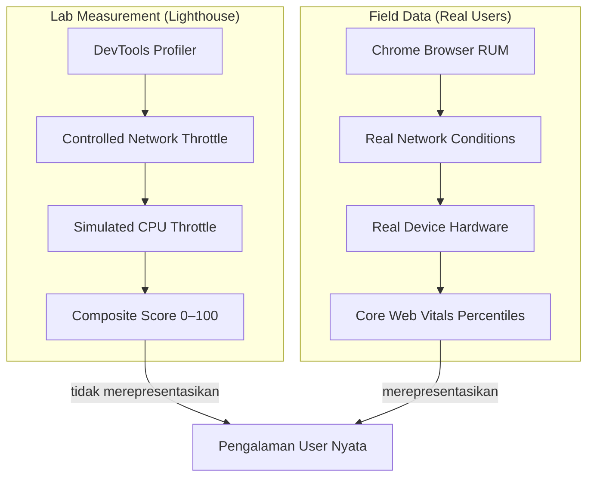
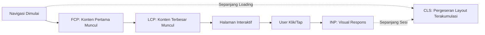
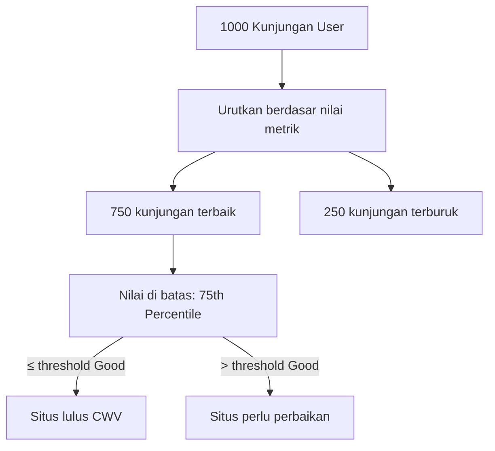
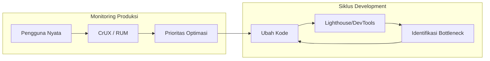
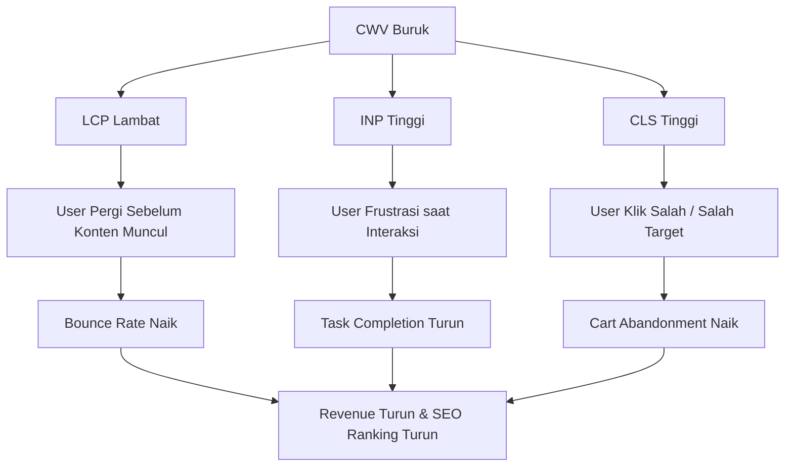

import { Section, Box, Steps, Step, Recap, CardGrid, Card, Chip, Hero, Compare } from "@components";

<Hero eyebrow="Chapter 01 &middot; Web Vitals" title="Fondasi &amp; <em>Mental Model</em> Web Vitals" sub="Kenapa user experience bisa diukur, tiga sinyal utama, dan jebakan Lighthouse score">
  
Performa web bukan soal angka di dashboard — performa web adalah soal apakah pengguna nyata merasakan halaman kamu cepat, responsif, dan stabil. Chapter ini membangun mental model yang benar sebelum kamu menyentuh satu baris optimasi pun.

  <Fragment slot="meta">
    <Chip icon="activity">Core Web Vitals</Chip>
    <Chip icon="clock">~28 menit baca</Chip>
  </Fragment>
</Hero>

Banyak developer langsung membuka Lighthouse, mendapat skor 47, lalu panik memburu cara menaikkan angka itu ke 100. Hasilnya? Skor naik, tapi konversi tidak bergerak — bahkan kadang bouncing malah naik. Yang terjadi adalah developer mengoptimasi untuk alat ukur, bukan untuk pengguna.

Chapter ini adalah fondasi yang harus kamu pahami sebelum menyentuh satu baris optimasi pun. Kita akan membahas mengapa Web Vitals lahir, apa yang sebenarnya ketiga sinyal utama itu ukur, bagaimana Google mendefinisikan "cukup baik" dengan angka spesifik, dan mengapa ada jarak besar antara hasil lab dengan pengalaman pengguna nyata. Di ujung chapter ini, kamu akan punya kerangka berpikir yang benar untuk seluruh course ini.

<Section num="01" id="kenapa-web-vitals" title="Kenapa Web Vitals, Bukan Skor Lighthouse?" sub="Composite score vs sinyal pengalaman nyata">

Lighthouse score adalah angka komposit yang dihasilkan dari lingkungan terkontrol di mesin kamu — bukan cerminan dari apa yang pengguna rasakan di jaringan 4G lemah dengan ponsel mid-range.

Lighthouse adalah alat yang luar biasa untuk debugging dan iterasi. Tapi sejak peluncurannya, banyak tim engineering yang keliru menjadikan skor Lighthouse sebagai KPI performa. Padahal Lighthouse score adalah **composite metric** yang menggabungkan enam metrik dengan bobot tertentu: First Contentful Paint (10%), Speed Index (10%), Largest Contentful Paint (25%), Total Blocking Time (30%), dan Cumulative Layout Shift (25%). Angka-angka ini dihasilkan dari simulasi di lingkungan lab yang sama setiap kali dijalankan — bukan dari pengguna sungguhan yang duduk di Surabaya dengan jaringan Telkomsel 3G.

Yang lebih berbahaya: Lighthouse menggunakan throttling CPU dan network yang bisa berbeda antar versi, antar mesin, bahkan antar waktu di mesin yang sama jika ada proses lain berjalan. Skor 92 hari Senin bisa menjadi 78 hari Rabu bukan karena kode berubah, tapi karena kondisi mesin berbeda.

Web Vitals lahir dari kesadaran Google bahwa mereka perlu standar yang **mengukur pengalaman nyata pengguna**, bukan simulasi. Dengan Chrome sebagai browser terbesar di dunia, Google memiliki akses ke data lapangan (field data) dari ratusan juta pengguna sungguhan — data yang jauh lebih representatif dari setiap lab test yang pernah ada. Web Vitals adalah distilasi dari data lapangan itu menjadi sinyal yang bisa dioptimasi.

Koneksi ke SEO juga nyata: sejak Juni 2021, Google menjadikan Core Web Vitals sebagai **Page Experience signal** dalam algoritma peringkat pencarian. Artinya, halaman dengan CWV buruk bisa kalah peringkat dari halaman dengan konten setara tapi performa lebih baik. Ini bukan sekadar "best practice" — ini memiliki dampak langsung ke visibilitas organik.

<b>Gambar 1.1.</b> Lab measurement menghasilkan composite score yang tidak selalu mencerminkan pengalaman pengguna nyata; field data dari browser nyata jauh lebih representatif.

<Box variant="analogy" icon="🧩" label="Analogi: Nilai Ujian vs Kemampuan Nyata">
Skor Lighthouse seperti nilai ujian sekolah — bisa dioptimasi dengan hafalan tanpa benar-benar paham materinya. Web Vitals seperti kemampuan kerja nyata: apakah kamu bisa menyelesaikan tugas dengan cepat, tepat, dan tanpa kesalahan saat kondisi tidak ideal? Yang pertama mudah dioptimasi secara artifisial; yang kedua tidak bisa dipalsukan.
</Box>

Jebakan "fast on my machine" adalah nyata. Developer biasanya membangun dan menguji di MacBook Pro M3 dengan koneksi fiber 1 Gbps. Rata-rata pengguna di Indonesia mengakses internet dengan ponsel seharga 1–3 juta rupiah di jaringan 4G dengan kualitas bervariasi. Perbedaan kecepatan CPU bisa 4–6 kali lipat; perbedaan bandwidth bisa 10–20 kali lipat. Apa yang terasa "instan" di mesin development bisa terasa "lemot" di tangan pengguna nyata.

<Box variant="note" icon="📝" label="Yang baru kamu pelajari">
Lighthouse score adalah composite metric dari lingkungan lab — berguna untuk debugging tapi tidak merepresentasikan pengalaman pengguna nyata. Core Web Vitals mengukur sinyal nyata dari pengguna sungguhan dan merupakan ranking signal Google Search sejak 2021.
</Box>

Dengan fondasi ini, kita bisa masuk ke inti: apa sebenarnya yang diukur oleh tiga Core Web Vitals?

</Section>

<Section num="02" id="core-web-vitals" title="Tiga Core Web Vitals: LCP, INP, CLS" sub="Loading, interaktivitas, dan stabilitas visual">

Google memilih tiga dimensi pengalaman pengguna yang paling berdampak: seberapa cepat konten utama muncul, seberapa cepat halaman merespons interaksi, dan seberapa stabil layout selama halaman dimuat.

Sebelum Core Web Vitals, dunia performa web dipenuhi puluhan metrik: FCP, TTI, TBT, TTFB, Speed Index, Time to Interactive, First Meaningful Paint, dan seterusnya. Setiap alat memiliki metrik favoritnya sendiri, dan tidak ada konsensus tentang mana yang paling penting. Core Web Vitals adalah upaya Google untuk menyederhanakan ini menjadi tiga sinyal yang masing-masing mewakili dimensi pengalaman yang berbeda dan dapat dioptimasi secara independen.

**LCP — Largest Contentful Paint** mengukur kecepatan loading konten utama halaman. Secara teknis, LCP adalah waktu dari navigasi awal hingga elemen konten terbesar yang terlihat di viewport dirender. Elemen yang dipertimbangkan: ``, `<image>` di dalam `<svg>`, `<video>` (dengan poster), elemen dengan background image via CSS, dan blok teks (`
`, `<h1>`, dll). LCP menjawab pertanyaan: "Kapan pengguna bisa mulai membaca/melihat konten yang mereka datang untuk lihat?"

**INP — Interaction to Next Paint** adalah metrik terbaru, resmi menggantikan FID (First Input Delay) sejak Maret 2024. INP mengukur responsivitas keseluruhan halaman terhadap interaksi pengguna — klik, tap, keyboard. Berbeda dengan FID yang hanya mengukur delay input pertama, INP mengukur semua interaksi selama sesi dan mengambil nilai percentile tertinggi. INP menjawab: "Ketika pengguna klik tombol, seberapa cepat halaman merespons secara visual?"

**CLS — Cumulative Layout Shift** mengukur stabilitas visual layout selama halaman dimuat. CLS adalah skor kumulatif dari semua pergeseran layout yang tidak diharapkan — ketika gambar load dan mendorong tombol ke bawah, ketika iklan muncul dan menggeser konten, ketika font tiba-tiba swap dan mengubah ukuran teks. CLS menjawab: "Apakah elemen yang pengguna lihat tetap di tempatnya, atau melompat-lompat?"

<table><thead><tr><th>Metrik</th><th>Mengukur</th><th>Good</th><th>Needs Improvement</th><th>Poor</th><th>Elemen Utama</th></tr></thead><tbody><tr><td><code>LCP</code></td><td>Kecepatan loading konten utama</td><td>≤ 2.5 detik</td><td>2.5 – 4 detik</td><td>&gt; 4 detik</td><td>Hero image, heading besar, video poster</td></tr><tr><td><code>INP</code></td><td>Responsivitas interaksi</td><td>≤ 200 ms</td><td>200 – 500 ms</td><td>&gt; 500 ms</td><td>Klik tombol, tap link, input keyboard</td></tr><tr><td><code>CLS</code></td><td>Stabilitas visual layout</td><td>≤ 0.1</td><td>0.1 – 0.25</td><td>&gt; 0.25</td><td>Gambar tanpa dimensi, iklan dinamis, font swap</td></tr></tbody></table>

Penting dipahami bahwa ketiga metrik ini bukan independent silos — mereka saling berinteraksi. Misalnya, JavaScript berat yang menyebabkan INP buruk juga bisa memblokir rendering dan membuat LCP lambat. Gambar tanpa dimensi yang menyebabkan CLS tinggi juga bisa menunda LCP karena browser perlu mereflow layout setelah gambar dimuat.

<b>Gambar 1.2.</b> Timeline kunjungan user menunjukkan kapan LCP, INP, dan CLS terjadi — LCP dan CLS terjadi selama loading awal, INP berlanjut sepanjang sesi interaktif.

<Box variant="bridge" icon="🌉" label="Jembatan: Dari Backend ke Frontend Metrics">
Jika kamu familiar dengan backend observability, bayangkan LCP seperti response time endpoint utama kamu, INP seperti latency operasi database yang dipicu oleh aksi user, dan CLS seperti race condition yang membuat data muncul di tempat salah. Ketiganya mengukur dimensi berbeda dari "seberapa baik sistem melayani user".
</Box>

Ada satu hal yang sering diabaikan: **INP menggantikan FID** karena FID hanya mengukur delay sebelum event handler pertama dijalankan — bukan waktu hingga browser benar-benar merender respons visual. Di halaman dengan JavaScript berat, FID bisa sangat baik (input diterima cepat) tapi respons visual tetap lambat karena main thread sibuk. INP menutup celah ini.

<Box variant="note" icon="📝" label="Yang baru kamu pelajari">
Tiga Core Web Vitals mewakili tiga dimensi: LCP untuk loading, INP untuk interaktivitas, CLS untuk stabilitas visual. INP menggantikan FID sejak Maret 2024 karena mengukur responsivitas secara lebih komprehensif.
</Box>

Sekarang kita tahu apa yang diukur — tapi berapa nilai yang dianggap "cukup baik"? Dan bagaimana Google memutuskan siapa yang dihitung?

</Section>

<Section num="03" id="threshold-dan-percentil" title="Threshold dan 75th Percentile" sub="Mengapa bukan rata-rata, dan apa arti setiap ambang batas">

Google tidak menggunakan rata-rata untuk menilai performa situs — mereka menggunakan 75th percentile, karena rata-rata bisa menyembunyikan masalah besar yang dialami sebagian pengguna.

Mari kita bayangkan sebuah situs e-commerce. Dari 1000 kunjungan, 750 mendapat LCP di bawah 2 detik (pengguna desktop dengan fiber), tapi 250 lainnya mendapat LCP di atas 6 detik (pengguna mobile dengan 3G di daerah). Rata-rata LCP mungkin 2.5 detik — angka yang terlihat bagus. Tapi 25% pengguna mengalami halaman yang lambat sekali, dan mereka adalah segmen yang paling rentan meninggalkan halaman.

**75th percentile** berarti: nilai tersebut adalah nilai di mana 75% dari semua kunjungan mendapat nilai yang *lebih baik atau sama*. Jika LCP pada 75th percentile adalah 3 detik, artinya 75% kunjungan memiliki LCP ≤ 3 detik, dan 25% sisanya lebih lambat dari itu. Google menganggap sebuah situs "lulus" Core Web Vitals jika nilai 75th percentile untuk semua tiga metrik berada di ambang batas "Good".

<table><thead><tr><th>Metrik</th><th>Good (Hijau)</th><th>Needs Improvement (Kuning)</th><th>Poor (Merah)</th></tr></thead><tbody><tr><td><code>LCP</code></td><td>≤ 2.5 detik</td><td>2.5 – 4.0 detik</td><td>&gt; 4.0 detik</td></tr><tr><td><code>INP</code></td><td>≤ 200 ms</td><td>200 – 500 ms</td><td>&gt; 500 ms</td></tr><tr><td><code>CLS</code></td><td>≤ 0.1</td><td>0.1 – 0.25</td><td>&gt; 0.25</td></tr></tbody></table>

Angka-angka ini bukan sembarang ambang batas. LCP ≤ 2.5 detik dipilih karena penelitian pengguna menunjukkan bahwa di atas angka ini pengguna mulai memersepsi halaman sebagai "lambat". INP ≤ 200ms dipilih karena respons di bawah 200ms terasa "instan" bagi persepsi manusia — otak tidak bisa membedakan delay di bawah 200ms dari respons immediate. CLS ≤ 0.1 dipilih sebagai titik di mana pergeseran layout masih dalam batas yang "bisa ditoleransi" tanpa menyebabkan kesalahan klik.

Google juga melakukan segmentasi antara **mobile dan desktop**. Pengguna mobile biasanya mendapat hardware yang lebih lambat dan koneksi yang lebih tidak stabil. Threshold-nya sama, tapi karena kondisi yang berbeda, skor CWV untuk mobile hampir selalu lebih buruk dari desktop. Ini mengapa PageSpeed Insights dan Search Console selalu menampilkan data mobile dan desktop secara terpisah — dan Google mengutamakan mobile dalam penilaian.

<Box variant="analogy" icon="🧩" label="Analogi: Kemacetan Lalu Lintas">
Bayangkan mengukur "kelancaran" jalur tol. Menggunakan kecepatan rata-rata semua kendaraan bisa menyesatkan — jika 75% kendaraan melaju 80 km/jam tapi 25% terjebak macet total di 5 km/jam, rata-ratanya masih terlihat oke. Yang lebih bermakna: "Berapa persen perjalanan yang selesai tepat waktu?" — itulah logika di balik 75th percentile. Kita tidak peduli rata-rata; kita peduli berapa banyak user yang mendapat pengalaman baik.
</Box>

Ada nuansa penting dalam cara CLS dihitung: CLS menggunakan **session window** algorithm sejak 2021. Alih-alih menjumlah semua layout shift sepanjang halaman terbuka (yang bisa sangat tinggi untuk halaman panjang dengan infinite scroll), CLS dikelompokkan dalam jendela waktu 5 detik dengan gap antar shift maksimal 1 detik. Window dengan skor tertinggi yang diambil sebagai nilai CLS akhir. Ini membuat CLS lebih adil untuk halaman yang sengaja memperbarui konten secara dinamis.

<b>Gambar 1.3.</b> Cara Google menentukan status CWV: ambil nilai pada 75th percentile dari semua kunjungan, bandingkan dengan threshold Good masing-masing metrik.

<Box variant="warn" icon="⚠️" label="Gotcha: Sampel Data Minimum">
CrUX (Chrome UX Report) hanya menampilkan data untuk URL atau origin yang memiliki cukup kunjungan dalam 28 hari terakhir. Situs baru atau halaman dengan traffic rendah mungkin tidak memiliki data CWV di PageSpeed Insights atau Search Console. Dalam kasus ini, kamu harus mengandalkan lab data sebagai proxy sampai data lapangan terkumpul.
</Box>

<Box variant="note" icon="📝" label="Yang baru kamu pelajari">
Google menggunakan 75th percentile — bukan rata-rata — untuk menilai CWV karena rata-rata bisa menyembunyikan masalah serius yang dialami sebagian pengguna. Segmentasi mobile/desktop dilakukan secara terpisah, dan Google mengutamakan mobile.
</Box>

Berbicara tentang data lapangan membawa kita ke pertanyaan penting: dari mana data itu berasal, dan mengapa ia bisa sangat berbeda dari hasil lab?

</Section>

<Section num="04" id="lab-vs-field" title="Lab Data vs Field Data" sub="Dua jenis pengukuran yang saling melengkapi, bukan menggantikan">

Lab data dan field data bukan pesaing — mereka adalah dua lensa berbeda yang memberikan informasi berbeda. Menggunakan hanya satu dari keduanya adalah seperti mendiagnosis penyakit dengan hanya satu jenis tes.

**Lab data** (data sintetis) adalah hasil pengukuran dalam lingkungan terkontrol. Kamu menjalankan Lighthouse, WebPageTest, atau Chrome DevTools Performance profiler — alat ini mensimulasikan jaringan lambat, throttle CPU, dan memuat halaman dalam kondisi yang sama setiap kali. Hasilnya sangat *reproducible* dan mudah di-debug karena kamu tahu persis kondisi saat pengukuran dilakukan. Lab data sangat berguna untuk:
- Iterasi cepat saat development: ubah kode, jalankan Lighthouse, lihat hasilnya
- Membandingkan sebelum dan sesudah optimasi dengan kondisi yang identik
- Debugging bottleneck spesifik: mana resource yang paling lambat, mana JavaScript yang memblokir rendering
- CI/CD: reject build jika Lighthouse score turun di bawah threshold

**Field data** (Real User Monitoring / RUM) adalah data yang dikumpulkan dari browser pengguna nyata saat mereka menggunakan situs kamu. Chrome secara otomatis mengumpulkan data ini (dari pengguna yang telah opt-in ke Chrome's data sharing) dan membuatnya tersedia melalui **Chrome UX Report (CrUX)**. CrUX adalah dataset publik yang mencakup 28 hari data rolling dari jutaan situs. Kamu bisa mengaksesnya melalui:
- **PageSpeed Insights**: tab "Discover what your real users are experiencing"
- **Google Search Console**: laporan Core Web Vitals
- **CrUX API**: untuk query programatik
- **BigQuery**: untuk analisis skala besar

<table><thead><tr><th>Alat</th><th>Tipe Data</th><th>Kapan Dipakai</th><th>Keterbatasan</th></tr></thead><tbody><tr><td>Lighthouse (DevTools/CLI)</td><td>Lab</td><td>Development, debugging, iterasi</td><td>Tidak mewakili user nyata, hasil bisa bervariasi</td></tr><tr><td>WebPageTest</td><td>Lab</td><td>Deep profiling, multiple locations</td><td>Lingkungan terkontrol, bukan kondisi nyata</td></tr><tr><td>PageSpeed Insights (Field tab)</td><td>Field (CrUX)</td><td>Quick check data lapangan 28 hari</td><td>Butuh traffic minimum, hanya Chrome</td></tr><tr><td>Search Console CWV Report</td><td>Field (CrUX)</td><td>Monitor trend, SEO impact</td><td>Agregat per group URL, bukan per-halaman</td></tr><tr><td>Custom RUM (web-vitals.js)</td><td>Field</td><td>Data detail untuk analisis sendiri</td><td>Butuh implementasi &amp; infrastructure sendiri</td></tr></tbody></table>

Mengapa lab data dan field data bisa berbeda sangat jauh? Ada beberapa faktor utama:

**Keragaman hardware**: Lighthouse mungkin menyimulasikan CPU 4x lebih lambat dari laptop kamu — tapi pengguna nyata ada yang punya HP jadul yang 10x lebih lambat, dan ada yang punya iPhone 15 Pro yang lebih cepat dari mesin dev kamu. Distribusi ini jauh lebih lebar dari throttle yang bisa disimulasikan.

**Kondisi jaringan**: Lab menggunakan throttle jaringan yang konsisten (biasanya simulasi "Slow 4G"). Pengguna nyata punya variasi ekstrem — mulai dari WiFi rumah 100 Mbps, 4G stabil di kota, 3G di daerah pinggiran, sampai koneksi yang intermittent di lift atau transportasi.

**State cache**: Lab biasanya menguji dalam keadaan cold cache (tidak ada resource yang di-cache). Pengguna yang kembali ke situs kamu sudah punya sebagian resource di-cache — experience mereka jauh lebih cepat. Sebaliknya, first-time visitor dengan cold cache akan lebih lambat.

**Pola interaksi**: CLS dan INP sangat bergantung pada bagaimana pengguna berinteraksi. Lab hanya mensimulasikan skenario tertentu, tapi pengguna nyata melakukan hal yang tidak terprediksi — scroll cepat, klik berulang, tab berpindah, dll.

<Box variant="warn" icon="⚠️" label="Jangan Hanya Andalkan Lighthouse">
Skor Lighthouse 100 tidak menjamin pengguna senang. Ada laporan nyata situs dengan Lighthouse score 98 tapi CWV field data buruk, karena situs menggunakan teknik yang menguntungkan kondisi lab tapi tidak membantu (bahkan kadang merugikan) kondisi nyata. Prioritaskan field data untuk keputusan bisnis; gunakan lab data untuk debugging dan iterasi.
</Box>

<Box variant="tip" icon="💡" label="Strategi Dua Lensa">
Gunakan lab data (Lighthouse/WebPageTest) untuk siklus development harian — cepat, reproducible, mudah di-debug. Gunakan field data (PageSpeed Insights/Search Console) untuk keputusan prioritas: "Apa masalah terbesar yang dialami pengguna nyata kami saat ini?" Jika keduanya menunjuk pada masalah yang sama, itu prioritas tertinggi.
</Box>

<b>Gambar 1.4.</b> Dua lensa yang saling melengkapi: lab data untuk siklus iterasi cepat, field data untuk menentukan prioritas optimasi berdasarkan pengalaman pengguna nyata.

<Box variant="note" icon="📝" label="Yang baru kamu pelajari">
Lab data berguna untuk iterasi dan debugging tapi tidak mewakili pengguna nyata. Field data dari CrUX/RUM mencerminkan kondisi sesungguhnya. Keduanya dibutuhkan: lab untuk debugging, field untuk prioritas dan validasi.
</Box>

Kita sudah paham apa yang diukur dan bagaimana cara mengukurnya. Tapi mengapa kita harus peduli? Mari kita lihat bukti dampak bisnis nyata dari performa web.

</Section>

<Section num="05" id="dampak-bisnis" title="Dampak Bisnis Performa Web" sub="Konversi, bounce rate, SEO, dan kepercayaan pengguna">

Performa web bukan urusan teknis semata — setiap 100ms improvement bisa berdampak pada pendapatan, dan setiap detik tambahan latency menyebabkan ratusan ribu pengguna meninggalkan halaman sebelum melihat satu kata pun.

Angka-angka berikut bukan hasil survei opini — ini adalah data dari studi terukur yang dilakukan oleh perusahaan besar dengan traffic nyata:

**Deloitte & Google (2020)** melakukan studi bersama pada 37 brand retail dan travel di Eropa dan Amerika. Temuan utama: peningkatan 0.1 detik pada kecepatan situs menghasilkan rata-rata **8% peningkatan konversi** untuk retail dan 10% untuk travel. Untuk situs dengan revenue $100 juta per tahun, ini berarti $8 juta tambahan hanya dari 100ms improvement.

**Setiap 1 detik tambahan waktu load** berkorelasi dengan peningkatan bounce rate sekitar 7%. Artinya jika situs kamu load dalam 1 detik, bounce rate mungkin 40%. Jika load dalam 3 detik, bounce rate sudah mendekati 54%. Di 5 detik, lebih dari 60% pengunjung sudah pergi sebelum halaman selesai dimuat.

**Google & SOASTA Research (2017)** — meskipun sudah beberapa tahun, angka ini masih sering dikutip karena relevansinya: **53% pengguna mobile meninggalkan halaman** yang load lebih dari 3 detik. Di Indonesia dengan karakteristik koneksi mobile yang bervariasi, angka ini bisa lebih tinggi.

**Pinterest** menemukan bahwa mengurangi perceived wait time sebesar 40% menghasilkan peningkatan 15% dalam traffic organik dan 15% peningkatan signup rate. Bukan performa aktual yang berubah drastis — tapi *persepsi* kecepatan.

<table><thead><tr><th>Perusahaan</th><th>Perubahan Performa</th><th>Dampak Bisnis</th></tr></thead><tbody><tr><td>Zalando</td><td>Improvement LCP halaman produk</td><td>+0.7% konversi per 100ms</td></tr><tr><td>Vodafone</td><td>LCP improvement 31%</td><td>+8% penjualan, +15% lead</td></tr><tr><td>Tokopedia (2021)</td><td>Optimasi TTI halaman utama</td><td>+35% sesi, -65% loading time</td></tr><tr><td>Pinterest</td><td>-40% perceived wait time</td><td>+15% organic traffic &amp; signup</td></tr><tr><td>BBC</td><td>+1 detik load time</td><td>-10% pengguna per halaman</td></tr></tbody></table>

**Dampak SEO** sering diremehkan karena tidak langsung terlihat. Core Web Vitals adalah salah satu sinyal dalam sistem **Page Experience** Google. Google sendiri mengklarifikasi bahwa konten tetap menjadi faktor #1 — CWV tidak akan membuat halaman dengan konten buruk outrank halaman dengan konten sangat relevan. Namun ketika dua halaman memiliki konten yang setara relevansinya (seperti artikel berita dari beberapa publisher), CWV bisa menjadi **tie-breaker**. Di kategori kompetitif seperti berita, e-commerce, atau review produk, ini sangat signifikan.

Kasus CLS yang sering diabaikan memiliki dampak yang unik: **CLS tinggi menyebabkan kesalahan klik**. Bayangkan checkout page yang masih memuat — user mau klik "Lanjut ke Pembayaran" tapi tiba-tiba iklan muncul dan menggeser tombol ke bawah, dan jari user justru klik iklan. Atau worse: user klik "Batal" padahal mau klik "Konfirmasi" karena tombol bergeser tepat saat jari menyentuh layar. Ini langsung berdampak ke cart abandonment dan user frustration.

<b>Gambar 1.5.</b> Alur dampak bisnis dari CWV buruk: setiap dimensi yang buruk memiliki jalur uniknya sendiri menuju penurunan revenue dan ranking.

<Box variant="bridge" icon="🌉" label="Jembatan: Dari Latency Backend ke UX Frontend">
Jika kamu pernah debuggig API yang response time-nya 2000ms dan melihat grafik konversi turun, kamu sudah memahami konsep ini. Performa frontend bekerja dengan cara yang sama — hanya saja pengukurannya lebih kompleks karena melibatkan rendering, layout, dan interaksi di sisi client. Seperti latency API di Grafana, CWV adalah metrik yang bisa kamu monitor, alert, dan improve secara sistematis.
</Box>

Penting juga memahami bahwa **dampak performa tidak linear** dan tidak merata. Pengguna yang paling terdampak performa buruk adalah mereka yang menggunakan device paling lambat dan koneksi paling buruk — yang sering kali adalah segmen pasar yang baru berkembang, justru segmen dengan potensi pertumbuhan tertinggi. Mengoptimasi performa adalah bentuk inklusivitas: membuat produk bisa diakses oleh lebih banyak orang di lebih banyak kondisi.

<Box variant="tip" icon="💡" label="Cara Mempresentasikan ke Stakeholder">
Jangan bilang "LCP kami 4.2 detik" ke product manager atau bisnis. Katakan: "25% pengguna kami menunggu lebih dari 4 detik sebelum bisa membaca konten utama, dan data industri menunjukkan setiap 1 detik tambahan meningkatkan bounce rate 7%. Kami estimasikan ini menyumbang X% dari churn di halaman landing." Terjemahkan metrik teknis ke bahasa bisnis.
</Box>

<Box variant="note" icon="📝" label="Yang baru kamu pelajari">
Performa web memiliki dampak bisnis terukur: 0.1 detik improvement bisa berarti 8% peningkatan konversi, 53% mobile user meninggalkan halaman yang load &gt; 3 detik, dan CWV memengaruhi SEO ranking sebagai tie-breaker. CLS yang buruk juga menyebabkan kesalahan klik yang langsung berdampak ke cart abandonment.
</Box>

Dengan pemahaman ini — mengapa Web Vitals lebih baik dari Lighthouse score, apa yang diukur, bagaimana threshold ditentukan, perbedaan lab dan field data, dan dampak bisnisnya — kamu sudah memiliki fondasi mental model yang kuat untuk course ini.

</Section>

<Section num="06" id="ringkasan" title="Ringkasan" sub="Yang wajib menempel dari chapter ini">

Chapter ini membangun fondasi mental model yang benar: performa web diukur dari perspektif pengguna nyata, bukan dari skor lab — dan perbedaan ini sangat penting untuk keputusan optimasi yang tepat sasaran.

Kita telah menelusuri perjalanan dari mengapa Lighthouse score tidak cukup sebagai satu-satunya ukuran, lalu memahami tiga dimensi yang diukur Core Web Vitals (loading, interaktivitas, stabilitas visual), cara Google menentukan "cukup baik" menggunakan 75th percentile bukan rata-rata, mengapa lab data dan field data keduanya dibutuhkan tapi untuk tujuan berbeda, dan akhirnya melihat bukti nyata bahwa performa web memiliki dampak bisnis yang sangat terukur.

<Recap title="Yang Wajib Menempel">
<ul>
<li>Lighthouse score adalah composite metric dari lingkungan lab — berguna untuk debugging tapi bukan cerminan pengalaman pengguna nyata</li>
<li>Core Web Vitals adalah tiga sinyal Google untuk mengukur UX nyata: LCP (loading), INP (interaktivitas), CLS (stabilitas visual)</li>
<li>INP menggantikan FID sejak Maret 2024 karena mengukur responsivitas secara lebih komprehensif — semua interaksi, bukan hanya yang pertama</li>
<li>Google menggunakan 75th percentile, bukan rata-rata, untuk menilai CWV — ini memastikan mayoritas pengguna (75%) mendapat pengalaman yang baik</li>
<li>Lab data (Lighthouse, WebPageTest) berguna untuk iterasi cepat; field data (CrUX, PageSpeed Insights) berguna untuk keputusan prioritas dan validasi</li>
<li>Performa web memiliki dampak bisnis nyata: 0.1 detik improvement = 8% konversi uplift (Deloitte); 53% mobile user meninggalkan halaman yang load &gt; 3 detik</li>
<li>Core Web Vitals adalah ranking signal Google Search sejak 2021 — CWV buruk bisa merugikan SEO untuk halaman yang bersaing konten setara</li>
</ul>
</Recap>

Di **Chapter 02** kita akan menyelami LCP secara mendalam: apa elemen yang paling sering menjadi LCP candidate, kenapa gambar tanpa dimensi bisa merusak LCP dan CLS sekaligus, dan teknik-teknik spesifik untuk membawa LCP turun ke bawah 2.5 detik dengan strategi yang tepat — bukan sekadar mengecilkan gambar.

</Section>
