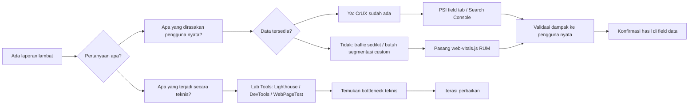
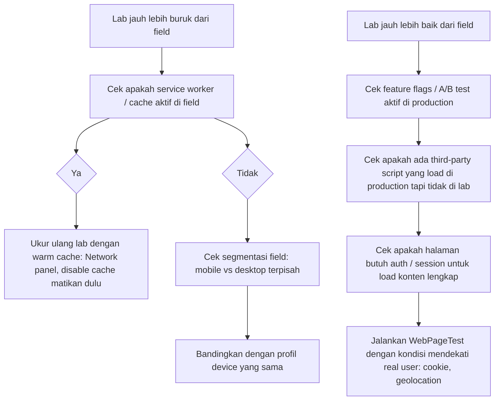

import { Section, Box, Steps, Step, Recap, CardGrid, Card, Chip, Hero, Compare } from "@components";

<Hero eyebrow="Chapter 02 &middot; Web Vitals" title="<em>Mengukur</em> Web Vitals" sub="Peta alat ukur dari PageSpeed Insights sampai web-vitals.js, lab vs field, rekonsiliasi data">
  <p>Setiap metrik hanya sebagus alat yang mengukurnya. Chapter ini memetakan semua alat ukur Web Vitals yang tersedia — kapan masing-masing tepat dipakai, apa batasannya, dan bagaimana menggabungkan data dari berbagai sumber agar keputusan optimasi tidak diambil dari data yang salah.</p>
  <Fragment slot="meta">
    <Chip icon="activity">Pengukuran &amp; Tooling</Chip>
    <Chip icon="clock">~30 menit baca</Chip>
  </Fragment>
</Hero>

Di chapter sebelumnya kita mempelajari apa itu LCP, INP, dan CLS secara konseptual. Tapi mengetahui definisi metrik saja tidak cukup — kamu perlu tahu cara mengukurnya dengan akurat, dari sumber yang tepat, untuk membuat keputusan yang benar.

Masalahnya, ekosistem alat ukur Web Vitals cukup kaya dan kadang membingungkan. Ada PageSpeed Insights, ada Lighthouse, ada Chrome DevTools, ada CrUX, ada Search Console, ada web-vitals.js. Semua mengukur "hal yang sama" tetapi dari sudut pandang dan konteks yang sangat berbeda — dan hasilnya bisa tampak kontradiktif jika kamu tidak tahu cara membacanya.

Chapter ini membangun peta mental yang jelas: setiap alat punya tempat yang tepat, setiap data punya konteks yang harus direspek. Dengan peta ini kamu bisa debug masalah performa secara sistematis, bukan nebak-nebak mengapa nilai PSI berbeda dengan yang kamu ukur di DevTools.

<Section num="01" id="peta-alat-ukur" title="Peta Alat Ukur: Pilih yang Tepat" sub="Decision tree sebelum membuka tab baru">

<p class="lead">Memilih alat yang salah bukan hanya membuang waktu — ia bisa menyesatkan arah optimasi dan menghasilkan keputusan yang salah di tengah rapat.</p>

Perbedaan mendasar yang perlu dipahami pertama kali adalah antara **lab data** dan **field data**. Lab data dikumpulkan dalam lingkungan terkontrol: satu mesin, satu konfigurasi jaringan, satu kali load halaman. Field data dikumpulkan dari pengguna nyata: beragam perangkat, koneksi bervariasi, browser berbeda, caching berbeda, lokasi berbeda. Keduanya berguna, tetapi untuk pertanyaan yang berbeda.

**Lab tools** (Lighthouse, Chrome DevTools Performance panel, WebPageTest) menjawab pertanyaan: "Apa yang terjadi secara teknis di halaman ini?" Mereka cocok untuk iterasi cepat saat debugging — kamu ubah satu baris kode, reload, ukur lagi dalam hitungan detik. Tapi mereka tidak mencerminkan pengalaman pengguna nyata, karena cache production, service worker, A/B test flags, dan edge network tidak ikut dalam simulasi.

**Field tools** (PageSpeed Insights field tab, CrUX, Search Console) menjawab pertanyaan: "Apa yang benar-benar dirasakan pengguna?" Mereka menggunakan data yang dikumpulkan dari Chrome nyata di perangkat nyata pengguna selama 28 hari terakhir. Mereka adalah sumber kebenaran untuk Core Web Vitals yang dinilai Google untuk SEO ranking. Tapi mereka punya lag — kamu tidak bisa lihat dampak perubahan hari ini di CrUX sampai data ter-refresh.

**Library web-vitals.js** berada di posisi ketiga yang unik: ia mengukur field data milikmu sendiri, dari pengguna produksi, di semua browser yang kamu monitor, dan kamu kontrol sepenuhnya kemana data itu dikirim.

<div class="tbl-wrap"><table><thead><tr><th>Tool</th><th>Tipe Data</th><th>Sumber Data</th><th>Update Freq</th><th>Kapan Ideal</th></tr></thead><tbody><tr><td>Lighthouse CLI / DevTools</td><td>Lab</td><td>Satu browser terkontrol</td><td>Real-time</td><td>Iterasi cepat saat coding</td></tr><tr><td>WebPageTest</td><td>Lab</td><td>Device nyata di data center</td><td>Real-time</td><td>Simulasi device spesifik, waterfall detail</td></tr><tr><td>PSI (lab tab)</td><td>Lab</td><td>Lighthouse di server Google</td><td>Real-time (on request)</td><td>Quick check tanpa install apapun</td></tr><tr><td>PSI (field tab)</td><td>Field</td><td>CrUX 28 hari</td><td>Daily</td><td>Lihat status CWV untuk SEO</td></tr><tr><td>CrUX BigQuery</td><td>Field</td><td>Chrome users global</td><td>Monthly</td><td>Analisis tren historis mendalam</td></tr><tr><td>Search Console CWV</td><td>Field</td><td>CrUX, dikelompokkan per URL</td><td>Daily</td><td>Prioritisasi halaman bermasalah</td></tr><tr><td>web-vitals.js RUM</td><td>Field</td><td>Pengguna produksi kamu</td><td>Real-time</td><td>Monitor semua browser, segmentasi custom</td></tr></tbody></table></div>


<p class="fig-cap"><b>Alur memilih alat.</b> Mulai dari pertanyaan, bukan dari tool yang sudah terbiasa dibuka.</p>

<Box variant="warn" icon="⚠️" label="Jangan jadikan Lighthouse score sebagai KPI tim"><p>Lighthouse score 0-100 mudah di-game: matikan fitur, hapus gambar, preload semua resource secara agresif — skor naik, tapi pengalaman pengguna nyata tidak berubah. Lighthouse mengukur satu skenario cold start terkontrol. Gunakan field data CrUX atau RUM sendiri sebagai KPI, bukan skor lab.</p></Box>

<Box variant="note" icon="📝" label="Yang baru kamu pelajari"><p>Lab dan field bukan saingan — mereka menjawab pertanyaan berbeda. Lab untuk iterasi cepat dan debugging teknis; field untuk validasi bahwa perbaikan terasa oleh pengguna nyata.</p></Box>

Sekarang kita masuk ke masing-masing kategori secara detail, mulai dari lab tools.

</Section>

<Section num="02" id="lab-tools" title="Lab Tools: Lighthouse, DevTools, WebPageTest" sub="Alat iterasi cepat untuk debugging teknis">

<p class="lead">Lab tools adalah lingkungan percobaan kamu — cepat, deterministik, dan bisa direproduksi, tetapi tidak mencerminkan variasi yang ada di dunia nyata.</p>

### PageSpeed Insights — Lab Tab

PageSpeed Insights (PSI) di `pagespeed.web.dev` menjalankan Lighthouse di server Google setiap kali kamu submit URL. Hasilnya adalah skor 0-100 untuk Performance, Accessibility, Best Practices, dan SEO, plus daftar **Opportunities** (estimasi penghematan waktu load) dan **Diagnostics** (masalah yang terdeteksi tanpa estimasi waktu).

Skor 0-100 dihitung sebagai weighted average dari beberapa metrik lab: FCP, LCP, TBT (Total Blocking Time, proxy untuk INP di lab), Speed Index, dan CLS. Bobot berubah setiap beberapa saat saat Google merevisi formula — jadi jangan heran kalau skor tiba-tiba berubah tanpa ada perubahan kode di situsmu.

PSI lab tab paling cocok dipakai untuk: cek cepat tanpa install apapun, screening awal saat pertama audit halaman baru, atau sharing hasil dengan stakeholder yang belum bisa install Lighthouse CLI.

### Lighthouse CLI

Untuk workflow yang lebih terkontrol, jalankan Lighthouse dari terminal. Hasilnya bisa disimpan sebagai JSON untuk diintegrasikan ke CI pipeline.

```bash
# Install global
npm install -g lighthouse

# Jalankan audit, simpan JSON output
lighthouse https://skincare.example.com \
  --output json \
  --output-path ./reports/lighthouse.json \
  --chrome-flags="--headless"

# Parse hasil LCP dari JSON
node -e "
const r = require('./reports/lighthouse.json');
const lcp = r.audits['largest-contentful-paint'];
console.log('LCP:', lcp.displayValue, '— score:', lcp.score);
"
```

Di CI/CD pipeline, kamu bisa set threshold di script dan fail build jika LCP regresi di atas 500ms. Library [`lighthouse-ci`](https://github.com/GoogleChrome/lighthouse-ci) menyediakan scaffolding untuk ini.

### Chrome DevTools Performance Panel

Performance panel di DevTools adalah yang paling powerful untuk debugging teknis. Ia merekam **timeline trace** lengkap: JavaScript execution, rendering, compositing, network waterfall, dan main thread activity.

<Steps>
  <Step>Buka DevTools: <code>Ctrl+Shift+I</code> (Windows/Linux) atau <code>Cmd+Option+I</code> (Mac)</Step>
  <Step>Klik tab <strong>Performance</strong> di panel atas</Step>
  <Step>Centang <strong>Screenshots</strong> dan <strong>Memory</strong> di toolbar atas untuk context visual</Step>
  <Step>Klik tombol <strong>Record</strong> (lingkaran merah), lalu reload halaman dengan <code>Ctrl+R</code></Step>
  <Step>Tunggu halaman selesai load, lalu klik <strong>Stop</strong></Step>
  <Step>Analisis flame chart yang muncul: cari blok merah di bagian <em>Main</em> — itu Long Tasks yang memblokir main thread</Step>
</Steps>

**Cara membaca flame chart**: sumbu horizontal adalah waktu, sumbu vertikal adalah call stack (bawah = fungsi terluar, atas = fungsi terdalam yang dipanggil). Blok berwarna merah dengan segitiga oranye di sudut kanan atas menandakan **Long Task** — task yang memakan lebih dari 50ms di main thread dan menunda responsivitas browser.

Untuk mengukur LCP di DevTools, lihat panel **Timings** di bagian atas trace — ada marker untuk FCP dan LCP. Untuk debugging CLS, enable Rendering > Layout Shift Regions di DevTools untuk menampilkan overlay visual di halaman.

### WebPageTest

WebPageTest (`webpagetest.org`) adalah pilihan terbaik saat kamu butuh simulasi pada **device nyata** atau **koneksi jaringan spesifik**. Berbeda dengan Lighthouse yang mensimulasikan throttling di satu mesin desktop, WebPageTest punya test agents di berbagai lokasi dunia dan pool device Android fisik.

Fitur unggulan WebPageTest:
- **Waterfall chart** yang detail: visualisasi urutan resource load, dependency, blocking time
- **Filmstrip view**: screenshot setiap 100ms sehingga kamu bisa lihat kapan halaman mulai terlihat
- **Multi-step transaction**: simulasi user flow (login, tambah ke keranjang, checkout)
- **Perbandingan A/B**: bandingkan dua URL atau dua konfigurasi side-by-side

### Throttling: Kunci Simulasi Realistis

Satu kesalahan umum saat pakai lab tools adalah mengukur di kondisi terbaik — laptop baru, WiFi kencang, tanpa throttling. Pengguna di lapangan sangat berbeda: mayoritas mobile menggunakan perangkat mid-range 3-5 tahun lalu dengan CPU lebih lambat dan koneksi 4G yang tidak stabil.

Google Lighthouse menggunakan profil **Moto G Power** sebagai referensi device mobile, dengan throttling **CPU 4x slowdown** dan jaringan simulasi **Fast 3G** (~1.6 Mbps). Untuk skenario lebih konservatif, DevTools bisa dikonfigurasi ke CPU 6x slowdown.

```bash
# Lighthouse dengan throttling eksplisit mobile
lighthouse https://skincare.example.com \
  --preset=perf \
  --emulated-form-factor=mobile \
  --throttling-method=simulate \
  --throttling.cpuSlowdownMultiplier=4 \
  --output json
```

<Box variant="analogy" icon="🧩" label="Analogi: laboratorium kimia"><p>Lab tools seperti eksperimen di laboratorium yang terkontrol: suhu, tekanan, dan konsentrasi bahan diatur dengan tepat. Hasilnya reprodusibel dan mudah di-debug. Tapi itu tidak berarti reaksi yang sama persis terjadi di pabrik dengan skala berbeda, batch bahan yang bervariasi, dan kondisi lingkungan yang berubah-ubah. Lab tools memberi pemahaman mekanistik; field tools memberi gambaran realita.</p></Box>

<Box variant="note" icon="📝" label="Yang baru kamu pelajari"><p>Lighthouse CLI cocok untuk CI integration, DevTools Performance panel untuk debugging call stack dan Long Tasks, dan WebPageTest untuk simulasi device nyata dan waterfall detail. Semua butuh throttling realistis agar hasilnya tidak terlalu optimistis.</p></Box>

Setelah menguasai lab tools, saatnya beralih ke field tools yang mengukur pengalaman pengguna nyata.

</Section>

<Section num="03" id="field-tools" title="Field Tools: PSI, CrUX, Search Console" sub="Data nyata dari pengguna Chrome di seluruh dunia">

<p class="lead">Field data adalah sumber kebenaran untuk Web Vitals yang mempengaruhi SEO ranking — tidak bisa dipalsukan, tidak bisa di-game, dan mencerminkan keberagaman pengguna nyata.</p>

### PageSpeed Insights — Field Tab

Bagian atas PSI setelah kamu submit URL menampilkan **Field Data** dengan latar kuning pucat — ini data CrUX, bukan hasil Lighthouse. Kamu akan melihat distribusi LCP, INP, dan CLS untuk URL tersebut (atau origin jika URL spesifik tidak punya cukup data), segmented antara Mobile dan Desktop.

Visualisasi berupa **distribution bar** berwarna hijau (Good), kuning (Needs Improvement), dan merah (Poor). Google menilai URL sebagai "Good" untuk satu metrik jika 75th percentile pengguna mengalami nilai dalam threshold Good. Jadi jika 75% pengguna mendapat LCP di bawah 2.5 detik, LCP kamu dianggap Good.

Catatan penting: PSI field data hanya tersedia jika situsmu punya cukup traffic dari Chrome. Situs dengan traffic rendah atau dominan mobile akan melihat pesan "The Chrome User Experience Report does not have sufficient real-world speed data for this page."

### Chrome User Experience Report (CrUX)

CrUX adalah dataset publik yang dikumpulkan Google dari pengguna Chrome yang mengaktifkan opsi sinkronisasi history browsing. Dataset ini tersedia di dua tempat:

**CrUX di BigQuery**: snapshot monthly yang bisa di-query dengan SQL. Berisi data per-origin dan per-URL untuk semua website yang punya cukup traffic di top ~15 juta origin. Gratis diakses jika kamu punya Google Cloud project.

```sql
-- Contoh query CrUX BigQuery: LCP p75 untuk semua URL di domain kamu
SELECT
  origin,
  p75_lcp,
  p75_inp,
  p75_cls
FROM
  `chrome-ux-report.materialized.metrics_summary`
WHERE
  origin = 'https://skincare.example.com'
  AND date = '2026-05-01'
```

**CrUX API**: akses programmatic per-URL atau per-origin dengan data lebih segar (mendekati real-time rolling 28 hari). Cocok untuk monitoring otomatis.

```bash
# Query CrUX API untuk LCP, INP, CLS di URL spesifik
curl -X POST \
  "https://chromeuxreport.googleapis.com/v1/records:queryRecord?key=YOUR_API_KEY" \
  -H "Content-Type: application/json" \
  -d '{
    "url": "https://skincare.example.com/products",
    "metrics": ["largest_contentful_paint", "interaction_to_next_paint", "cumulative_layout_shift"]
  }'
```

### Google Search Console Core Web Vitals Report

Search Console menyediakan laporan Core Web Vitals yang paling actionable untuk tujuan SEO. Laporan ini mengelompokkan URL di situsmu ke dalam status Good, Needs Improvement, atau Poor berdasarkan CrUX, dan menyajikannya sebagai **grup URL** yang mengalami masalah serupa.

Fungsi paling berguna dari Search Console CWV report:
- **Prioritisasi**: mana halaman dengan traffic tinggi yang perlu diperbaiki duluan
- **Trend**: grafik jumlah URL per status selama 90 hari terakhir, jadi kamu bisa melihat apakah perbaikan memberi dampak
- **Segmentasi Mobile vs Desktop** yang terpisah
- **Notifikasi** jika ada penurunan performa signifikan

Satu keterbatasan: Search Console mengelompokkan URL berdasarkan pola, bukan per-URL individual. Kamu mungkin melihat "Category: /products/..." yang bermasalah tanpa tahu URL spesifik mana. Di sini CrUX API atau RUM sendiri lebih helpful untuk drill-down.

### Philosophy Real User Monitoring (RUM)

RUM adalah pendekatan di mana kamu menginstrumentasi kode production untuk mengumpulkan metrik performa dari browser pengguna dan mengirimnya ke backend atau analytics platform milikmu. Berbeda dengan CrUX yang hanya mengumpulkan dari Chrome dan punya lag data, RUM milik sendiri:

- Mencakup **semua browser** yang kamu support (Firefox, Safari, Samsung Internet, dll.)
- Bisa **segmentasi custom**: per user segment, per A/B test variant, per feature flag
- **Real-time**: data masuk segera tanpa menunggu CrUX refresh
- Bisa korelasi dengan **data bisnis**: konversi, bounce rate, revenue per session

<div class="tbl-wrap"><table><thead><tr><th>Aspek</th><th>CrUX</th><th>RUM Sendiri</th></tr></thead><tbody><tr><td>Browser coverage</td><td>Chrome saja</td><td>Semua browser yang kamu instrument</td></tr><tr><td>Lag data</td><td>28 hari rolling, update daily</td><td>Real-time atau near-real-time</td></tr><tr><td>Setup</td><td>Zero setup, otomatis dari Google</td><td>Perlu pasang library + backend/analytics</td></tr><tr><td>Segmentasi</td><td>Mobile / Desktop / 4G / dll. bawaan</td><td>Custom sesuai kebutuhan bisnismu</td></tr><tr><td>Akses data historis</td><td>CrUX BigQuery bulan lalu</td><td>Sesuai retensi backend-mu</td></tr></tbody></table></div>

<Box variant="tip" icon="💡" label="Pro tip: kombinasikan CrUX dan RUM"><p>CrUX memberi gambaran status Core Web Vitals untuk ranking Google secara gratis dan tanpa setup. RUM milikmu memberi granularitas yang CrUX tidak bisa berikan: kamu bisa korelasi LCP buruk dengan sesi yang akhirnya tidak checkout, atau INP lambat dengan segment pengguna di perangkat tertentu. Idealnya pakai keduanya.</p></Box>

<Box variant="note" icon="📝" label="Yang baru kamu pelajari"><p>PSI field tab, CrUX BigQuery, CrUX API, dan Search Console semuanya bersumber dari data Chrome nyata. Keempatnya saling melengkapi: Search Console untuk prioritas SEO, CrUX API untuk monitoring otomatis, RUM sendiri untuk segmentasi bisnis yang dalam.</p></Box>

Sekarang kita bahas cara paling tepat untuk mengimplementasikan RUM sendiri: library web-vitals.js.

</Section>

<Section num="04" id="web-vitals-library" title="Library web-vitals.js" sub="RUM resmi dari Google, langsung di browser pengguna">

<p class="lead">web-vitals.js adalah library resmi Google untuk mengukur Core Web Vitals di browser pengguna — satu-satunya cara untuk mendapatkan angka yang benar-benar identik dengan yang Google ukur untuk ranking SEO.</p>

Library ini dikembangkan dan dirawat langsung oleh tim Chrome, artinya implementasi di dalamnya selalu sinkron dengan definisi resmi metrik. Kalau Google mengubah cara hitung INP, library ini yang pertama diperbarui.

### Install dan Setup Dasar

```bash
# Install via npm
npm install web-vitals

# Atau via CDN untuk quick prototype
# <script type="module">
#   import { onLCP, onINP, onCLS } from 'https://unpkg.com/web-vitals/dist/web-vitals.attribution.js';
# </script>
```

Penggunaan paling sederhana — log ke console untuk development:

```javascript
// src/utils/vitals.js
import { onLCP, onINP, onCLS, onFCP, onTTFB } from 'web-vitals';

onLCP(console.log);
onINP(console.log);
onCLS(console.log);
onFCP(console.log);
onTTFB(console.log);
```

Setiap callback menerima satu objek `Metric` dengan struktur:

```javascript
// Contoh objek Metric yang dikirim ke callback
{
  name: 'LCP',           // Nama metrik: 'LCP', 'INP', 'CLS', 'FCP', 'TTFB'
  value: 1842,           // Nilai dalam ms (atau tanpa unit untuk CLS)
  rating: 'good',       // 'good', 'needs-improvement', atau 'poor'
  delta: 1842,           // Perubahan dari laporan sebelumnya (berguna untuk CLS yang bisa update)
  id: 'v4-1234567890',   // ID unik untuk session-metrik ini
  navigationType: 'navigate', // Tipe navigasi
  entries: [...]         // PerformanceEntry mentah yang membentuk nilai ini
}
```

### Attribution: Debug ke Elemen Spesifik

Versi `attribution` dari library memberi informasi tambahan yang sangat berguna untuk debugging: elemen mana yang menjadi LCP, interaction mana yang lambat untuk INP, elemen mana yang bergerak untuk CLS.

```javascript
import { onLCP, onINP, onCLS } from 'web-vitals/attribution';

onLCP((metric) => {
  const { element, url, loadTime, renderTime } = metric.attribution.lcpEntry;
  console.log('LCP element:', element);      // misalnya: "img#hero-banner"
  console.log('LCP resource URL:', url);     // URL gambar hero
  console.log('LCP load time:', loadTime);   // waktu download resource
  console.log('LCP render time:', renderTime); // waktu render element di layar
});

onINP((metric) => {
  const { interactionTarget, interactionType, inputDelay, processingDuration } = metric.attribution;
  console.log('INP target:', interactionTarget); // misalnya: "button#add-to-cart"
  console.log('INP type:', interactionType);      // 'click', 'keypress', dll.
  console.log('Input delay:', inputDelay);         // waktu tunggu sebelum event handler mulai
  console.log('Processing:', processingDuration);  // waktu eksekusi event handler
});

onCLS((metric) => {
  metric.attribution.largestShiftEntry?.sources?.forEach(({ node }) => {
    console.log('CLS sumber pergeseran:', node); // elemen yang bergerak
  });
});
```

### Mengirim Data ke Backend atau Analytics

Di production, kamu tidak ingin log ke console — kamu ingin mengirim data ke tempat yang bisa dianalisis. Pilihan paling andal adalah `navigator.sendBeacon` karena ia tidak memblokir navigasi halaman dan berjalan bahkan saat halaman di-unload.

```javascript
// src/utils/vitals.js — RUM untuk production
import { onLCP, onINP, onCLS, onFCP, onTTFB } from 'web-vitals/attribution';

function sendToRUM(metric) {
  const body = JSON.stringify({
    name: metric.name,
    value: metric.value,
    rating: metric.rating,
    id: metric.id,
    // Kirim attribution untuk debugging di server
    attribution: metric.attribution,
    // Sertakan context halaman
    url: location.href,
    userAgent: navigator.userAgent,
    // Timestamp untuk analisis temporal
    timestamp: Date.now(),
  });

  // sendBeacon lebih andal daripada fetch saat halaman di-close
  if (navigator.sendBeacon) {
    navigator.sendBeacon('/api/vitals', body);
  } else {
    // Fallback untuk browser lama
    fetch('/api/vitals', {
      method: 'POST',
      body,
      headers: { 'Content-Type': 'application/json' },
      keepalive: true, // penting: jaga request tetap hidup saat navigasi
    });
  }
}

onLCP(sendToRUM);
onINP(sendToRUM);
onCLS(sendToRUM);
onFCP(sendToRUM);
onTTFB(sendToRUM);
```

Endpoint `/api/vitals` di backend bisa menerima data ini dan menyimpannya ke database time-series atau mengirimnya ke service analytics seperti BigQuery, ClickHouse, atau Grafana Loki.

### Integrasi dengan Google Analytics 4

Jika kamu sudah menggunakan GA4, kamu bisa mengirim Web Vitals sebagai custom events tanpa perlu backend tambahan:

```javascript
import { onLCP, onINP, onCLS } from 'web-vitals';

function sendToGA4(metric) {
  // window.gtag tersedia jika GA4 snippet sudah dipasang
  if (typeof gtag === 'function') {
    gtag('event', metric.name, {
      value: Math.round(metric.name === 'CLS' ? metric.value * 1000 : metric.value),
      metric_id: metric.id,
      metric_rating: metric.rating,
      metric_delta: Math.round(metric.name === 'CLS' ? metric.delta * 1000 : metric.delta),
      non_interaction: true,
    });
  }
}

onLCP(sendToGA4);
onINP(sendToGA4);
onCLS(sendToGA4);
```

<Box variant="tip" icon="💡" label="Gunakan onLCP bukan getLCP"><p>API lama <code>getLCP()</code>, <code>getINP()</code>, <code>getCLS()</code> sudah deprecated di web-vitals v3 ke atas. Selalu gunakan <code>onLCP()</code>, <code>onINP()</code>, <code>onCLS()</code> — mereka menangani kasus edge seperti CLS yang bisa diperbarui setelah nilai awal dilaporkan, dan INP yang baru bisa diukur setelah ada interaksi pengguna.</p></Box>

<Box variant="bridge" icon="🌉" label="Jembatan: dari logging di Go ke RUM di browser"><p>Di backend Go, kamu terbiasa memanggil <code>log.Info("request processed", "duration_ms", elapsed)</code> lalu mengumpulkan logs di ClickHouse atau Loki untuk analisis. web-vitals.js melakukan hal yang sama tetapi di sisi browser: ia mengukur event performa, lalu kamu kirim ke backend-mu untuk dianalisis. Pola pengiriman dengan <code>sendBeacon</code> mirip dengan fire-and-forget goroutine di Go — tidak memblokir eksekusi utama.</p></Box>

<Box variant="note" icon="📝" label="Yang baru kamu pelajari"><p>web-vitals.js adalah cara resmi dan paling akurat untuk mengimplementasikan RUM Web Vitals. Gunakan versi <code>attribution</code> di production untuk bisa debug masalah spesifik, kirim data via <code>sendBeacon</code> agar tidak hilang saat user navigasi pergi.</p></Box>

Setelah punya data dari lab tools dan field tools (termasuk RUM sendiri), langkah berikutnya adalah merekonsiliasi keduanya ketika hasilnya berbeda.

</Section>

<Section num="05" id="rekonsiliasi-data" title="Rekonsiliasi Lab vs Field" sub="Mengapa angka bisa sangat berbeda dan cara menyikapinya">

<p class="lead">Perbedaan besar antara data lab dan field bukan berarti salah satu alat rusak — ia adalah sinyal berharga tentang kondisi yang ada di production tapi tidak ada di lab.</p>

### Mengapa Lab dan Field Bisa Sangat Berbeda

Beberapa penyebab paling umum diskrepansi besar antara Lighthouse dan CrUX:

**1. Caching dan Service Worker**

Lighthouse selalu memuat halaman dalam kondisi cold start — tidak ada cache browser, tidak ada service worker pre-cache. Tapi pengguna nyata yang kembali ke situsmu kemungkinan besar punya cache browser penuh dan service worker yang sudah install. LCP mereka jauh lebih cepat karena resource sudah tersedia lokal.

Ini bisa menyebabkan Lighthouse menunjukkan LCP 3.5 detik (poor), tapi CrUX menunjukkan p75 LCP 1.8 detik (good) — karena mayoritas pengguna adalah returning visitors dengan cache hangat.

**2. Spektrum Device Pengguna**

Lighthouse mensimulasikan satu konfigurasi device (setara Moto G Power dengan CPU 4x throttle). CrUX mengumpulkan dari semua device Chrome yang digunakan pengunjung situsmu — dari flagship terbaru sampai HP entry-level 5 tahun lalu. Jika target pasarmu adalah pengguna affluent dengan device flagship, field data-mu akan lebih baik dari simulasi Lighthouse. Jika targetmu adalah pasar perangkat entry-level, field data bisa lebih buruk.

**3. Variabilitas Jaringan**

Fast 3G simulasi Lighthouse adalah rata-rata yang sangat kasar. Pengguna nyata mengalami jaringan yang naik-turun: sinyal 4G di lift bisa lebih lambat dari 3G, WiFi di kafe bisa 50 Mbps. Distribusi ini menciptakan "ekor" di field data yang tidak akan pernah kamu lihat di lab.

**4. Interaksi Pengguna**

INP hanya bisa diukur jika pengguna benar-benar berinteraksi dengan halaman. Lighthouse menggunakan Total Blocking Time (TBT) sebagai proxy untuk INP di lab, karena TBT mengukur potensi blocking bahkan tanpa interaksi. Tapi TBT dan INP tidak selalu berkorelasi sempurna — TBT tinggi tidak selalu berarti INP tinggi jika interaksi pengguna tidak terjadi di saat main thread sedang sibuk.

**5. A/B Tests dan Feature Flags**

Lighthouse mengakses URL kamu tanpa cookie, tanpa session, tanpa authentication. Feature flags yang hanya aktif untuk pengguna login, atau A/B test yang hanya dilihat 50% traffic, tidak akan ikut ke hasil Lighthouse. Jika variant B dari A/B test-mu memuat library berat tambahan, Lighthouse tidak akan menangkap itu.

### Workflow Rekonsiliasi Saat Ada Diskrepansi


<p class="fig-cap"><b>Alur rekonsiliasi diskrepansi.</b> Selalu mulai dengan hipotesis, bukan langsung coding.</p>

### Segmentasi Field Data

Jangan pernah membaca field data sebagai satu angka agregat. Selalu segmentasi:

**Mobile vs Desktop**: CrUX dan PSI sudah memisahkan ini secara default. LCP di mobile biasanya 1.5-2x lebih lambat dari desktop karena CPU lebih lemah dan jaringan lebih lambat.

**Tipe koneksi**: CrUX di BigQuery punya kolom `effective_connection_type` yang memungkinkan kamu membandingkan pengguna 4G vs WiFi. Pengguna 4G dengan INP buruk mungkin masalahnya bukan CPU tapi jaringan yang lambat memuat bundle JavaScript.

**Geografis**: Pengguna di kota besar dengan infrastruktur telekomunikasi baik akan punya data yang sangat berbeda dengan pengguna di daerah terpencil. Jika kamu melayani pasar yang beragam, segmentasi ini krusial untuk prioritisasi.

```sql
-- Segmentasi CrUX per tipe koneksi dan device
SELECT
  effective_connection_type,
  form_factor,
  APPROX_QUANTILES(lcp.histogram.start[SAFE_OFFSET(0)], 100)[OFFSET(75)] AS p75_lcp_ms
FROM
  `chrome-ux-report.all.202605`
WHERE
  origin = 'https://skincare.example.com'
GROUP BY
  1, 2
ORDER BY
  p75_lcp_ms DESC
```

### Target Workflow: Lab untuk Iterasi, Field untuk Validasi

Pola kerja yang efektif untuk optimasi performa:

<Steps>
  <Step><strong>Identifikasi dari field</strong>: buka Search Console atau PSI field tab, tentukan metrik mana yang bermasalah dan di halaman mana</Step>
  <Step><strong>Reproduksi di lab</strong>: buka Lighthouse atau DevTools, coba reproduksi masalah dengan throttling yang realistis</Step>
  <Step><strong>Debugging di lab</strong>: gunakan DevTools Performance panel dan flame chart untuk temukan root cause teknis</Step>
  <Step><strong>Implementasi perbaikan</strong>: iterasi cepat di lab — detik per eksperimen, tidak perlu tunggu data CrUX</Step>
  <Step><strong>Deploy ke production</strong>: push perubahan ke production dengan feature flag jika perlu</Step>
  <Step><strong>Validasi di field</strong>: tunggu 28 hari untuk CrUX refresh, atau pantau via web-vitals.js RUM sendiri untuk hasil lebih cepat</Step>
</Steps>

CrUX butuh setidaknya beberapa hari hingga minggu untuk menangkap perbaikan, karena ia adalah rolling window 28 hari. Data lama masih masuk ke kalkulasi. Jika kamu butuh validasi lebih cepat, RUM sendiri dengan web-vitals.js adalah satu-satunya cara.

<Box variant="bridge" icon="🌉" label="Jembatan: Go microbenchmark vs load test production"><p>Ini persis seperti perbedaan antara <code>go test -bench</code> dan load test production di Go. Microbenchmark di lab mengukur satu fungsi dalam isolasi: deterministik, cepat, bisa direproduksi — tapi tidak ada GC pressure dari goroutine lain, tidak ada OS scheduling contention, tidak ada memory allocator yang sudah lelah setelah 10 jam traffic. Load test production di Locust atau k6 menangkap semua itu. Lab tools di web adalah microbenchmark; CrUX adalah load test production-mu.</p></Box>

<Box variant="warn" icon="⚠️" label="Jangan optimasi untuk lab sambil mengabaikan field"><p>Ada kasus klasik di mana tim berhasil menaikkan Lighthouse score dari 45 ke 90 — tapi CrUX tidak bergerak setelah 28 hari. Investigasi: mereka menghapus fitur yang digunakan pengguna (fitur chat live yang jadi bottleneck lab tapi dicintai pengguna mobile). Lab naik, pengalaman nyata tidak berubah. Selalu konfirmasi di field sebelum merayakan kemenangan.</p></Box>

<Box variant="note" icon="📝" label="Yang baru kamu pelajari"><p>Diskrepansi lab vs field hampir selalu punya penyebab yang bisa dijelaskan: caching, spectrum device, A/B test, feature flags, atau third-party script. Tugasmu adalah membangun hipotesis berdasarkan perbedaan kondisi lab dan production, bukan panik melihat angka yang berbeda.</p></Box>

</Section>

<Section num="06" id="ringkasan" title="Ringkasan" sub="Yang wajib menempel dari chapter ini">

<p class="lead">Mengukur Web Vitals bukan soal membuka satu tool dan membaca satu angka — ia butuh pemilihan alat yang tepat untuk pertanyaan yang tepat, dan kemampuan merekonsiliasi data dari berbagai sumber.</p>

Chapter ini membangun peta mental yang jelas: lab tools (Lighthouse, DevTools, WebPageTest) untuk iterasi cepat dan debugging teknis; field tools (PSI field tab, CrUX, Search Console) untuk memahami pengalaman pengguna nyata dan status SEO; web-vitals.js sebagai jembatan RUM yang memberi kamu data field dengan granularitas dan kontrol penuh. Diskrepansi antara lab dan field adalah sinyal, bukan anomali — dan selalu punya penjelasan yang bisa diinvestigasi.

<Recap title="Yang Wajib Menempel">
<ul>
<li>Lab data mengukur kondisi terkontrol; field data mengukur pengalaman pengguna nyata — keduanya menjawab pertanyaan yang berbeda dan tidak bisa saling menggantikan.</li>
<li>Jangan jadikan Lighthouse score sebagai KPI tim — ia mudah di-game dan tidak mencerminkan kondisi production seperti caching, service worker, dan A/B tests.</li>
<li>PSI field tab dan Search Console menggunakan data CrUX (rolling 28 hari dari Chrome users); ini adalah sumber yang Google gunakan untuk SEO ranking.</li>
<li>web-vitals.js adalah library resmi Google untuk RUM — gunakan <code>onLCP/onINP/onCLS</code> (bukan versi <code>get*</code> yang deprecated) dan kirim data via <code>sendBeacon</code> agar tidak hilang saat navigasi.</li>
<li>Versi <code>attribution</code> dari web-vitals.js memberikan informasi elemen spesifik (LCP element, INP interaction target, CLS source) yang sangat berguna untuk debugging.</li>
<li>Workflow yang benar: identifikasi masalah dari field data → reproduksi dan debug di lab → iterasi cepat di lab → deploy → validasi kembali di field (28 hari CrUX atau via RUM sendiri).</li>
<li>Segmentasi field data selalu: pisahkan mobile vs desktop, koneksi 4G vs WiFi, returning vs new visitors — angka agregat bisa menyembunyikan masalah di segment tertentu.</li>
</ul>
</Recap>

Di **Chapter 3** kita mendalami metrik pertama dari Core Web Vitals: **Largest Contentful Paint (LCP)** — apa yang sebenarnya diukur, bagaimana browser menentukan elemen mana yang jadi LCP, faktor-faktor yang mempengaruhinya, dan strategi optimasi yang paling efektif.

</Section>
