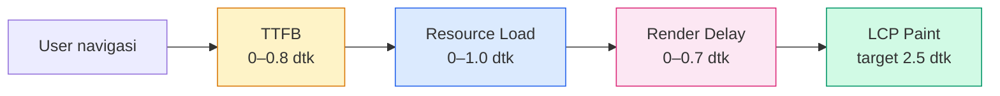
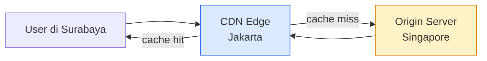

import { Section, Box, Steps, Step, Recap, CardGrid, Card, Chip, Hero, Compare } from "@components";

<Hero eyebrow="Chapter 03 &middot; Web Vitals" title="<em>Largest Contentful Paint</em>" sub="Mengapa loading terasa lambat, siapa elemen LCP-nya, dan cara mempercepat dari TTFB sampai render">
  <p>LCP adalah metrik yang paling langsung merepresentasikan pengalaman loading dari sudut pandang pengguna. Chapter ini membedah apa yang browser anggap sebagai elemen LCP, mengapa sebuah halaman bisa lambat di bagian mana saja dalam perjalanan bytes dari server ke layar, dan bagaimana cara memperbaiki tiap fase secara konkret.</p>
  <Fragment slot="meta">
    <Chip icon="activity">LCP &amp; Loading Performance</Chip>
    <Chip icon="clock">~35 menit baca</Chip>
  </Fragment>
</Hero>

Sebelum kamu bisa mempercepat LCP, kamu harus tahu persis apa yang diukur — dan lebih penting lagi, apa yang *tidak* diukur. Banyak developer salah menduga elemen LCP mereka, lalu mengoptimasi gambar yang salah sementara bottleneck sebenarnya ada di server response time. Chapter ini bergerak dari definisi yang presisi ke diagnosis yang sistematis, lalu ke solusi yang tepat sasaran.

Urutan dalam chapter ini dirancang dengan sengaja: kita mulai dari definisi (apa itu LCP), lalu model mental (empat fase), lalu alat diagnosis (DevTools dan PSI), baru kemudian solusi konkret (gambar dan infrastruktur). Kalau kamu langsung loncat ke solusi tanpa memahami fase mana yang jadi bottleneck di situsmu, optimasimu mungkin tidak menghasilkan perubahan yang berarti.

<Section num="01" id="apa-itu-lcp" title="Apa yang Dihitung Browser sebagai LCP?" sub="Definisi presisi sebelum kita mengoptimasi">

<p class="lead">LCP melaporkan <em>render time</em> dari konten terbesar yang terlihat di viewport saat halaman pertama kali dimuat — bukan elemen terbesar di seluruh halaman, tapi yang paling besar di area yang terlihat user tanpa scroll.</p>

Kata "terbesar" di sini berarti ukuran area yang ditampilkan di layar, bukan ukuran file. Sebuah gambar banner 200KB yang mengisi setengah layar akan menjadi kandidat LCP yang jauh lebih kuat daripada gambar thumbnail 2MB yang tersembunyi di bawah fold. Browser menghitung luas piksel yang ter-render, lalu mencatat waktu ketika elemen dengan luas terbesar pertama kali selesai dirender.

Browser tidak menghitung LCP hanya sekali. Ia memperbarui kandidat LCP secara berkelanjutan selama loading berlangsung. Misalnya, pertama-tama sebuah heading besar muncul dan menjadi kandidat LCP, kemudian gambar hero yang lebih besar muncul beberapa ratus milidetik kemudian — browser menggeser kandidat ke gambar tersebut. Proses pembaruan kandidat ini berlangsung hingga **user pertama kali berinteraksi** dengan halaman (click, tap, atau keypress). Setelah ada interaksi, nilai LCP dianggap final karena user sudah mulai terlibat dan pengalaman loading awal sudah terbentuk.

<div class="tbl-wrap"><table>
<thead>
<tr>
<th>Tipe Elemen</th>
<th>Dihitung sebagai LCP?</th>
<th>Catatan</th>
</tr>
</thead>
<tbody>
<tr>
<td><code>&lt;img&gt;</code></td>
<td>Ya</td>
<td>Elemen gambar standar, kandidat paling umum</td>
</tr>
<tr>
<td><code>&lt;image&gt;</code> dalam SVG</td>
<td>Ya</td>
<td>Gambar yang di-embed di dalam elemen SVG</td>
</tr>
<tr>
<td><code>&lt;video&gt;</code> dengan poster</td>
<td>Ya (poster-nya)</td>
<td>Frame poster video dihitung, bukan frame video itu sendiri</td>
</tr>
<tr>
<td>Elemen dengan <code>background-image</code> via CSS</td>
<td>Ya</td>
<td>Hanya URL gambar, bukan gradient CSS</td>
</tr>
<tr>
<td>Text block (<code>p</code>, <code>h1</code>–<code>h6</code>, <code>li</code>, dll)</td>
<td>Ya</td>
<td>Blok teks besar bisa menjadi LCP jika tidak ada gambar yang lebih besar</td>
</tr>
<tr>
<td>Elemen dengan <code>opacity: 0</code></td>
<td>Tidak</td>
<td>Browser menganggap elemen tidak terlihat oleh user</td>
</tr>
<tr>
<td>Elemen di luar viewport (below fold)</td>
<td>Tidak</td>
<td>Hanya konten yang visible tanpa scroll yang diperhitungkan</td>
</tr>
<tr>
<td><code>&lt;svg&gt;</code> langsung (tanpa <code>&lt;image&gt;</code>)</td>
<td>Tidak</td>
<td>SVG sebagai vektor tidak termasuk kandidat LCP</td>
</tr>
<tr>
<td><code>&lt;canvas&gt;</code></td>
<td>Tidak</td>
<td>Canvas tidak dilacak oleh LCP API</td>
</tr>
<tr>
<td>CSS gradient</td>
<td>Tidak</td>
<td>Hanya <code>url()</code> image yang dihitung, bukan <code>linear-gradient</code></td>
</tr>
</tbody>
</table></div>

<Box variant="analogy" icon="🧩" label="Analogi: Bingkai utama film">
<p>LCP seperti mengukur kapan <em>bingkai utama</em> sebuah film pertama kali muncul jelas di layar — bukan ketika loading bar selesai, bukan ketika semua subtitle dimuat, tapi tepat saat adegan inti yang kamu tunggu akhirnya terlihat. Browser mencari "adegan inti" halamanmu: elemen visual terbesar yang membuat user merasa halaman sudah "ada" di depan mereka.</p>
</Box>

Cara memeriksa elemen LCP di DevTools sangat mudah. Buka **Performance panel**, klik **Record**, refresh halaman, lalu klik tombol stop. Di timeline yang muncul, cari entry bertuliskan "Largest Contentful Paint" di bagian bawah flame chart. Klik entry tersebut untuk melihat detail: browser akan menampilkan elemen mana yang dipilih sebagai LCP, beserta timestamp-nya.

Ada cara lebih cepat untuk mengecek elemen LCP tanpa merekam performance trace penuh. Buka **Elements panel**, klik elemen yang kamu curigai sebagai LCP, lalu perhatikan annotation di atas elemen tersebut di panel rendering. Alternatifnya, gunakan snippet JavaScript di Console:

```js
// Cara cepat melihat LCP entry di console
new PerformanceObserver((entryList) => {
  const entries = entryList.getEntries();
  const lastEntry = entries[entries.length - 1];
  console.log("LCP element:", lastEntry.element);
  console.log("LCP time:", lastEntry.startTime, "ms");
}).observe({ type: "largest-contentful-paint", buffered: true });
```

Dengan snippet ini, kamu bisa tahu persis elemen mana yang dianggap browser sebagai LCP dan pada milidetik berapa elemen itu selesai dirender.

<Box variant="note" icon="📝" label="Yang baru kamu pelajari">
<p>Browser memperbarui kandidat LCP selama loading berlangsung dan memfinalkannya saat user berinteraksi pertama kali. Elemen yang tidak terlihat di viewport, punya opacity 0, atau berupa canvas/SVG langsung tidak dihitung. Kandidat terkuat biasanya adalah gambar hero, thumbnail video (poster), atau heading besar yang muncul di atas fold.</p>
</Box>

Mengetahui elemen mana yang menjadi LCP hanyalah langkah pertama. Pertanyaan selanjutnya: mengapa elemen itu lambat muncul? Untuk menjawab ini, kita perlu memahami empat fase yang dilewati setiap byte dari server ke layar.

</Section>

<Section num="02" id="empat-fase-lcp" title="Empat Fase LCP: TTFB sampai Render" sub="Model mental untuk memahami di mana waktu hilang">

<p class="lead">Setiap milidetik LCP dapat dipetakan ke dalam satu dari empat fase yang berurutan. Mengidentifikasi fase mana yang paling besar di situsmu adalah syarat utama sebelum memilih strategi optimasi.</p>

Bayangkan perjalanan sebuah gambar hero dari server ke layar user. Perjalanan ini melewati empat tahapan yang masing-masing bisa menjadi bottleneck. Memahami keempat fase ini akan mengubah cara kamu melihat angka LCP dari sekadar "angka besar" menjadi peta yang menunjukkan di mana waktu sebenarnya hilang.

**Fase 1 — Time to First Byte (TTFB)** adalah waktu dari saat browser mengirimkan HTTP request hingga byte pertama response HTML tiba. TTFB mencakup: DNS lookup, TCP handshake, TLS negotiation, server processing (termasuk database query, rendering template, dll), dan waktu transmisi byte pertama melalui jaringan. TTFB yang baik adalah di bawah **0.8 detik**. Jika TTFB-mu sudah 1.5 detik, LCP tidak mungkin di bawah 2.5 detik meskipun semua optimasi lain sudah sempurna.

**Fase 2 — Resource Load Time** adalah waktu yang dibutuhkan untuk mendownload sumber daya yang menjadi elemen LCP — biasanya sebuah gambar. Fase ini dimulai saat browser menemukan elemen LCP (baik dari parsing HTML maupun setelah CSS/JS selesai diproses), lalu browser mengirimkan request untuk gambar tersebut, dan menunggu seluruh gambar selesai didownload. Ukuran file gambar, kecepatan koneksi user, dan jarak ke server semuanya berkontribusi di sini.

**Fase 3 — Element Render Delay** adalah gap antara saat resource sudah selesai didownload hingga browser benar-benar merender elemen LCP ke layar. Gap ini seringkali disebabkan oleh JavaScript yang masih memblokir main thread, CSS yang belum selesai diproses, atau hydration dari framework JavaScript (React, Vue, dll) yang menguasai CPU sebelum browser sempat melukis piksel.

**Fase 4 — Subpart untuk LCP Teks** adalah fase tambahan yang relevan ketika elemen LCP bukan gambar melainkan blok teks. Untuk teks, browser menghitung: `input_delay` (waktu tunggu main thread tersedia), `processing_time` (waktu rendering teks), dan `presentation_delay` (waktu dari compositing ke tampil di layar).


<p class="fig-cap"><b>Empat fase LCP.</b> Masing-masing fase memiliki anggaran waktu ideal agar total LCP tidak melampaui 2.5 detik. TTFB dominan di fase awal, Resource Load di tengah, dan Render Delay di akhir.</p>

Target breakdown yang ideal untuk LCP 2.5 detik adalah sebagai berikut:

<div class="tbl-wrap"><table>
<thead>
<tr>
<th>Fase</th>
<th>Target Waktu</th>
<th>Kontributor Utama</th>
</tr>
</thead>
<tbody>
<tr>
<td>TTFB</td>
<td>&lt; 0.8 detik</td>
<td>Server speed, database, CDN edge, DNS</td>
</tr>
<tr>
<td>Resource Load Time</td>
<td>&lt; 1.0 detik</td>
<td>Ukuran gambar, format, bandwidth user</td>
</tr>
<tr>
<td>Element Render Delay</td>
<td>&lt; 0.7 detik</td>
<td>Render-blocking CSS/JS, hydration delay</td>
</tr>
<tr>
<td><strong>Total LCP</strong></td>
<td><strong>&lt; 2.5 detik</strong></td>
<td>Semua fase digabung</td>
</tr>
</tbody>
</table></div>

Perlu dicatat bahwa fase-fase ini tidak selalu berjalan secara sekuensial yang kaku. Browser melakukan banyak hal secara paralel. Namun secara konseptual, model empat fase ini sangat berguna untuk mendiagnosis di mana bottleneck berada karena masing-masing fase memiliki alat ukur dan solusi yang berbeda.

<Box variant="tip" icon="💡" label="Pro tip: Identifikasi fase sebelum memilih solusi">
<p>Sebelum memilih strategi optimasi, identifikasi dulu fase mana yang paling besar di situsmu. TTFB tinggi butuh solusi server-side (caching, CDN, query optimization), sedangkan resource load tinggi butuh solusi gambar (format, kompresi, preload). Memilih solusi yang salah bisa menghabiskan waktu berminggu-minggu tanpa hasil yang terlihat di LCP.</p>
</Box>

Penting juga untuk membedakan bahwa Resource Load Time hanya ada kalau elemen LCP-mu adalah resource eksternal (gambar, video poster). Jika LCP-mu adalah blok teks besar, fase 2 tidak ada — teks dirender langsung dari HTML, sehingga perjalananmu dari TTFB langsung ke Render Delay. Ini berarti situs blog dengan teks besar sebagai LCP memiliki keuntungan struktural: tidak perlu menunggu download gambar.

<Box variant="note" icon="📝" label="Yang baru kamu pelajari">
<p>LCP dapat dipetakan ke empat fase: TTFB, Resource Load, Render Delay, dan (untuk teks) subpart presentasi. Setiap fase memiliki anggaran waktu idealnya sendiri. Mengidentifikasi fase mana yang dominan di situsmu adalah langkah pertama yang wajib sebelum memilih strategi optimasi.</p>
</Box>

Sekarang kita tahu ada empat fase. Tapi bagaimana cara mengetahui fase mana yang paling bermasalah di situsmu? Di section berikutnya kita masuk ke workflow diagnosis yang konkret.

</Section>

<Section num="03" id="diagnosa-lcp" title="Mendiagnosis LCP Lambat" sub="Workflow sistematis dari DevTools sampai PageSpeed Insights">

<p class="lead">Diagnosis LCP yang baik bukan menebak — melainkan mengikuti data dari alat yang tepat sampai ditemukan fase mana yang memakan waktu terbanyak.</p>

Ada dua alat utama yang perlu kamu kuasai untuk mendiagnosis LCP: Chrome DevTools (untuk lab data lokal yang detail) dan PageSpeed Insights / Lighthouse (untuk field data dan rekomendasi). Keduanya saling melengkapi: DevTools memberi detail milidetik per milidetik, sedangkan PSI memberi gambaran dari data pengguna nyata di berbagai kondisi jaringan dan perangkat.

**Workflow DevTools untuk diagnosis LCP** dimulai dari Performance panel. Berikut langkah-langkahnya:

<Steps>
<Step>
Buka Chrome DevTools (F12), pilih tab **Performance**. Pastikan kamu dalam mode Incognito untuk menghindari cache dan ekstensi yang bisa mempengaruhi hasil.
</Step>
<Step>
Klik tombol **Record** (lingkaran merah), kemudian refresh halaman dengan Ctrl+Shift+R (hard refresh). Tunggu halaman selesai loading, lalu klik **Stop**.
</Step>
<Step>
Di timeline yang muncul, scroll ke bawah ke bagian **Timings**. Kamu akan melihat marker berwarna untuk FCP, LCP, dan metrik lainnya. Klik marker **LCP** untuk melihat timestamp dan highlight elemen.
</Step>
<Step>
Lihat bagian **Main** (flame chart) di bawah Timings. Identifikasi aktivitas apa yang sedang terjadi selama fase LCP berlangsung — apakah ada long task JavaScript, apakah ada banyak network request yang aktif, atau apakah browser sedang idle menunggu response?
</Step>
<Step>
Klik entry "Largest Contentful Paint" di panel Summary untuk melihat detail: elemen apa yang dipilih, URL resource-nya (jika gambar), dan breakdown waktu per sub-fase.
</Step>
</Steps>

**Workflow PageSpeed Insights** lebih mudah diakses. Buka [pagespeed.web.dev](https://pagespeed.web.dev), masukkan URL situsmu, dan tunggu laporan. Di hasil laporan, cari kartu **"LCP element"** yang menampilkan elemen HTML mana yang dipilih sebagai LCP di halaman tersebut. Perhatikan juga rekomendasi di bawah: "Reduce initial server response time" mengindikasikan masalah TTFB, "Efficiently encode images" atau "Serve images in next-gen formats" mengindikasikan masalah Resource Load.

Berikut adalah pola ciri khas untuk masing-masing fase:

<div class="tbl-wrap"><table>
<thead>
<tr>
<th>Fase Bermasalah</th>
<th>Ciri di DevTools</th>
<th>Rekomendasi PSI yang Muncul</th>
</tr>
</thead>
<tbody>
<tr>
<td>TTFB Tinggi</td>
<td>Panjangnya garis biru muda di network waterfall sebelum byte pertama tiba; server response time &gt; 800ms</td>
<td>"Reduce initial server response time (TTFB)"</td>
</tr>
<tr>
<td>Resource Load Tinggi</td>
<td>Request gambar LCP memiliki bar yang panjang; ukuran gambar besar (terlihat di Network panel)</td>
<td>"Efficiently encode images", "Serve images in next-gen formats", "Avoid enormous network payloads"</td>
</tr>
<tr>
<td>Render Delay Tinggi</td>
<td>Gambar sudah selesai didownload tapi LCP belum muncul; ada long task JS di main thread setelah download selesai</td>
<td>"Eliminate render-blocking resources", "Reduce JavaScript execution time"</td>
</tr>
</tbody>
</table></div>

<Box variant="warn" icon="⚠️" label="Jebakan umum: lazy loading pada elemen LCP">
<p>Lazy loading gambar adalah teknik yang sangat baik untuk gambar di bawah fold — tapi jika kamu menerapkan <code>loading="lazy"</code> pada gambar yang menjadi elemen LCP, kamu secara aktif menyuruh browser untuk <em>menunda</em> loading gambar yang paling penting. Browser tidak akan memprioritaskan gambar tersebut, sehingga LCP melambat drastis. Selalu pastikan elemen LCP menggunakan <code>loading="eager"</code> (default) atau tidak ada atribut <code>loading</code> sama sekali.</p>
</Box>

Ada satu gotcha lain yang sering terlewat: ketika elemen LCP adalah gambar yang diset via CSS `background-image`, browser tidak bisa menemukan gambar tersebut dari parsing HTML saja. Browser harus dulu mengunduh dan memproses CSS, menemukan rule `background-image`, baru kemudian bisa mulai mengunduh gambar. Ini menambah delay yang tidak perlu. Solusinya adalah menggunakan `<link rel="preload">` di `<head>` untuk memberitahu browser tentang gambar tersebut lebih awal.

```html
<!-- Memberitahu browser sejak dini tentang gambar background LCP -->
<link rel="preload" as="image" href="/images/hero-bg.webp" />

<!-- SALAH: ini menunda loading gambar LCP -->


<!-- BENAR: tanpa lazy untuk elemen LCP -->

```

<Box variant="note" icon="📝" label="Yang baru kamu pelajari">
<p>Diagnosis LCP yang efektif menggunakan Performance panel DevTools untuk memahami timeline detail, dan PSI untuk melihat pattern dari real-user data. Ciri bottleneck per fase berbeda-beda: TTFB tinggi menunjuk ke server/CDN, resource load tinggi menunjuk ke ukuran gambar, render delay tinggi menunjuk ke blocking resources. Jangan lazy load elemen LCP.</p>
</Box>

Setelah kamu tahu fase mana yang bermasalah, saatnya bertindak. Section berikutnya membahas solusi konkret untuk bottleneck yang paling umum: gambar yang terlalu besar atau lambat diload.

</Section>

<Section num="04" id="optimasi-gambar" title="Optimasi Gambar: Format, Dimensi, Preload" sub="Dari format modern sampai fetchpriority yang sering terlupa">

<p class="lead">Gambar adalah elemen LCP yang paling umum, dan ada empat dimensi optimasi yang perlu kamu pertimbangkan: format, ukuran/dimensi, cara loading (preload vs lazy), dan delivery (CDN dengan transformasi otomatis).</p>

Format gambar adalah keputusan yang paling berdampak besar dengan usaha yang relatif kecil. Tiga format yang relevan untuk web modern adalah JPEG, WebP, dan AVIF. JPEG adalah format yang sudah ada sejak lama dan didukung semua browser, cocok sebagai fallback. **WebP** rata-rata menghasilkan file 30–35% lebih kecil dari JPEG dengan kualitas visual yang setara — dan sudah didukung semua browser modern sejak 2020. **AVIF** bahkan lebih agresif lagi: bisa 50% lebih kecil dari JPEG. Namun AVIF memiliki kelemahan: waktu encoding yang sangat lambat (tidak cocok untuk resize on-the-fly di server) dan dukungan browser yang masih lebih terbatas dibanding WebP (belum semua browser mendukung, meski mayoritas modern sudah bisa).

Strategi terbaik adalah menggunakan `<picture>` element dengan multiple source untuk browser memilih format yang mereka dukung:

```html
<picture>
  <!-- Browser yang mendukung AVIF akan menggunakan ini -->
  <source
    srcset="/images/hero-400.avif 400w, /images/hero-800.avif 800w, /images/hero-1200.avif 1200w"
    sizes="(max-width: 640px) 100vw, (max-width: 1024px) 80vw, 1200px"
    type="image/avif"
  />
  <!-- Fallback ke WebP untuk browser yang tidak mendukung AVIF -->
  <source
    srcset="/images/hero-400.webp 400w, /images/hero-800.webp 800w, /images/hero-1200.webp 1200w"
    sizes="(max-width: 640px) 100vw, (max-width: 1024px) 80vw, 1200px"
    type="image/webp"
  />
  <!-- Fallback JPEG untuk browser sangat lama -->
  
</picture>
```

Atribut `fetchpriority="high"` pada elemen LCP adalah sinyal eksplisit ke browser bahwa gambar ini harus diprioritas di atas gambar lain yang ada di halaman. Tanpa atribut ini, browser harus menggunakan heuristiknya sendiri untuk menebak mana gambar yang paling penting — dan browser sering menebak salah, terutama di halaman dengan banyak gambar. Atribut ini didukung di Chrome, Edge, dan Safari modern.

`decoding="async"` adalah optimasi berbeda: ia memberitahu browser bahwa decoding gambar bisa dilakukan di luar main thread, sehingga tidak memblokir rendering konten lain. Kombinasi `fetchpriority="high"` dan `decoding="async"` adalah pasangan yang sangat efektif untuk elemen LCP.

Atribut `srcset` dan `sizes` memungkinkan browser memilih resolusi gambar yang tepat untuk device dan viewport saat ini. Tanpa ini, browser mobile dengan layar 390px akan mengunduh gambar 1200px yang sama dengan browser desktop — boros bandwidth dan memperlambat LCP di mobile. Selalu definisikan setidaknya tiga breakpoint ukuran gambar (kecil/sedang/besar).

<div class="tbl-wrap"><table>
<thead>
<tr>
<th>Format</th>
<th>Kompresi vs JPEG</th>
<th>Browser Support</th>
<th>Encoding Speed</th>
<th>Rekomendasi</th>
</tr>
</thead>
<tbody>
<tr>
<td>JPEG</td>
<td>Baseline</td>
<td>Semua browser</td>
<td>Cepat</td>
<td>Fallback wajib</td>
</tr>
<tr>
<td>WebP</td>
<td>~30–35% lebih kecil</td>
<td>Semua browser modern (2020+)</td>
<td>Cepat</td>
<td>Default untuk semua gambar web</td>
</tr>
<tr>
<td>AVIF</td>
<td>~50% lebih kecil</td>
<td>Chrome, Firefox, Safari 16+</td>
<td>Sangat lambat</td>
<td>Gunakan hanya via CDN yang handle encoding</td>
</tr>
</tbody>
</table></div>

Untuk gambar yang menjadi elemen LCP via CSS `background-image`, kamu tidak bisa menggunakan `fetchpriority` karena itu adalah atribut HTML. Solusinya adalah `<link rel="preload">` di `<head>`:

```html
<head>
  <!-- Preload gambar hero yang diset via CSS background-image -->
  <link
    rel="preload"
    as="image"
    href="/images/hero-bg.webp"
    imagesrcset="/images/hero-bg-640.webp 640w, /images/hero-bg-1280.webp 1280w"
    imagesizes="100vw"
  />
</head>
```

Tag ini memberitahu browser tentang gambar kritis ini bahkan sebelum CSS diproses, sehingga download bisa dimulai lebih awal.

**Image CDN** adalah solusi terbaik untuk mengelola format dan dimensi gambar di skala produksi. Alih-alih menyimpan banyak varian gambar secara manual, Image CDN seperti Cloudinary, Imgix, atau Cloudflare Images menerima gambar asli dari kamu dan melakukan transformasi on-the-fly berdasarkan parameter URL:

```html
<!-- Cloudflare Images: auto-format, auto-dimensi, auto-quality -->

```

Image CDN secara otomatis mengirimkan WebP atau AVIF ke browser yang mendukung, serta menyimpan hasil transformasi di cache edge global. Ini mengeliminasi kebutuhan untuk mengelola format secara manual di pipeline build.

<Box variant="bridge" icon="🌉" label="Jembatan: kompresi API vs kompresi gambar">
<p>Seperti endpoint API Go yang mengirimkan response JSON besar — kamu tidak mengirimkan data mentah, tapi mengkompresi dengan gzip atau menggunakan protocol yang efisien seperti Protobuf. Prinsip yang sama berlaku untuk gambar: jangan kirim piksel mentah resolusi tinggi ke device yang hanya butuh setengahnya. Compress dulu dengan format yang tepat, pilih dimensi yang sesuai viewport, baru kirim. Bandwidth yang tidak terbuang = LCP yang lebih cepat.</p>
</Box>

<Box variant="note" icon="📝" label="Yang baru kamu pelajari">
<p>Optimasi gambar untuk LCP mencakup: pilih format modern (WebP default, AVIF via CDN), gunakan <code>srcset</code> dan <code>sizes</code> untuk responsive images, tambahkan <code>fetchpriority="high"</code> pada elemen LCP, preload gambar background via <code>&lt;link rel="preload"&gt;</code>, dan jangan lazy load elemen LCP. Image CDN menyederhanakan semua ini di produksi.</p>
</Box>

Optimasi gambar menangani fase Resource Load. Tapi kalau Render Delay masih tinggi, masalahnya ada di lapisan lain: CSS dan JS yang memblokir rendering, dan infrastruktur yang terlalu jauh dari user. Section terakhir sebelum ringkasan membahas kedua hal ini.

</Section>

<Section num="05" id="render-blocking-cdn" title="Render-Blocking, CDN, dan Caching" sub="Menghilangkan hambatan di antara resource siap dan piksel terlukis">

<p class="lead">Fase Render Delay yang tinggi berarti resource LCP sudah siap tapi browser belum bisa merender — biasanya karena CSS atau JS memblokir main thread. CDN dan caching menangani masalah yang berbeda: mempercepat pengiriman bytes ke user dari server yang lebih dekat.</p>

**Render-Blocking CSS** adalah salah satu kontributor terbesar Render Delay yang sering luput dari perhatian. Browser memiliki aturan dasar: ia tidak akan merender apapun ke layar sampai semua stylesheet di `<head>` sudah selesai didownload dan diproses. Alasannya masuk akal — browser khawatir bahwa stylesheet yang belum diproses bisa mengubah tampilan elemen yang sudah dirender, sehingga lebih aman untuk menunggu semua siap. Tapi ini berarti setiap kilobyte CSS tambahan di `<head>` menambah waktu tunggu sebelum LCP bisa muncul.

Solusi untuk render-blocking CSS adalah **Critical CSS**: pisahkan CSS yang dibutuhkan untuk merender "above the fold" (area yang terlihat tanpa scroll), inline langsung di `<style>` tag di `<head>`, dan muat sisa CSS secara non-blocking. Lighthouse bahkan menyediakan audit "Eliminate render-blocking resources" yang mencantumkan file mana saja yang menjadi masalah.

```html
<head>
  <!-- Critical CSS diinline langsung — tidak perlu network request -->
  <style>
    /* Hanya CSS untuk elemen above-fold: nav, hero, dan LCP element */
    .hero { display: grid; grid-template-columns: 1fr; }
    .hero-img { width: 100%; height: auto; object-fit: cover; }
    /* ... sekitar 1-3KB CSS kritis ... */
  </style>

  <!-- Sisa CSS dimuat non-blocking dengan trik media="print" -->
  <link rel="stylesheet" href="/styles/main.css" media="print" onload="this.media='all'" />
  <noscript><link rel="stylesheet" href="/styles/main.css" /></noscript>
</head>
```

**Render-Blocking JavaScript** adalah masalah serupa tapi berbeda mekanisme. Tag `<script>` tanpa atribut `defer` atau `async` memblokir parsing HTML — browser berhenti membaca HTML, mendownload script, mengeksekusinya, baru melanjutkan parsing. Satu file JavaScript besar tanpa `defer` bisa menunda LCP ratusan milidetik.

```html
<!-- SALAH: memblokir parsing HTML -->
<script src="/js/analytics.js"></script>
<script src="/js/chat-widget.js"></script>

<!-- BENAR: defer mengeksekusi script setelah HTML selesai diparsing -->
<script src="/js/analytics.js" defer></script>

<!-- async untuk script yang tidak bergantung pada DOM -->
<script src="/js/chat-widget.js" async></script>
```

Perbedaan `defer` dan `async`: `defer` mempertahankan urutan eksekusi dan menjalankan script setelah HTML selesai diparsing; `async` menjalankan script segera setelah download selesai tanpa menunggu HTML, tanpa jaminan urutan. Untuk kebanyakan script aplikasi, `defer` adalah pilihan yang lebih aman.

**CDN (Content Delivery Network)** menangani masalah fundamental yang berbeda: jarak fisik antara server asal dan user. Ketika user di Surabaya mengakses situsmu yang server-nya di Singapore, setiap request harus melakukan round-trip Singapore–Surabaya–Singapore, yang menambah latency 20–50ms per request. CDN menyimpan salinan asetmu di ratusan "edge node" di seluruh dunia, sehingga user di Surabaya bisa mengambil asset dari node CDN terdekat di Surabaya atau Jakarta — latency turun menjadi 1–5ms.


<p class="fig-cap"><b>CDN Edge Caching.</b> Saat cache hit di edge node terdekat, user mendapatkan asset tanpa perlu request ke origin server. TTFB turun drastis dari ratusan milidetik menjadi puluhan milidetik.</p>

Beberapa pilihan CDN populer untuk web:

<CardGrid cols={3}>
  <Card><h4>Cloudflare</h4><p>Edge network terbesar, free tier tersedia, otomatis cache HTML dan assets, integrasi mudah via DNS proxy. Ideal untuk semua ukuran proyek.</p></Card>
  <Card><h4>Vercel Edge Network</h4><p>Terintegrasi langsung dengan deployment Vercel/Next.js. Static assets dan ISR pages otomatis di-cache di edge global tanpa konfigurasi tambahan.</p></Card>
  <Card><h4>AWS CloudFront</h4><p>CDN AWS yang terintegrasi dengan S3, EC2, dan Lambda@Edge. Fleksibel dan sangat bisa dikonfigurasi, tapi setup lebih kompleks dari Cloudflare.</p></Card>
</CardGrid>

**Cache-Control headers** adalah cara kamu memberitahu CDN (dan browser) berapa lama sebuah resource boleh disimpan di cache sebelum perlu diambil ulang dari origin:

```http
# Untuk static assets dengan hash di nama file (CSS, JS, gambar)
# File berubah = nama file berubah, jadi bisa di-cache selamanya
Cache-Control: public, max-age=31536000, immutable

# Untuk HTML — jangan cache lama karena konten bisa berubah
Cache-Control: public, max-age=0, must-revalidate

# Untuk API response yang bisa di-cache singkat
Cache-Control: public, max-age=60, s-maxage=300
```

`max-age` mendefinisikan berapa detik resource bisa di-cache di browser. `s-maxage` (shared max-age) mendefinisikan berapa detik resource bisa di-cache di CDN/proxy. Dengan `immutable`, browser tidak akan mencoba memvalidasi ulang resource yang sudah di-cache meskipun `max-age`-nya belum habis — ini menghilangkan round-trip conditional request yang tidak perlu.

**SSR vs SSG untuk LCP** adalah keputusan arsitektur yang berdampak besar. Static Site Generation (SSG) menghasilkan HTML yang sudah jadi saat build time, sehingga TTFB bisa sangat rendah (server hanya mengirim file statis yang sudah di-cache di CDN). Server-Side Rendering (SSR) menghasilkan HTML di server saat setiap request masuk, yang berarti TTFB bergantung pada kecepatan server processing. Jika halamanmu tidak harus dinamis per-user, SSG atau ISR (Incremental Static Regeneration) adalah pilihan terbaik untuk LCP.

<Box variant="bridge" icon="🌉" label="Jembatan: Redis cache untuk API vs CDN untuk web">
<p>CDN untuk web bekerja persis seperti Redis cache untuk API Go kamu. Tanpa cache, setiap request ke endpoint <code>/api/products</code> harus hit database, query, serialize, dan respond — mungkin 100–300ms. Dengan Redis, response yang sudah disiapkan bisa dikembalikan dalam 1–2ms. CDN bekerja dengan cara yang sama: tanpa CDN, setiap request gambar atau HTML harus sampai ke origin server; dengan CDN, response diambil dari edge node terdekat dalam milidetik. Prinsipnya sama: simpan hasil kerja dekat dengan peminta, bukan ulangi pekerjaan dari awal setiap kali.</p>
</Box>

<Box variant="warn" icon="⚠️" label="Gotcha: CDN tidak membantu jika HTML tidak di-cache">
<p>CDN sangat efektif untuk static assets (CSS, JS, gambar). Tapi jika HTML halaman kamu tidak bisa di-cache di CDN (karena konten dinamis per-user), CDN hanya akan mem-proxy request ke origin — TTFB tetap sama dengan tanpa CDN. Pisahkan layer: gunakan CDN untuk assets, dan pertimbangkan caching di application layer (Redis, Varnish) untuk HTML yang semi-dinamis.</p>
</Box>

<Box variant="note" icon="📝" label="Yang baru kamu pelajari">
<p>Render Delay tinggi seringkali disebabkan render-blocking CSS dan JS. Solusinya: Critical CSS inline, stylesheet non-kritis dengan <code>media="print"</code> trick, dan tambahkan <code>defer</code>/<code>async</code> pada semua <code>&lt;script&gt;</code>. CDN mengurangi TTFB dengan menyimpan asset di edge node dekat user. Cache-Control headers yang tepat memaksimalkan efisiensi cache. SSG atau ISR memberikan TTFB terbaik untuk halaman yang tidak harus dinamis per-request.</p>
</Box>

Kita sudah mencakup seluruh perjalanan LCP — dari definisi, model empat fase, cara diagnosis, optimasi gambar, hingga infrastruktur. Saatnya merangkum semua yang paling penting untuk menempel.

</Section>

<Section num="06" id="ringkasan" title="Ringkasan" sub="Yang wajib menempel dari chapter ini">

<p class="lead">LCP adalah metrik yang paling langsung merepresentasikan kapan halaman terasa "sudah ada" bagi user. Menguasainya berarti menguasai empat fase, mendiagnosis dengan data, dan memilih solusi yang tepat untuk fase yang tepat.</p>

Chapter ini telah membawa kamu dari definisi presisi (elemen apa yang dihitung browser sebagai LCP dan mana yang tidak), ke model empat fase yang memungkinkan diagnosis yang sistematis, ke workflow konkret di DevTools dan PSI untuk menemukan bottleneck, hingga ke solusi aktual untuk dua kategori masalah terbesar: gambar yang tidak optimal dan infrastruktur yang tidak efisien. Urutan ini penting — tanpa memahami model dan diagnosis, kamu bisa menghabiskan waktu mengoptimasi hal yang salah.

<Recap title="Yang Wajib Menempel">
<ul>
<li>LCP mengukur render time elemen konten terbesar yang <em>visible di viewport</em> — bukan elemen terbesar di seluruh halaman. Elemen dengan opacity 0, di luar viewport, atau berupa canvas/SVG tidak dihitung.</li>
<li>Browser memperbarui kandidat LCP selama loading berlangsung dan memfinalkannya saat user pertama kali berinteraksi. Kandidat yang terakhir diperbarui adalah nilai LCP akhir.</li>
<li>Ada empat fase: TTFB (target &lt;0.8s), Resource Load (target &lt;1.0s), Render Delay (target &lt;0.7s), dan total LCP harus di bawah 2.5 detik untuk dianggap "Good" oleh Core Web Vitals.</li>
<li>Diagnosis dimulai dari menemukan fase mana yang paling besar. TTFB tinggi → masalah server/CDN. Resource Load tinggi → masalah format/ukuran gambar. Render Delay tinggi → masalah blocking CSS/JS atau hydration.</li>
<li>Jangan lazy load elemen LCP. Gunakan <code>fetchpriority="high"</code> untuk sinyal eksplisit ke browser, dan <code>&lt;link rel="preload"&gt;</code> untuk gambar background via CSS.</li>
<li>Format WebP adalah default yang tepat untuk semua gambar web; AVIF memberikan kompresi lebih baik tapi sebaiknya dilayani via Image CDN yang handle encoding. Selalu gunakan <code>srcset</code> dan <code>sizes</code> untuk responsive images.</li>
<li>Render-blocking CSS diselesaikan dengan Critical CSS inline + non-blocking load untuk sisa stylesheet. Render-blocking JS diselesaikan dengan atribut <code>defer</code> atau <code>async</code>.</li>
<li>CDN bekerja seperti Redis cache untuk API: memindahkan asset mendekati user mengurangi latency secara dramatis. Cache-Control dengan <code>immutable</code> untuk hashed assets dan <code>max-age=0</code> untuk HTML adalah kombinasi yang tepat.</li>
</ul>
</Recap>

Di **Chapter 4** kita beralih ke **Interaction to Next Paint (INP)** — metrik yang mengukur responsivitas halaman saat user berinteraksi. Jika LCP tentang kecepatan loading, INP tentang kecepatan reaksi: seberapa cepat halaman merespons klik, tap, dan keypress. Kita akan membedah bagaimana main thread yang sibuk merusak pengalaman interaksi, dan cara mengoptimasi JavaScript agar halaman terasa responsif bahkan di perangkat low-end.

</Section>
