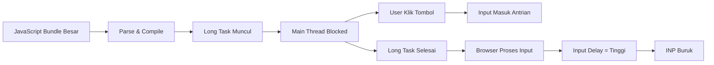
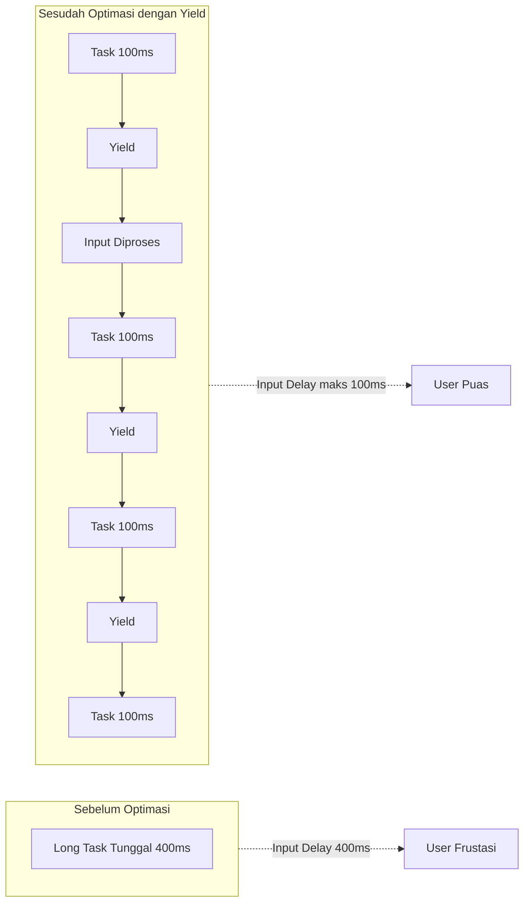

import { Section, Box, Steps, Step, Recap, CardGrid, Card, Chip, Hero, Compare } from "@components";

<Hero eyebrow="Chapter 04 &middot; Web Vitals" title="<em>Interaction</em> to Next Paint" sub="Tiga fase interaksi, long tasks, dan cara membuat setiap klik terasa instan">
  <p>INP (Interaction to Next Paint) adalah metric paling jujur dalam mengukur seberapa responsif halaman web kamu. Berbeda dari pendahulunya FID, INP mengawasi <em>setiap</em> interaksi user — dari klik pertama hingga ketikan terakhir — dan melaporkan nilai representatif dari semua itu.</p>
  <Fragment slot="meta">
    <Chip icon="activity">Responsivitas &amp; INP</Chip>
    <Chip icon="clock">~34 menit baca</Chip>
  </Fragment>
</Hero>

Bab sebelumnya membahas visual stability dengan CLS. Kini kita beralih ke dimensi ketiga kualitas user experience: **responsivitas**. Responsivitas bukan hanya soal apakah halaman cepat dimuat — ini soal seberapa cepat halaman bereaksi ketika user menekan tombol, mengetik di form, atau melakukan tap di layar sentuh.

INP menggantikan FID sebagai Core Web Vital resmi sejak 12 Maret 2024. Pergantian ini bukan sekadar rebranding — ini pergeseran paradigma dalam cara kita mengukur dan memahami pengalaman interaktif. Chapter ini akan membongkar arsitektur INP dari tiga fasenya, mengidentifikasi penyebab utama skor buruk, dan memberikan teknik konkret yang bisa langsung kamu terapkan di proyek manapun.

<Section num="01" id="dari-fid-ke-inp" title="Dari FID ke INP: Mengapa Diganti?" sub="Evolusi metric responsivitas dan alasan INP lebih representatif">

<p class="lead">FID (First Input Delay) hanya mengukur satu momen — respons pertama kali user menyentuh halaman — sementara INP mengukur semua interaksi sepanjang hidup sebuah halaman, memberikan gambaran yang jauh lebih akurat tentang pengalaman nyata pengguna.</p>

Bayangkan kamu mengevaluasi kinerja seorang kasir supermarket. Kalau kamu hanya mengukur kecepatan transaksi pertama di pagi hari (saat toko baru buka, antrian kosong, kasir segar), kamu mungkin mendapat angka bagus. Tapi itu tidak mencerminkan pengalaman pelanggan yang datang saat jam sibuk, ketika antrian panjang dan kasir sudah kelelahan. FID melakukan hal serupa: ia hanya mengintip satu momen pertama dan mengabaikan sisa hari kerja.

FID didefinisikan sebagai **waktu antara interaksi pertama user dan saat browser mulai memproses event handler tersebut**. Definisi ini punya beberapa kelemahan struktural. Pertama, ia hanya mengukur *input delay* — bukan total waktu hingga perubahan visual muncul di layar. Kedua, ia hanya mengukur interaksi *pertama* selama page load, saat main thread biasanya paling sibuk karena sibuk parsing JavaScript dan membangun DOM. Ketiga, ia sama sekali tidak mengukur interaksi berikutnya — padahal inilah interaksi yang paling sering dilakukan user.

Masalah FID semakin terasa di era **Single Page Application (SPA)**. Halaman React, Vue, atau Angular biasanya sudah lolos FID dengan baik karena interaksi pertama terjadi sebelum hydration selesai (user klik sesuatu dan browser memang sedang idle sejenak). Namun begitu hydration selesai dan user mulai berinteraksi dengan komponen React yang berat — dropdown menu dengan ratusan item, tabel data yang di-filter, form wizard multi-step — performa bisa langsung terjun bebas. FID tidak pernah melihat ini.

**INP hadir untuk menjawab semua gap tersebut.** INP mengamati setiap interaksi (klik, tap, dan penekanan tombol keyboard) sepanjang seluruh page lifecycle. Dari sekian banyak interaksi tersebut, INP mengambil nilai representatif — biasanya nilai terburuk atau mendekati terburuk (percentile ke-98 dari semua interaksi). Dengan cara ini, INP mencerminkan pengalaman user di momen-momen paling kritis.

Threshold INP yang ditetapkan Google sudah memperhitungkan persepsi manusia terhadap responsivitas:

<div class="tbl-wrap"><table><thead><tr><th>Nilai INP</th><th>Status</th><th>Persepsi User</th></tr></thead><tbody><tr><td>≤ 200ms</td><td>Good</td><td>Instan, tidak ada jeda terasa</td></tr><tr><td>200ms – 500ms</td><td>Needs Improvement</td><td>Sedikit lag, user mungkin mulai frustrasi</td></tr><tr><td>&gt; 500ms</td><td>Poor</td><td>Jelas lambat, user merasa halaman "macet"</td></tr></tbody></table></div>

Kenapa 200ms? Penelitian psikologi menunjukkan bahwa respons di bawah 100ms terasa instan, 100–300ms terasa cepat namun ada sedikit jeda, dan di atas 300ms user mulai menyadari ada delay. Google memberikan sedikit kelonggaran di 200ms karena ada overhead teknis yang tidak bisa dihindari (misalnya composite layers, browser paint pipeline).

<div class="tbl-wrap"><table><thead><tr><th>Aspek</th><th>FID</th><th>INP</th></tr></thead><tbody><tr><td>Apa yang diukur</td><td>Input delay interaksi pertama saja</td><td>Total duration semua interaksi (klik, tap, keyboard)</td></tr><tr><td>Kapan diukur</td><td>Saat halaman pertama kali dimuat</td><td>Sepanjang seluruh page lifecycle</td></tr><tr><td>Nilai yang dilaporkan</td><td>Single value dari 1 interaksi</td><td>Nilai representatif (worst/near-worst) dari semua interaksi</td></tr><tr><td>Siapa yang terpengaruh</td><td>Semua halaman web (terutama page load)</td><td>Terutama SPA &amp; halaman interaktif kompleks</td></tr><tr><td>Status (2024)</td><td>Dihapus dari Core Web Vitals</td><td>Core Web Vital resmi sejak Maret 2024</td></tr><tr><td>Blind spot</td><td>Tidak mengukur post-hydration interactions</td><td>Tidak mengukur interaksi non-discrete (scroll)</td></tr></tbody></table></div>

<Box variant="analogy" icon="🧩" label="Analogi: Penilaian Kasir Supermarket"><p>FID seperti mengukur waktu kasir pertama kali merespons pelanggan di pagi hari — ketika toko baru buka dan antrian masih kosong. INP mengukur semua transaksi di kasir selama toko buka dari pagi hingga malam, lalu melaporkan transaksi yang paling lambat. Barulah kita tahu apakah kasir tersebut konsisten cepat atau hanya "pura-pura bagus" di momen pertama.</p></Box>

Penting untuk dicatat: INP tidak mengukur *scroll* dan *hover*, karena kedua interaksi tersebut tidak menghasilkan visual feedback yang diskrit. INP fokus pada **interaksi diskrit** — klik tombol, ketukan di layar, penekanan tombol keyboard — yang semuanya menghasilkan perubahan UI yang bisa diukur waktunya.

<Box variant="note" icon="📝" label="Yang baru kamu pelajari"><p>INP menggantikan FID karena FID hanya mengukur interaksi pertama dan hanya input delay-nya saja — bukan representasi nyata pengalaman interaktif user. INP mengukur semua interaksi dan melaporkan nilai representatif, sehingga jauh lebih akurat menggambarkan responsivitas halaman sepanjang user session.</p></Box>

Sekarang setelah kita tahu *mengapa* INP ada, saatnya membedah *bagaimana* INP bekerja dengan memahami tiga fase yang membentuk setiap interaksi.

</Section>

<Section num="02" id="tiga-fase-inp" title="Tiga Fase: Input Delay, Processing, Presentation" sub="Anatomi satu interaksi dari sentuhan jari hingga pixel berubah">

<p class="lead">Setiap interaksi yang diukur INP terdiri dari tiga fase berurutan: Input Delay (menunggu main thread kosong), Processing Time (menjalankan event handler), dan Presentation Delay (browser me-render perubahan ke layar) — dan ketiganya harus diselesaikan dalam total 200ms.</p>

Ketika user menekan tombol di halamanmu, banyak hal terjadi di balik layar sebelum pixel di layar berubah. Proses ini terdiri dari tiga fase yang benar-benar berbeda sifatnya, penyebabnya, dan cara mengoptimasinya. Memahami ketiga fase ini adalah kunci untuk men-debug INP yang buruk — karena taktik yang berbeda berlaku untuk tiap fase.

**Fase 1: Input Delay** adalah periode antara saat user pertama kali berinteraksi (menekan tombol, mengetuk layar) dan saat browser *mulai* menjalankan event handler JavaScript yang terkait. Selama fase ini, browser tahu ada input, tapi main thread sedang sibuk mengerjakan sesuatu yang lain dan belum bisa "angkat telepon."

Penyebab input delay hampir selalu adalah **main thread yang sedang sibuk** — biasanya karena long task (JavaScript yang berjalan > 50ms tanpa henti), banyak microtask yang antri (Promise chains panjang), atau timer yang menyumbat. Target yang ideal untuk fase ini adalah di bawah 50ms.

**Fase 2: Processing Time** adalah waktu yang dibutuhkan untuk menjalankan event handler itu sendiri — semua JavaScript yang kamu tulis untuk merespons klik tersebut. Ini termasuk manipulasi DOM, perhitungan, memanggil fungsi filter/sort, memperbarui state, dan sebagainya.

Fase ini sepenuhnya dalam kendalimu. Jika event handler kamu melakukan terlalu banyak pekerjaan berat secara sinkronus — query DOM berulang kali, melakukan loop besar, menjalankan algoritma kompleks, atau melakukan synchronous fetch — fase ini akan memakan waktu lama. Target idealnya di bawah 100ms.

**Fase 3: Presentation Delay** adalah waktu yang dibutuhkan browser untuk mengonversi perubahan DOM yang kamu buat menjadi pixel nyata di layar. Ini mencakup proses Style Calculation, Layout, Paint, dan Compositing. Fase ini sering diabaikan developer, tapi bisa menjadi botleneck yang signifikan.

Penyebab presentation delay yang panjang: layout thrashing (membaca dan menulis DOM secara bergantian yang memaksa browser melakukan reflow berulang), terlalu banyak elemen yang perlu di-repaint, animasi yang berjalan di main thread (bukan GPU), dan perubahan CSS yang memicu full layout.

```mermaid
sequenceDiagram
  participant U as User
  participant B as Browser
  participant MT as Main Thread
  participant R as Render Pipeline

  U->>B: Klik tombol [t=0ms]
  Note over B,MT: FASE 1: Input Delay
  MT-->>MT: Sibuk menjalankan long task
  B->>MT: Queue: ada event klik! [t=30ms]
  MT->>MT: Selesai long task [t=45ms]
  Note over MT,R: FASE 2: Processing Time
  MT->>MT: Jalankan onClick handler [t=45ms]
  MT->>MT: Update DOM &amp; state [t=120ms]
  Note over MT,R: FASE 3: Presentation Delay
  MT->>R: Commit DOM changes [t=120ms]
  R->>R: Style → Layout → Paint → Composite
  R->>U: Pixel berubah di layar [t=175ms]
  Note over U,R: Total INP = 175ms [GOOD]
```
<p class="fig-cap"><b>Tiga fase INP.</b> Dari klik user hingga pixel berubah, browser melewati Input Delay, Processing Time, dan Presentation Delay. Total semua fase harus ≤ 200ms untuk skor Good.</p>

Cara termudah untuk melihat breakdown tiga fase ini adalah melalui Chrome DevTools. Buka **Performance panel**, klik record, lakukan interaksi, stop recording. Cari blok berwarna oranye atau merah di track "Main" — hover di atasnya untuk melihat detail. Di bagian bawah panel, tab "Interactions" akan menampilkan setiap interaksi beserta durasi totalnya.

Untuk mengukur INP secara programatik dalam kode, gunakan library `web-vitals`:

```javascript
import { onINP } from 'web-vitals/attribution';

onINP((metric) => {
  const { value, attribution } = metric;

  // Breakdown tiga fase
  const { inputDelay, processingDuration, presentationDelay } = attribution;

  console.log(`INP Total: ${value}ms`);
  console.log(`  Input Delay:        ${inputDelay}ms`);
  console.log(`  Processing Time:    ${processingDuration}ms`);
  console.log(`  Presentation Delay: ${presentationDelay}ms`);

  // Identifikasi fase mana yang menjadi bottleneck
  if (inputDelay > 50) {
    console.warn('Bottleneck: Input Delay — main thread terlalu sibuk');
  }
  if (processingDuration > 100) {
    console.warn('Bottleneck: Processing — event handler terlalu berat');
  }
  if (presentationDelay > 50) {
    console.warn('Bottleneck: Presentation — render pipeline terlalu lambat');
  }
}, { reportAllChanges: true });
```

Perlu diperhatikan: opsi `{ reportAllChanges: true }` membuat callback dipanggil setiap kali INP candidate baru ditemukan — berguna untuk debugging. Di production, kamu bisa menghapus opsi ini agar hanya nilai final yang dilaporkan.

<Box variant="tip" icon="💡" label="Pro Tip: Gunakan DevTools Interaction Breakdown"><p>Di Chrome DevTools Performance panel, setelah merekam sesi interaksi, klik tab <code>Interactions</code> di bagian bawah. Setiap baris menampilkan satu interaksi lengkap dengan color-coded bar: biru tua = input delay, kuning = processing, hijau = presentation. Hover di atas bar untuk melihat angka pasti tiap fase. Ini cara paling cepat untuk menentukan fase mana yang harus dioptimasi.</p></Box>

Ketiga fase ini tidak berdiri sendiri — mereka saling mempengaruhi. Input delay yang panjang biasanya berasal dari long tasks yang seharusnya menjadi bagian dari "fase 3" iterasi sebelumnya. Presentation delay yang panjang bisa memicu layout thrashing yang kemudian memperpanjang input delay berikutnya. Memahami interaksi antar fase ini penting sebelum kita menyelami penyebab paling umum: long tasks.

<Box variant="note" icon="📝" label="Yang baru kamu pelajari"><p>INP terdiri dari tiga fase: Input Delay (main thread sibuk, target &lt; 50ms), Processing Time (event handler berjalan, target &lt; 100ms), dan Presentation Delay (render pipeline, target &lt; 50ms). Library <code>web-vitals</code> dengan attribution API memungkinkan kita melihat breakdown ketiga fase ini untuk debugging yang tepat sasaran.</p></Box>

Fase satu — input delay — hampir selalu disebabkan oleh satu musuh utama: long tasks. Mari kita bedah apa itu long tasks dan mengapa mereka bisa merusak responsivitas.

</Section>

<Section num="03" id="long-tasks" title="Long Tasks dan Main Thread Blocking" sub="Musuh utama responsivitas dan cara mengidentifikasinya">

<p class="lead">Long task adalah tugas JavaScript yang berjalan lebih dari 50ms di main thread tanpa berhenti — selama durasi itu browser tidak bisa memproses input apapun dari user, menjadikannya penyebab utama input delay yang tinggi dan skor INP yang buruk.</p>

Browser web adalah single-threaded dalam hal yang paling penting: **main thread**. Thread tunggal ini bertanggung jawab untuk segalanya — menjalankan JavaScript, menghitung style CSS, melakukan layout, painting, dan juga merespons input user. Ketika main thread sedang menjalankan sebuah task, ia tidak bisa melakukan hal lain, termasuk memproses klik atau ketukan dari user.

Browser mencoba menjaga responsivitas dengan memberikan kesempatan untuk memproses input *di antara* tasks. Setiap kali sebuah task selesai, browser bisa memeriksa: "Ada input user yang perlu diproses?" Inilah mengapa **panjang maksimal sebuah task yang "aman" ditetapkan di 50ms** — batas yang cukup singkat sehingga user tidak menyadari jeda, namun cukup panjang untuk menyelesaikan pekerjaan yang berarti.

Ketika sebuah task melebihi 50ms, ia disebut **Long Task**. Selama long task berjalan, semua input user (klik, tap, keyboard) mengantri di event queue dan menunggu. Inilah yang menciptakan input delay — user sudah menekan tombol, tapi browser baru bisa memrosesnya setelah long task selesai.

Cara mengidentifikasi long tasks di Chrome DevTools sangat mudah: buka Performance panel, klik Record, lakukan beberapa interaksi di halaman, Stop. Di track "Main", long tasks ditampilkan sebagai blok dengan **sudut merah di pojok kanan atas** (disebut "red corner"). Lebar blok menunjukkan durasi — semakin lebar, semakin lama.

```javascript
// Cara mengidentifikasi long tasks secara programatik
// menggunakan PerformanceObserver

const observer = new PerformanceObserver((list) => {
  for (const entry of list.getEntries()) {
    if (entry.duration > 50) {
      console.warn(`Long Task terdeteksi: ${entry.duration.toFixed(0)}ms`);
      console.log('  Attribution:', entry.attribution);
    }
  }
});

observer.observe({ type: 'longtask', buffered: true });
```

Penyebab long tasks yang paling umum di produksi:

1. **Bundle JavaScript yang besar** — semua kode diparse dan dicompile sekaligus saat halaman pertama dimuat
2. **Event handler yang terlalu berat** — melakukan banyak komputasi atau manipulasi DOM secara sinkronus
3. **Hydration SPA** — React, Vue, Angular me-replay semua event listener sekaligus saat pertama kali diaktifkan
4. **Third-party scripts** — analytics, tag manager, chat widget yang berjalan di main thread

Salah satu penyebab long task yang sering tidak disadari adalah **layout thrashing**. Ini terjadi ketika JavaScript membaca properti layout DOM (seperti `offsetHeight`, `getBoundingClientRect()`, `scrollTop`) dan langsung menulis ke DOM (mengubah style, menambah class) dalam loop yang bergantian.

```javascript
// ❌ BURUK: Layout thrashing — tiap iterasi memaksa forced reflow
function updateCardHeights(cards) {
  for (const card of cards) {
    // 1. Baca: paksa browser hitung layout
    const height = card.getBoundingClientRect().height;
    // 2. Tulis: invalidate layout cache
    card.style.height = (height * 1.1) + 'px';
    // Iterasi berikutnya: browser harus hitung ulang layout dari awal!
  }
}

// ✅ BAIK: Batch reads dulu, lalu batch writes
function updateCardHeightsFix(cards) {
  // Fase 1: Baca semua nilai sekaligus
  const heights = Array.from(cards).map(card =>
    card.getBoundingClientRect().height
  );

  // Fase 2: Tulis semua perubahan sekaligus
  cards.forEach((card, i) => {
    card.style.height = (heights[i] * 1.1) + 'px';
  });
}
```

Perbedaan antara dua fungsi di atas bisa sangat dramatis. Versi buruk dengan 100 kartu bisa memakan waktu 800ms+ (100 forced reflow masing-masing ~8ms), sedangkan versi fix hanya ~10ms (1 batch read + 1 batch write).

**`scheduler.yield()`** adalah Web API baru yang tersedia di Chrome 115+ yang secara eksplisit memberikan kesempatan pada browser untuk memproses input di tengah-tengah pekerjaan yang panjang:

```javascript
// scheduler.yield() — yield ke browser di tengah long task
async function processLargeDataset(items) {
  const results = [];

  for (let i = 0; i < items.length; i++) {
    // Proses satu item
    results.push(heavyTransform(items[i]));

    // Yield ke browser setiap 50 item
    // Browser bisa memproses input user di jeda ini
    if (i % 50 === 0) {
      await scheduler.yield();
    }
  }

  return results;
}

// Fallback untuk browser yang belum support scheduler.yield()
function yieldToMain() {
  if ('scheduler' in window && 'yield' in scheduler) {
    return scheduler.yield();
  }
  // Fallback: setTimeout 0 memberikan kesempatan browser memproses events
  return new Promise(resolve => setTimeout(resolve, 0));
}
```

<Box variant="warn" icon="⚠️" label="Gotcha: Hydration SPA adalah Long Task Tersembunyi"><p>React, Vue, dan Angular me-replay seluruh virtual DOM tree dan memasang semua event listener sekaligus saat hydration — proses ini bisa memakan waktu 200–800ms di device mid-range dan seluruhnya berjalan sebagai satu long task besar di main thread. Ini berarti user tidak bisa berinteraksi dengan halaman selama durasi tersebut meskipun halaman sudah terlihat lengkap. Solusinya: selective hydration (React Suspense), streaming SSR, atau progressive hydration per-komponen.</p></Box>


<p class="fig-cap"><b>Rantai sebab-akibat Long Task.</b> Bundle besar memicu long task, memblokir main thread, membuat input user mengantri, menghasilkan input delay tinggi, dan akhirnya skor INP yang buruk.</p>

<div class="tbl-wrap"><table><thead><tr><th>Penyebab Long Task</th><th>Fase INP yang Terpengaruh</th><th>Solusi Utama</th></tr></thead><tbody><tr><td>Bundle JS besar</td><td>Input Delay (saat load)</td><td>Code splitting, tree shaking</td></tr><tr><td>Event handler berat</td><td>Processing Time</td><td>Yield, Web Worker, defer</td></tr><tr><td>Layout thrashing</td><td>Presentation Delay</td><td>Batch reads/writes</td></tr><tr><td>Hydration SPA</td><td>Input Delay (post-load)</td><td>Selective/progressive hydration</td></tr><tr><td>Third-party scripts</td><td>Input Delay (kapan saja)</td><td>Lazy load, facade pattern</td></tr></tbody></table></div>

<Box variant="note" icon="📝" label="Yang baru kamu pelajari"><p>Long task adalah task JavaScript yang berjalan &gt; 50ms dan memblokir main thread — termasuk memproses input user. Layout thrashing (read-write DOM bergantian dalam loop) adalah long task tersembunyi yang mudah diperbaiki dengan batch operations. <code>scheduler.yield()</code> memungkinkan pemecahan long task menjadi bagian-bagian kecil yang memberikan celah bagi browser untuk memproses input.</p></Box>

Long tasks sering kali bersumber dari JavaScript yang terlalu banyak. Sebelum kita bisa mengoptimasi responsivitas, kita perlu memahami biaya nyata dari setiap kilobyte JavaScript yang kita kirim ke browser.

</Section>

<Section num="04" id="biaya-javascript" title="Biaya JavaScript: Parse, Compile, Execute" sub="Mengapa setiap kilobyte JavaScript lebih mahal dari yang kamu kira">

<p class="lead">Setiap kilobyte JavaScript yang dikirim ke browser melewati empat tahap: download, parse, compile ke bytecode, dan execute — dan tidak satu pun dari tahap ini yang gratis, bahkan setelah file di-cache oleh browser.</p>

Ada kesalahpahaman umum di kalangan developer: "kalau sudah di-cache, JavaScript gratis." Ini tidak benar. Meskipun file JavaScript tidak perlu didownload ulang dari server, browser tetap harus **mem-parse dan meng-compile** source code menjadi bytecode setiap kali halaman dibuka (meski ada bytecode caching, ini tidak 100% efektif dan ada overhead tersendiri).

Proses yang dilalui setiap JavaScript file adalah sebagai berikut:

<Steps>
<Step>**Download** — Browser mengunduh file dari server (bisa di-cache, tapi tetap ada validasi)</Step>
<Step>**Parse** — Browser membaca karakter demi karakter dan membangun Abstract Syntax Tree (AST)</Step>
<Step>**Compile** — V8 (atau engine lain) mengkonversi AST menjadi bytecode yang bisa dieksekusi</Step>
<Step>**Execute** — Kode dijalankan, termasuk mendefinisikan fungsi, menginisialisasi variabel, menjalankan module code</Step>
</Steps>

Tahap parse dan compile adalah yang paling mahal dan sering diabaikan dalam diskusi performa. Penelitian Google menunjukkan bahwa **untuk setiap 1MB JavaScript yang diparse, dibutuhkan sekitar 1–4 detik di device mid-range** seperti Moto G Power atau Redmi series yang banyak digunakan pengguna Indonesia. Bandingkan ini dengan MacBook Pro yang bisa memproses hal yang sama dalam 200–400ms — artinya ada selisih **5–10x** antara device kelas atas dan menengah.

```javascript
// Cara mengukur biaya parse JavaScript dengan User Timing API
performance.mark('js-parse-start');

// Import heavy library
import('heavy-data-processing-library').then(({ processData }) => {
  performance.mark('js-parse-end');
  performance.measure('JS Parse Cost', 'js-parse-start', 'js-parse-end');

  const [measure] = performance.getEntriesByName('JS Parse Cost');
  console.log(`Biaya parse library: ${measure.duration.toFixed(0)}ms`);
});
```

Penyumbang biaya JavaScript terbesar yang sering terlewat adalah **third-party scripts**. Google Tag Manager, pixel Facebook, Google Analytics, Hotjar, Intercom, live chat widgets — semuanya berjalan di main thread dan bisa menyumbang 100–500ms blocking time. Satu GTM container dengan 15 tags bisa menghasilkan 4–6 long tasks saat halaman dimuat.

```javascript
// ❌ BURUK: Load analytics script di <head> tanpa defer
// <script src="https://www.googletagmanager.com/gtm.js?id=GTM-XXXXX"></script>

// ✅ BAIK: Lazy load analytics setelah halaman interaktif
// Tunggu sampai user idle baru load script non-kritis
function loadAnalyticsWhenIdle() {
  if ('requestIdleCallback' in window) {
    requestIdleCallback(() => {
      const script = document.createElement('script');
      script.src = 'https://www.googletagmanager.com/gtm.js?id=GTM-XXXXX';
      script.async = true;
      document.head.appendChild(script);
    });
  } else {
    // Fallback untuk Safari
    setTimeout(() => {
      const script = document.createElement('script');
      script.src = 'https://www.googletagmanager.com/gtm.js?id=GTM-XXXXX';
      script.async = true;
      document.head.appendChild(script);
    }, 2000);
  }
}

// Trigger setelah INP critical window lewat
window.addEventListener('load', () => {
  setTimeout(loadAnalyticsWhenIdle, 1000);
});
```

**Tree shaking** adalah teknik di mana bundler (Webpack, Vite, Rollup) menghapus code yang tidak pernah digunakan berdasarkan analisis static import/export. Syaratnya: kode harus menggunakan **ES Modules** (`import`/`export`), bukan CommonJS (`require`/`module.exports`).

```javascript
// ❌ Tidak bisa di-tree-shake (CommonJS)
const _ = require('lodash'); // import SELURUH lodash (~70KB)
const result = _.sortBy(data, 'name');

// ✅ Bisa di-tree-shake (ES Modules named import)
import { sortBy } from 'lodash-es'; // hanya import fungsi sortBy
const result = sortBy(data, 'name');

// ✅✅ Lebih baik: import langsung dari path
import sortBy from 'lodash-es/sortBy'; // zero dead code overhead
const result = sortBy(data, 'name');
```

**Code splitting** memecah satu bundle besar menjadi beberapa chunk yang dimuat hanya ketika dibutuhkan. Teknik paling efektif adalah **route-level splitting** dan **component-level lazy loading**:

```javascript
// React: lazy loading komponen berat
import { lazy, Suspense } from 'react';

// Komponen ini hanya didownload ketika pertama kali dirender
const HeavyDataTable = lazy(() => import('./HeavyDataTable'));
const AdvancedChart = lazy(() => import('./AdvancedChart'));

function Dashboard() {
  return (
    <div>
      <h1>Dashboard</h1>
      <Suspense fallback={<div>Loading tabel...</div>}>
        <HeavyDataTable />
      </Suspense>
      <Suspense fallback={<div>Loading chart...</div>}>
        <AdvancedChart />
      </Suspense>
    </div>
  );
}

// Vite: dynamic import untuk route-level splitting
// vite.config.js
export default {
  build: {
    rollupOptions: {
      output: {
        manualChunks: {
          // Pisahkan vendor libraries ke chunk terpisah
          'vendor-react': ['react', 'react-dom'],
          'vendor-charts': ['recharts', 'd3'],
          'vendor-utils': ['date-fns', 'zod'],
        }
      }
    }
  }
};
```

Untuk audit bundle size, gunakan alat-alat berikut:

<div class="tbl-wrap"><table><thead><tr><th>Alat</th><th>Cara Pakai</th><th>Yang Diungkap</th></tr></thead><tbody><tr><td>Lighthouse</td><td>DevTools → Lighthouse tab</td><td>"Remove unused JavaScript", potensi savings per file</td></tr><tr><td>Webpack Bundle Analyzer</td><td><code>npx webpack-bundle-analyzer stats.json</code></td><td>Treemap visual semua module dan ukurannya</td></tr><tr><td>Vite Bundle Visualizer</td><td><code>vite-plugin-bundle-visualizer</code></td><td>Treemap untuk Vite projects</td></tr><tr><td>Bundlephobia</td><td>bundlephobia.com</td><td>Ukuran dan parse time npm package sebelum install</td></tr><tr><td>Import Cost (VS Code)</td><td>Extension IDE</td><td>Tampilkan ukuran import inline di editor</td></tr></tbody></table></div>

<Box variant="bridge" icon="🌉" label="Jembatan: Go Binary vs JavaScript Bundle"><p>Di Go, kamu mungkin terbiasa melakukan <code>go build -ldflags="-s -w"</code> untuk strip debug symbols dan mengurangi ukuran binary sebelum deploy. Prinsip yang sama berlaku untuk JavaScript: bundle yang besar = waktu parse lama sebelum kode bisa berjalan. Tree shaking seperti <code>-s -w</code> — menghapus kode yang tidak dipakai. Code splitting seperti microservices — memecah satu binary monolitik menjadi bagian-bagian yang dimuat sesuai kebutuhan.</p></Box>

<div class="tbl-wrap"><table><thead><tr><th>Teknik</th><th>Impact pada INP</th><th>Effort</th><th>Framework Support</th></tr></thead><tbody><tr><td>Tree shaking</td><td>Tinggi (kurangi parse time)</td><td>Rendah (aktif otomatis di Vite/Webpack)</td><td>Semua (perlu ES Modules)</td></tr><tr><td>Route-level code splitting</td><td>Tinggi (kurangi initial parse)</td><td>Sedang</td><td>Next.js, Nuxt, SvelteKit otomatis</td></tr><tr><td>Component lazy loading</td><td>Sedang-Tinggi</td><td>Sedang</td><td>React.lazy, Vue defineAsyncComponent</td></tr><tr><td>Lazy load third-party</td><td>Tinggi (hilangkan blocking)</td><td>Rendah-Sedang</td><td>Semua</td></tr><tr><td>Minifikasi + compression</td><td>Sedang (kurangi download time)</td><td>Rendah (otomatis di production build)</td><td>Semua</td></tr></tbody></table></div>

<Box variant="note" icon="📝" label="Yang baru kamu pelajari"><p>JavaScript tidak gratis meskipun di-cache — parse dan compile tetap terjadi. Device mid-range 5–10x lebih lambat dalam memproses JavaScript dibanding laptop kelas atas. Gunakan tree shaking, code splitting, dan lazy loading untuk mengurangi jumlah JavaScript yang harus diparse saat startup. Audit third-party scripts karena bisa menyumbang ratusan milidetik blocking time.</p></Box>

Mengurangi jumlah JavaScript adalah fondasi penting. Tapi ada kalanya pekerjaan berat memang tidak bisa dihindari — untuk itu, kita butuh teknik responsivitas yang memastikan user tetap mendapat feedback instan meski pekerjaan berat berjalan di belakang.

</Section>

<Section num="05" id="optimasi-responsivitas" title="Optimasi Responsivitas: Yield, Worker, Debounce" sub="Teknik konkret agar setiap interaksi terasa instan meski ada pekerjaan berat">

<p class="lead">Prinsip inti optimasi INP adalah sederhana: beri user feedback visual segera (dalam &lt; 50ms), lakukan pekerjaan berat di background atau setelah paint — jangan paksa user menunggu sebelum ada respons visual apapun.</p>

Responsivitas yang terasa instan tidak berarti semua pekerjaan harus selesai dalam 200ms. Yang terpenting adalah **user merasakan bahwa sesuatu terjadi** dalam 200ms — tombol berubah warna, loading spinner muncul, teks terupdate. Pekerjaan sesungguhnya bisa diselesaikan setelahnya. Inilah filosofi di balik semua teknik yang akan kita bahas.

### Debounce dan Throttle

**Debounce** menunda eksekusi handler sampai user *berhenti* melakukan aksi selama periode tertentu. Paling cocok untuk input yang memicu operasi berat seperti search — kita tidak mau mengirim API request setiap kali user mengetik satu karakter.

```javascript
// Implementasi debounce sederhana
function debounce(fn, delay) {
  let timeoutId;
  return function (...args) {
    clearTimeout(timeoutId);
    timeoutId = setTimeout(() => fn.apply(this, args), delay);
  };
}

// Penggunaan: search hanya terkirim 300ms setelah user berhenti mengetik
const searchProducts = debounce(async (query) => {
  const results = await fetch(`/api/products?q=${query}`).then(r => r.json());
  renderSearchResults(results);
}, 300);

document.getElementById('search-input').addEventListener('input', (e) => {
  searchProducts(e.target.value);
});
```

**Throttle** berbeda dari debounce: ia memastikan handler *tidak dieksekusi lebih dari sekali per N milidetik*, tapi tetap berjalan secara berkala selama user aktif. Cocok untuk scroll handler dan resize listener.

```javascript
// Implementasi throttle sederhana
function throttle(fn, limit) {
  let lastRun = 0;
  return function (...args) {
    const now = Date.now();
    if (now - lastRun >= limit) {
      lastRun = now;
      fn.apply(this, args);
    }
  };
}

// Penggunaan: update UI scroll maksimal 1x per 16ms (60fps)
const updateScrollProgress = throttle(() => {
  const scrollPercent = (window.scrollY / document.body.scrollHeight) * 100;
  document.getElementById('progress-bar').style.width = `${scrollPercent}%`;
}, 16);

window.addEventListener('scroll', updateScrollProgress, { passive: true });
```

<div class="tbl-wrap"><table><thead><tr><th>Teknik</th><th>Kapan Digunakan</th><th>Perilaku</th><th>Contoh Use Case</th></tr></thead><tbody><tr><td>Debounce</td><td>User berhenti, baru proses</td><td>Reset timer setiap event baru</td><td>Search input, form validation, autocomplete</td></tr><tr><td>Throttle</td><td>Proses maksimal N kali/detik</td><td>Skip event jika terlalu sering</td><td>Scroll handler, resize, mousemove, game loop</td></tr></tbody></table></div>

### Web Workers: Computation di Thread Terpisah

Untuk pekerjaan yang benar-benar berat — parsing CSV besar, image processing, enkripsi, algoritma sorting kompleks — solusi terbaik adalah memindahkannya ke **Web Worker**, thread JavaScript terpisah yang tidak memblokir main thread sama sekali.

```javascript
// worker.js — berjalan di thread terpisah
self.addEventListener('message', (e) => {
  const { type, data } = e.data;

  if (type === 'PROCESS_CSV') {
    // Operasi berat ini TIDAK memblokir main thread
    const rows = data.split('\n').map(row => row.split(','));
    const processed = rows
      .filter(row => row.length > 0)
      .map(row => ({
        id: parseInt(row[0]),
        name: row[1]?.trim(),
        price: parseFloat(row[2]) || 0,
      }));

    // Kirim hasil kembali ke main thread
    self.postMessage({ type: 'CSV_DONE', result: processed });
  }
});
```

```javascript
// main.js — main thread tetap responsif
const worker = new Worker('/workers/csv-processor.js');

async function processCsvFile(file) {
  // Tampilkan loading state SEGERA — user dapat feedback instan
  showLoadingState('Memproses file CSV...');

  const text = await file.text();

  return new Promise((resolve) => {
    worker.postMessage({ type: 'PROCESS_CSV', data: text });

    worker.addEventListener('message', (e) => {
      if (e.data.type === 'CSV_DONE') {
        hideLoadingState();
        resolve(e.data.result);
      }
    }, { once: true });
  });
}

// Penggunaan
document.getElementById('csv-upload').addEventListener('change', async (e) => {
  const file = e.target.files[0];
  if (!file) return;

  const data = await processCsvFile(file);
  renderDataTable(data); // Render setelah processing selesai
});
```

### Optimistic UI: Feedback Segera, Proses di Belakang

**Optimistic UI** adalah pola di mana kita langsung memperbarui tampilan seolah-olah operasi sudah berhasil, lalu melakukan operasi asinkron di belakang. Jika operasi gagal, kita rollback perubahan.

```javascript
// Contoh: Tombol "Tambah ke Cart" dengan Optimistic UI
async function addToCart(productId) {
  const button = document.getElementById(`btn-${productId}`);
  const originalText = button.textContent;

  // SEGERA beri feedback visual — user merasakan respons instan
  button.textContent = 'Ditambahkan! ✓';
  button.classList.add('btn-success');
  button.disabled = true;

  // Update cart counter di navbar optimistically
  updateCartCount(+1);

  try {
    // Lakukan API call di belakang layar
    await fetch('/api/cart', {
      method: 'POST',
      headers: { 'Content-Type': 'application/json' },
      body: JSON.stringify({ productId, quantity: 1 }),
    });
    // Sukses — feedback sudah ditampilkan, tidak perlu lakukan apa-apa
  } catch (error) {
    // Gagal — rollback perubahan
    button.textContent = originalText;
    button.classList.remove('btn-success');
    button.disabled = false;
    updateCartCount(-1);
    showError('Gagal menambahkan ke cart. Coba lagi.');
  }
}
```

### Yield ke Main Thread dengan scheduler.yield()

Ketika kita memiliki loop besar yang tidak bisa dipindahkan ke Web Worker, kita bisa memecahnya dengan `scheduler.yield()` agar browser mendapat kesempatan memproses input user di antara setiap batch:

```javascript
// Memecah long task dengan yield setiap N iterasi
async function buildSearchIndex(articles) {
  const index = {};

  for (let i = 0; i < articles.length; i++) {
    const article = articles[i];

    // Indeks setiap kata dalam artikel
    const words = article.content.toLowerCase().split(/\W+/);
    for (const word of words) {
      if (!index[word]) index[word] = [];
      index[word].push(article.id);
    }

    // Yield ke browser setiap 10 artikel
    // Ini memberi browser waktu untuk memproses klik, scroll, atau input lain
    if (i % 10 === 0) {
      await scheduler.yield();
    }
  }

  return index;
}
```

### requestIdleCallback: Pekerjaan Non-Kritis Saat Browser Idle

Untuk pekerjaan yang sama sekali tidak urgent — pre-fetching data, analytics reporting, cache warming — gunakan `requestIdleCallback` agar hanya berjalan saat browser benar-benar tidak punya pekerjaan lain:

```javascript
// Prefetch data untuk halaman berikutnya saat browser idle
function prefetchNextPageData(nextPageUrl) {
  if ('requestIdleCallback' in window) {
    requestIdleCallback((deadline) => {
      // Deadline: berapa ms tersisa sebelum browser butuh main thread
      if (deadline.timeRemaining() > 30) {
        fetch(nextPageUrl)
          .then(r => r.json())
          .then(data => {
            sessionStorage.setItem(`prefetch:${nextPageUrl}`, JSON.stringify(data));
          });
      }
    }, { timeout: 5000 }); // Paksa jalankan paling lambat setelah 5 detik
  }
}
```


<p class="fig-cap"><b>Dampak yield pada long task.</b> Satu long task 400ms dipecah menjadi empat task 100ms dengan yield di antaranya. Browser dapat memproses input user di setiap jeda yield, menghasilkan input delay maksimal 100ms alih-alih 400ms.</p>

<Box variant="tip" icon="💡" label="Pro Tip: Urutan Prioritas Teknik INP"><p>Ketika mendebug INP buruk, gunakan urutan ini: (1) Identifikasi fase mana yang dominan dengan <code>web-vitals attribution API</code>. (2) Jika Input Delay tinggi: cari dan pecah long tasks, lazy load third-party scripts. (3) Jika Processing Time tinggi: pindahkan komputasi ke Web Worker, gunakan debounce/throttle, atau pecah handler dengan yield. (4) Jika Presentation Delay tinggi: periksa layout thrashing, batch DOM reads/writes, hindari CSS yang memicu layout di hot path.</p></Box>

<Box variant="bridge" icon="🌉" label="Jembatan: Goroutine vs Web Worker"><p>Jika kamu pernah menulis Go, kamu familiar dengan goroutine — lightweight thread untuk menjalankan pekerjaan secara konkuren tanpa memblokir goroutine lain. Web Worker adalah analog browser-side dari goroutine: jalankan komputasi berat di "goroutine" tersendiri agar main thread tetap responsif. Perbedaan utama: Web Worker berkomunikasi via <code>postMessage</code> (seperti channel Go), bukan shared memory langsung.</p></Box>

<Box variant="note" icon="📝" label="Yang baru kamu pelajari"><p>Tiga teknik utama untuk responsivitas INP: (1) Debounce/throttle untuk mengurangi frekuensi eksekusi handler, (2) Web Worker untuk memindahkan komputasi berat ke thread terpisah, dan (3) Optimistic UI untuk memberikan feedback visual segera kepada user. Kombinasikan dengan <code>scheduler.yield()</code> dan <code>requestIdleCallback</code> untuk pengelolaan main thread yang optimal.</p></Box>

Dengan kelima teknik ini dalam toolbox, kamu sudah memiliki semua yang dibutuhkan untuk mendorong INP ke zona hijau — bahkan di halaman SPA yang kompleks sekalipun.

</Section>

<Section num="06" id="ringkasan" title="Ringkasan" sub="Yang wajib menempel dari chapter ini">

<p class="lead">INP adalah metric responsivitas paling komprehensif yang pernah ada di Core Web Vitals — ia mengukur semua interaksi, bukan hanya yang pertama, dan melaporkan nilai representatif dari pengalaman interaktif user sepanjang session.</p>

Chapter ini membawa kita dalam perjalanan dari memahami mengapa FID pensiun dan INP mengambil alih, membedah tiga fase yang membentuk setiap interaksi (input delay, processing time, presentation delay), mengidentifikasi long tasks sebagai musuh utama responsivitas, memahami biaya nyata JavaScript, hingga menerapkan teknik konkret seperti yield, Web Worker, debounce, throttle, dan optimistic UI.

Kunci yang harus selalu diingat: **responsivitas bukan tentang menyelesaikan semua pekerjaan dalam 200ms, melainkan tentang memberi user feedback visual dalam 200ms**. Pekerjaan berat bisa — dan seharusnya — dilakukan di background, setelah user mendapat konfirmasi bahwa sesuatu sedang terjadi.

<Recap title="Yang Wajib Menempel">
<ul>
<li>INP menggantikan FID sebagai Core Web Vital sejak Maret 2024 karena FID hanya mengukur interaksi pertama dan hanya input delay-nya — tidak representatif untuk SPA dan halaman interaktif kompleks.</li>
<li>Threshold INP: ≤ 200ms = Good, 200–500ms = Needs Improvement, &gt; 500ms = Poor. Target 200ms didasarkan pada persepsi psikologis manusia terhadap "respons instan".</li>
<li>Setiap interaksi INP terdiri dari tiga fase: Input Delay (main thread sibuk, target &lt; 50ms), Processing Time (event handler berjalan, target &lt; 100ms), dan Presentation Delay (render pipeline, target &lt; 50ms).</li>
<li>Long task adalah JavaScript yang berjalan &gt; 50ms tanpa berhenti, memblokir main thread dari memproses input user. Layout thrashing (read-write DOM bergantian) adalah long task tersembunyi yang mudah diperbaiki dengan batch operations.</li>
<li>Biaya JavaScript melampaui download: parse dan compile tetap terjadi meski file di-cache. Device mid-range 5–10x lebih lambat dari laptop developer. Gunakan tree shaking, code splitting, dan lazy load third-party untuk mengurangi biaya ini.</li>
<li>Teknik utama optimasi INP: debounce/throttle untuk mengurangi frekuensi, Web Worker untuk komputasi di thread terpisah, optimistic UI untuk feedback segera, <code>scheduler.yield()</code> untuk memecah long task, dan <code>requestIdleCallback</code> untuk pekerjaan non-kritis saat browser idle.</li>
</ul>
</Recap>

Di **Chapter 5** kita akan masuk ke metric keempat yang melengkapi Core Web Vitals: **Time to First Byte (TTFB)** dan **First Contentful Paint (FCP)** — di sana kita akan membahas bagaimana sisi server dan network berkontribusi pada pengalaman loading yang dirasakan user sejak byte pertama diterima browser.

</Section>
