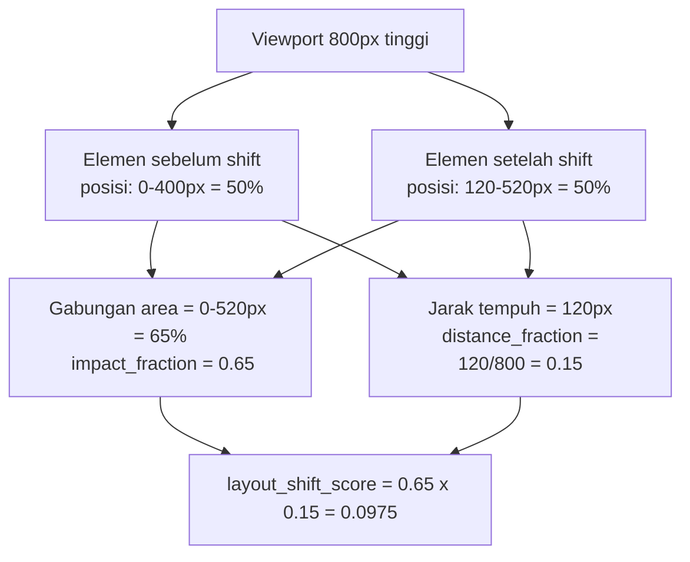
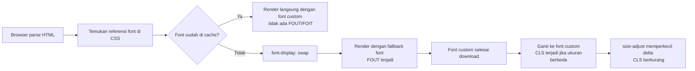
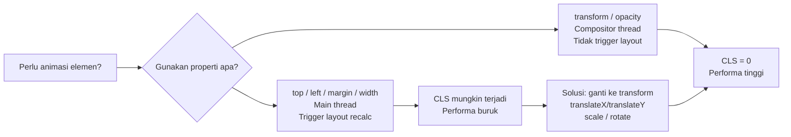

import { Section, Box, Steps, Step, Recap, CardGrid, Card, Chip, Hero, Compare } from "@components";

<Hero eyebrow="Chapter 05 &middot; Web Vitals" title="Cumulative <em>Layout Shift</em>" sub="Mengapa halaman loncat, cara menghitung shift score, dan enam penyebab paling sering">
  <p>CLS mengukur seberapa sering pengguna melihat konten di layar mereka tiba-tiba bergerak tanpa diduga. Ini bukan soal kecepatan — halaman bisa load cepat tapi tetap terasa tidak nyaman jika tombol loncat sebelum diklik, atau artikel yang sedang dibaca tiba-tiba bergeser ke bawah karena iklan muncul.</p>
  <Fragment slot="meta">
    <Chip icon="activity">Visual Stability</Chip>
    <Chip icon="clock">~32 menit baca</Chip>
  </Fragment>
</Hero>

Di antara tiga Core Web Vitals — LCP, INP, dan CLS — CLS adalah satu-satunya yang bukan soal waktu. LCP mengukur seberapa cepat konten terbesar muncul. INP mengukur seberapa cepat browser merespons interaksi. Namun CLS mengukur seberapa stabil tata letak halaman selama user membacanya.

Ketidakstabilan visual adalah sumber frustrasi yang sering diremehkan tim engineering. User yang hendak mengklik tombol "Beli" mendadak mengklik tombol "Hapus Keranjang" karena sebuah iklan muncul dan menggeser semuanya. Artikel yang sedang dibaca tiba-tiba loncat dua paragraf ke bawah karena gambar tanpa dimensi baru selesai diunduh. Ini bukan sekadar buruk secara estetika — ini memengaruhi konversi dan kepercayaan pengguna secara nyata.

Chapter ini membedah CLS dari akar: bagaimana browser menghitungnya, penyebab paling umum di lapangan, dan cara memperbaiki masing-masing. Kita mulai dari formula matematis agar kamu tidak sekadar "merasa halaman stabil", lalu bergerak ke penyebab satu per satu — gambar, font, iklan, konten dinamis, animasi — dan diakhiri dengan teknik debug yang bisa langsung dipakai di DevTools.

<Section num="01" id="apa-itu-cls" title="Apa itu CLS dan Bagaimana Dihitung?" sub="Formula, threshold, dan konsep unexpected shift">

<p class="lead">CLS bukan sekadar "apakah ada yang bergerak" — ia menghitung akumulasi semua pergeseran tak terduga selama seluruh masa hidup halaman, dengan bobot proporsional terhadap seberapa besar dan seberapa jauh elemen bergerak.</p>

Ketika browser merender ulang tata letak (layout) dan sebuah elemen bergerak dari posisi sebelumnya, terjadi sebuah *layout shift*. Tidak semua layout shift itu buruk — jika user mengklik tombol "Tampilkan komentar" dan area komentar muncul mendorong konten ke bawah, itu adalah shift yang *diharapkan* (expected shift). Yang menjadi masalah adalah *unexpected shift*: pergeseran yang terjadi tanpa dipicu langsung oleh tindakan user.

Secara teknis, sebuah shift dianggap *user-initiated* — dan tidak dihitung ke CLS — jika terjadi dalam jendela 500 milidetik setelah interaksi user seperti klik, ketuk layar, atau penekanan tombol keyboard. Di luar jendela itu, semua shift dianggap tak terduga dan masuk ke perhitungan CLS.

**Rumus dasar layout shift score per shift:**

```
layout_shift_score = impact_fraction × distance_fraction
```

**Impact fraction** adalah persentase viewport yang terdampak oleh elemen yang bergerak — dihitung dari gabungan area yang ditempati elemen sebelum dan sesudah bergerak. Jika sebuah gambar berukuran 50% tinggi viewport bergerak, dan posisi awal dan akhirnya bersama-sama menutupi 75% viewport, maka impact fraction = 0.75.

**Distance fraction** adalah jarak terjauh yang ditempuh elemen yang bergerak, dibagi dengan dimensi viewport terbesar (lebar atau tinggi). Jika sebuah elemen bergerak 120px ke bawah pada viewport setinggi 800px, maka distance fraction = 120 / 800 = 0.15.

Untuk kasus di atas: `layout_shift_score = 0.75 × 0.15 = 0.1125`.


<p class="fig-cap"><b>Diagram 1.</b> Cara menghitung impact fraction dan distance fraction dari satu layout shift event.</p>

**Nilai CLS akhir** bukan sekadar jumlah semua shift score. Browser menggunakan mekanisme *session window*: shift-shift yang terjadi berdekatan waktu (gap maksimal 1 detik antara shift berurutan, dan total window maksimal 5 detik) dikelompokkan menjadi satu session window. CLS diambil dari nilai session window terbesar. Ini mencegah halaman yang memiliki satu periode buruk dihukum jauh lebih berat dari halaman yang memiliki banyak periode buruk kecil yang tersebar.

<div class="tbl-wrap"><table>
  <thead>
    <tr>
      <th>Kategori</th>
      <th>Nilai CLS</th>
      <th>Status</th>
    </tr>
  </thead>
  <tbody>
    <tr>
      <td>Good</td>
      <td>≤ 0.1</td>
      <td>Halaman stabil secara visual</td>
    </tr>
    <tr>
      <td>Needs Improvement</td>
      <td>0.1 – 0.25</td>
      <td>Ada shift yang mengganggu</td>
    </tr>
    <tr>
      <td>Poor</td>
      <td>&gt; 0.25</td>
      <td>Halaman sangat tidak stabil</td>
    </tr>
  </tbody>
</table></div>

<Box variant="analogy" icon="🧩" label="Analogi: Buku yang Digoyang Saat Dibaca">
<p>Bayangkan kamu sedang membaca buku fisik. Setiap kali halaman buku digoyang — entah ada teman yang menepuk meja atau seseorang menarik kertas dari bawah buku — kamu harus mencari ulang baris yang kamu baca. CLS seperti mengukur total "goyang" yang dialami pembaca selama membaca satu halaman. Bukan hanya seberapa keras sekali goyang, tapi akumulasi semua goyang kecil dan besar selama sesi membaca.</p>
</Box>

Penting untuk memahami bahwa CLS diukur di lapangan, bukan hanya di lab. Pengguna yang membuka halaman dengan koneksi 4G lambat akan mengalami CLS berbeda dari pengguna broadband, karena resource (gambar, font, iklan) datang dengan urutan dan waktu berbeda. Inilah mengapa field data dari Chrome User Experience Report (CrUX) jauh lebih relevan dari sekadar skor Lighthouse lokal.

<Box variant="note" icon="📝" label="Yang baru kamu pelajari"><p>CLS = nilai session window terbesar dari akumulasi (impact_fraction × distance_fraction) per shift. Hanya unexpected shift yang dihitung — shift dalam 500ms setelah interaksi user diabaikan.</p></Box>

Di section berikutnya kita mulai membedah penyebab pertama dan paling klasik: gambar yang tidak punya dimensi eksplisit.

</Section>

<Section num="02" id="gambar-tanpa-dimensi" title="Gambar Tanpa Dimensi dan Aspek Rasio" sub="Penyebab CLS paling klasik dan cara memperbaikinya">

<p class="lead">Setiap elemen <code>&lt;img&gt;</code> yang tidak memiliki atribut <code>width</code> dan <code>height</code> adalah bom waktu CLS — browser tidak tahu berapa ruang yang harus disisihkan sebelum gambar selesai diunduh.</p>

Ketika browser mem-parse HTML dan menemukan tag ``, ia perlu memutuskan: seberapa besar ruang yang harus disisihkan untuk gambar ini di tata letak? Jika tidak ada atribut `width` dan `height`, browser tidak bisa menjawab pertanyaan ini. Ia akan membuat gambar memiliki ukuran nol, render konten di bawahnya seolah-olah gambar tidak ada, lalu — ketika gambar selesai diunduh dan ukuran aslinya diketahui — tiba-tiba menyisipkan tinggi gambar ke dalam alir dokumen. Semua konten di bawah gambar tergeser ke bawah. Inilah layout shift.

Fix-nya terdengar sederhana tapi sering dilewati: **selalu tulis atribut `width` dan `height`** pada setiap ``.

```html
<!-- Sebelum: tidak ada dimensi → layout shift saat gambar datang -->


<!-- Sesudah: atribut width dan height diberikan → browser reserve space -->

```

Apakah ini berarti gambar akan selalu ditampilkan 600×400 piksel? Tidak. Browser modern menggunakan nilai `width` dan `height` sebagai *petunjuk aspek rasio*, bukan nilai final. Jika CSS kamu mengubah gambar menjadi `width: 100%; height: auto;`, browser tetap akan menghormati rasio 600:400 untuk menyisihkan ruang yang proporsional — ini disebut *intrinsic size hint*.

```css
/* CSS ini tidak membatalkan manfaat atribut width/height */
img {
  width: 100%;
  height: auto;
}
```

Cara modern yang lebih eksplisit adalah menggunakan properti CSS `aspect-ratio` langsung pada container atau elemen gambar:

```css
.product-image-wrapper {
  aspect-ratio: 3 / 2;
  overflow: hidden;
}

.product-image-wrapper img {
  width: 100%;
  height: 100%;
  object-fit: cover;
}
```

Pendekatan ini sangat berguna ketika ukuran gambar tidak diketahui di HTML (misalnya URL gambar datang dari API dan dimensinya tidak di-embed di URL). Dengan `aspect-ratio` pada wrapper, browser tetap dapat menyisihkan ruang yang tepat.

**Video dan iframe** memiliki masalah yang sama. YouTube embed yang populer digunakan di halaman artikel atau halaman kursus sering menjadi sumber CLS tersembunyi karena tidak memiliki tinggi yang ditetapkan:

```html
<!-- YouTube embed tanpa tinggi tetap → layout shift saat iframe load -->
<iframe src="https://www.youtube.com/embed/abc123"></iframe>

<!-- Perbaikan: gunakan wrapper dengan aspect-ratio -->
<div style="position: relative; aspect-ratio: 16 / 9;">
  <iframe
    src="https://www.youtube.com/embed/abc123"
    style="position: absolute; inset: 0; width: 100%; height: 100%;"
    frameborder="0"
    allowfullscreen
  ></iframe>
</div>
```

Teknik "padding-top hack" yang menggunakan `padding-top: 56.25%` pada wrapper adalah versi lama dari pendekatan ini — sebelum `aspect-ratio` didukung secara luas. Hari ini `aspect-ratio` jauh lebih bersih dan readable.

<div class="tbl-wrap"><table>
  <thead>
    <tr>
      <th>Tipe Elemen</th>
      <th>Penyebab CLS</th>
      <th>Fix</th>
    </tr>
  </thead>
  <tbody>
    <tr>
      <td><code>&lt;img&gt;</code></td>
      <td>Tidak ada <code>width</code> / <code>height</code></td>
      <td>Tambah atribut, pakai <code>height: auto</code> di CSS</td>
    </tr>
    <tr>
      <td><code>&lt;video&gt;</code></td>
      <td>Poster image tanpa dimensi</td>
      <td>Set <code>width</code> dan <code>height</code> pada elemen <code>&lt;video&gt;</code></td>
    </tr>
    <tr>
      <td><code>&lt;iframe&gt;</code></td>
      <td>Tidak ada tinggi tetap</td>
      <td>Wrapper dengan <code>aspect-ratio</code> CSS</td>
    </tr>
    <tr>
      <td>CSS background-image</td>
      <td>Container tanpa dimensi tetap</td>
      <td>Set <code>aspect-ratio</code> atau tinggi eksplisit pada container</td>
    </tr>
  </tbody>
</table></div>

<Box variant="tip" icon="💡" label="Pro Tip: content-visibility dan CLS">
<p>Properti <code>content-visibility: auto</code> memungkinkan browser melewati rendering konten yang berada di luar viewport untuk mempercepat initial render. Namun jika kamu tidak menyertakan <code>contain-intrinsic-size</code> pada elemen tersebut, browser tidak tahu berapa ruang yang harus disisihkan — dan saat user men-scroll ke bagian itu, terjadi layout shift. Selalu pasangkan keduanya: <code>content-visibility: auto; contain-intrinsic-size: 0 500px;</code> (estimasikan tinggi elemen).</p>
</Box>

<Box variant="note" icon="📝" label="Yang baru kamu pelajari"><p>Atribut <code>width</code> dan <code>height</code> pada <code>&lt;img&gt;</code> adalah instruksi aspek rasio untuk browser, bukan ukuran render final. Browser menggunakannya untuk menyisihkan ruang sebelum gambar selesai diunduh — ini mencegah layout shift tanpa mengorbankan fleksibilitas CSS.</p></Box>

Setelah gambar, penyebab CLS berikutnya yang sering mengejutkan adalah font — khususnya bagaimana font web loading berinteraksi dengan tata letak teks.

</Section>

<Section num="03" id="font-dan-layout-shift" title="Font Loading: FOIT, FOUT, dan font-display" sub="Mengapa font web bisa memicu layout shift dan cara mencegahnya">

<p class="lead">Font web yang datang terlambat tidak hanya membuat teks "berkedip" — ia bisa mengubah ukuran teks cukup signifikan untuk menggeser seluruh layout di bawahnya, menghasilkan CLS yang susah dideteksi karena terjadi cepat.</p>

Browser menangani situasi "font belum siap" dengan dua cara berbeda yang masing-masing memiliki trade-off:

**FOIT (Flash of Invisible Text)**: Browser menyembunyikan teks sama sekali sampai font custom siap. Dari sisi CLS, ini aman — tidak ada teks yang ter-render dengan ukuran berbeda, jadi tidak ada layout shift. Namun dari sisi pengguna, ini buruk: teks menjadi tak terlihat selama beberapa ratus milidetik (atau bahkan 3 detik pada koneksi lambat), membuat halaman tampak rusak.

**FOUT (Flash of Unstyled Text)**: Browser langsung menampilkan teks dengan font fallback (biasanya Arial, Georgia, atau font sistem), lalu mengganti dengan font custom saat siap. Pengguna selalu melihat teks — ini lebih baik untuk experience. Namun ada risiko CLS: font custom seringkali memiliki ukuran, spasi, dan kerning berbeda dari font fallback, sehingga saat penggantian terjadi, tinggi dan lebar blok teks berubah, menggeser konten di bawahnya.

Properti CSS `font-display` menentukan perilaku mana yang digunakan:

```css
@font-face {
  font-family: 'Inter';
  src: url('/fonts/Inter-Regular.woff2') format('woff2');
  font-display: swap; /* FOUT — ada CLS risk, tapi teks selalu terlihat */
}
```

<div class="tbl-wrap"><table>
  <thead>
    <tr>
      <th>Nilai font-display</th>
      <th>Perilaku</th>
      <th>CLS Risk</th>
      <th>Teks Terlihat?</th>
    </tr>
  </thead>
  <tbody>
    <tr>
      <td><code>auto</code></td>
      <td>Tergantung browser (biasanya block)</td>
      <td>Rendah</td>
      <td>Tidak (sementara)</td>
    </tr>
    <tr>
      <td><code>block</code></td>
      <td>FOIT: teks disembunyikan hingga 3 detik</td>
      <td>Sangat Rendah</td>
      <td>Tidak (sementara)</td>
    </tr>
    <tr>
      <td><code>swap</code></td>
      <td>FOUT: fallback lalu ganti ke custom</td>
      <td>Tinggi</td>
      <td>Ya</td>
    </tr>
    <tr>
      <td><code>fallback</code></td>
      <td>Block singkat (100ms), lalu swap jika sudah siap</td>
      <td>Sedang</td>
      <td>Ya (setelah 100ms)</td>
    </tr>
    <tr>
      <td><code>optional</code></td>
      <td>Pakai custom hanya jika sudah cache; jika belum, pakai fallback seterusnya</td>
      <td>Sangat Rendah</td>
      <td>Ya</td>
    </tr>
  </tbody>
</table></div>

Untuk mengurangi besarnya FOUT-shift saat menggunakan `font-display: swap`, ada beberapa pendekatan modern:

**1. Preload font critical:** Minta browser mengunduh font lebih awal, sebelum browser menemukan referensi font di CSS:

```html
<!-- Di <head>, sebelum stylesheet -->
<link
  rel="preload"
  href="/fonts/Inter-Regular.woff2"
  as="font"
  type="font/woff2"
  crossorigin
>
```

Atribut `crossorigin` wajib ada meskipun font berada di domain yang sama — browser mensyaratkan ini untuk font preload agar mode CORS cocok dengan request font aslinya.

**2. size-adjust descriptor:** CSS modern memungkinkan kamu mengatur skala fallback font agar mendekati ukuran font custom:

```css
@font-face {
  font-family: 'Inter-fallback';
  src: local('Arial');
  size-adjust: 107%;          /* sesuaikan sampai ukuran mendekati Inter */
  ascent-override: 90%;       /* kontrol ascent metric */
  descent-override: 22%;      /* kontrol descent metric */
  line-gap-override: 0%;
}

body {
  font-family: 'Inter', 'Inter-fallback', sans-serif;
}
```

Dengan `size-adjust`, fallback font Arial akan di-scale sehingga ukurannya mendekati Inter. Ketika Inter akhirnya dimuat, pergeseran layout menjadi minimal karena kedua font mengisi ruang yang hampir sama.

**3. Font subsetting:** Mengirim hanya karakter yang benar-benar dibutuhkan:

```css
@font-face {
  font-family: 'Inter';
  src: url('/fonts/Inter-latin.woff2') format('woff2');
  unicode-range: U+0000-00FF; /* hanya karakter Latin dasar */
}
```

Font WOFF2 yang lebih kecil berarti waktu unduh lebih singkat, sehingga jendela FOUT menjadi lebih pendek, dan kemungkinan pengguna mengalami pergeseran berkurang.


<p class="fig-cap"><b>Diagram 2.</b> Alur font loading dengan font-display: swap dan peran size-adjust dalam meminimalkan CLS.</p>

<Box variant="bridge" icon="🌉" label="Jembatan: Docker &amp; Font Preload">
<p>Docker menyelesaikan "works on my machine" dengan memaket semua runtime dan dependency bersama aplikasi — tidak ada lagi kejutan "library versi berbeda di production". Preloading font melakukan hal serupa: alih-alih menunggu browser menemukan font saat mem-parse CSS, kita mengantarkan font lebih awal bersama HTML. Hasilnya, tidak ada lagi kejutan "font beda saat load pertama".</p>
</Box>

<Box variant="warn" icon="⚠️" label="Jangan preload semua font">
<p>Preload adalah sinyal prioritas tinggi — jika kamu me-preload terlalu banyak font, browser akan bersaing mengunduh semua itu di awal, berpotensi menunda resource yang lebih penting seperti CSS critical-path atau gambar LCP. Preload hanya font yang benar-benar dipakai above the fold, biasanya satu atau dua file font maksimum.</p>
</Box>

<Box variant="note" icon="📝" label="Yang baru kamu pelajari"><p>FOUT menyebabkan CLS ketika font custom memiliki ukuran berbeda dari fallback. Trio solusinya: <code>font-display: optional</code> atau <code>fallback</code> untuk kurangi risk, preload untuk persingkat jendela FOUT, dan <code>size-adjust</code> untuk perkecil delta layout saat swap terjadi.</p></Box>

Kita beralih ke kategori penyebab CLS yang sering menghasilkan skor paling tinggi di lapangan: konten yang diinjeksi secara dinamis setelah halaman load.

</Section>

<Section num="04" id="iklan-dan-konten-dinamis" title="Iklan, Embed, dan Konten Dinamis" sub="Cara konten yang datang terlambat merusak stabilitas visual">

<p class="lead">Konten yang diinjeksi setelah halaman selesai render — iklan, cookie banner, chat widget, atau personalisasi via JavaScript — adalah penyumbang terbesar CLS di situs nyata, karena semuanya menggeser konten yang sudah ada tanpa user mengklik apapun.</p>

**Iklan dinamis (Ad Slots)**

Ad slot adalah penyebab CLS tertinggi yang paling sering dilaporkan. Mekanismenya sederhana: container iklan berukuran nol atau sangat kecil saat halaman dimuat, script iklan dijalankan secara asinkron, kemudian iklan diinjeksi dengan ukuran penuh (misalnya 728×90 leaderboard atau 300×250 rectangle) — menggeser semua konten di bawahnya.

Solusi terbaik bukan menghilangkan iklan, tetapi **mereservasi ruang di awal**:

```css
.ad-slot {
  min-height: 90px;    /* reservasi untuk leaderboard banner */
  width: 100%;
  background: #f5f5f5; /* placeholder visual agar tidak terlihat kosong */
}

/* Untuk unit yang lebih besar */
.ad-slot--rectangle {
  min-height: 250px;
  min-width: 300px;
}
```

Bahkan ketika iklan tidak ditampilkan (user menggunakan adblocker, atau slot tidak terisi), ruang tetap ada — tidak ada pergeseran karena tidak ada yang berubah.

**Cookie Banner dan Consent Dialog**

Cookie banner yang muncul setelah halaman dimuat dan mendorong konten ke bawah adalah sumber CLS klasik lainnya. Ada dua pendekatan fix:

```html
<!-- Pendekatan 1: Render dari sisi server, bukan inject via JS -->
<!-- Server langsung menyertakan banner di HTML jika cookie consent belum ada -->
<div id="cookie-banner" class="banner-fixed">
  Kami menggunakan cookie...
  <button>Terima</button>
</div>
```

```css
/* Pendekatan 2: Gunakan posisi fixed atau sticky — tidak menggeser dokumen */
.banner-fixed {
  position: fixed;
  bottom: 0;
  left: 0;
  right: 0;
  z-index: 1000;
  /* Banner di atas konten, bukan mendorong konten */
}
```

Pendekatan `position: fixed` atau `position: sticky` tidak berkontribusi ke CLS karena elemen tersebut dikeluarkan dari flow normal dokumen — tidak ada konten yang terdorong.

**Skeleton Loaders yang Salah**

Skeleton loader adalah teknik baik yang bisa menjadi bumerang jika ukurannya tidak akurat:

```html
<!-- Skeleton 200px tinggi, konten nyata 380px tinggi → shift 180px -->
<div class="skeleton" style="height: 200px;"></div>
<!-- Saat konten nyata datang, shift CLS muncul! -->
```

Fix-nya adalah mengukur konten nyata dan mereservasi ruang yang akurat, atau menggunakan `min-height` yang konservatif (sedikit lebih besar dari estimasi):

```css
.product-card-skeleton {
  min-height: 400px; /* sedikit lebih besar dari rata-rata product card */
  border-radius: 8px;
  background: linear-gradient(90deg, #f0f0f0 25%, #e0e0e0 50%, #f0f0f0 75%);
  background-size: 200% 100%;
  animation: shimmer 1.5s infinite;
}
```

**Animasi yang Memicu Layout vs Animasi yang Aman**

Ini adalah perbedaan kritis yang sering diabaikan: tidak semua properti CSS diciptakan sama dalam konteks CLS dan performa rendering.

Properti yang memicu layout recalculation akan selalu memengaruhi CLS jika dianimasikan tanpa user interaction:

```css
/* BERBAHAYA: properti ini trigger layout recalc → bisa CLS */
.element {
  transition: margin-top 0.3s ease;  /* hindari */
  transition: height 0.3s ease;       /* hindari */
  transition: top 0.3s ease;          /* hindari */
  transition: width 0.3s ease;        /* hindari */
}
```

Sebaliknya, `transform` dan `opacity` dijalankan di *compositor thread* — terpisah dari main thread dan tidak memicu layout recalculation:

```css
/* AMAN: transform dan opacity tidak trigger layout */
.element {
  transition: transform 0.3s ease;  /* AMAN */
  transition: opacity 0.3s ease;    /* AMAN */
}

/* Contoh: slide-in panel dari atas */
.notification-banner {
  transform: translateY(-100%);
  opacity: 0;
  transition: transform 0.3s ease, opacity 0.3s ease;
}

.notification-banner.visible {
  transform: translateY(0);
  opacity: 1;
}
```

<div class="tbl-wrap"><table>
  <thead>
    <tr>
      <th>Properti CSS</th>
      <th>Trigger Layout?</th>
      <th>Trigger Paint?</th>
      <th>Trigger Composite?</th>
      <th>CLS Risk</th>
    </tr>
  </thead>
  <tbody>
    <tr>
      <td><code>transform</code></td>
      <td>Tidak</td>
      <td>Tidak</td>
      <td>Ya</td>
      <td>Tidak ada</td>
    </tr>
    <tr>
      <td><code>opacity</code></td>
      <td>Tidak</td>
      <td>Tidak</td>
      <td>Ya</td>
      <td>Tidak ada</td>
    </tr>
    <tr>
      <td><code>top</code> / <code>left</code></td>
      <td>Ya</td>
      <td>Ya</td>
      <td>Ya</td>
      <td>Tinggi</td>
    </tr>
    <tr>
      <td><code>margin</code> / <code>padding</code></td>
      <td>Ya</td>
      <td>Ya</td>
      <td>Ya</td>
      <td>Tinggi</td>
    </tr>
    <tr>
      <td><code>width</code> / <code>height</code></td>
      <td>Ya</td>
      <td>Ya</td>
      <td>Ya</td>
      <td>Tinggi</td>
    </tr>
    <tr>
      <td><code>background-color</code></td>
      <td>Tidak</td>
      <td>Ya</td>
      <td>Ya</td>
      <td>Tidak ada</td>
    </tr>
  </tbody>
</table></div>


<p class="fig-cap"><b>Diagram 3.</b> Alur keputusan memilih properti CSS untuk animasi agar tidak memicu layout shift.</p>

<Box variant="warn" icon="⚠️" label="Chat Widget dan Third-Party Script">
<p>Chat widget populer (Intercom, Crisp, Zendesk) sering menjadi sumber CLS tersembunyi. Widget tersebut menginjeksi elemen ke dalam DOM setelah halaman selesai load dan menggunakan <code>position: fixed</code> — yang seharusnya aman. Namun beberapa implementasi mengubah <code>padding-bottom</code> pada <code>body</code> untuk mencegah widget menutupi konten, yang justru memicu layout shift besar. Periksa selalu third-party script menggunakan DevTools sebelum menganggap CLS bersumber dari kode sendiri.</p>
</Box>

<Box variant="note" icon="📝" label="Yang baru kamu pelajari"><p>Tiga trik utama menghadapi konten dinamis: reservasi ruang di awal (min-height pada container), gunakan <code>position: fixed/sticky</code> untuk elemen overlay, dan animasikan hanya dengan <code>transform</code> dan <code>opacity</code> — bukan properti yang memicu layout recalculation.</p></Box>

Setelah memahami semua penyebab, kini saatnya belajar menemukan dan mengidentifikasi CLS menggunakan DevTools.

</Section>

<Section num="05" id="debug-cls" title="Debug CLS di DevTools" sub="Cara menemukan elemen yang menyebabkan layout shift">

<p class="lead">Mengetahui bahwa CLS buruk di laporan PageSpeed Insights hanyalah titik awal — langkah selanjutnya adalah mengidentifikasi elemen spesifik mana yang bergerak, kapan bergeraknya, dan mengapa, sehingga kamu bisa menargetkan perbaikan dengan tepat.</p>

**1. PerformanceObserver via JavaScript**

Layout Shift API dapat diakses langsung dari JavaScript menggunakan `PerformanceObserver`. Kode berikut mencatat setiap shift yang terjadi ke konsol beserta detail attribution-nya:

```javascript
// Salin ke Console DevTools untuk monitoring real-time
let clsValue = 0;
let clsEntries = [];

const observer = new PerformanceObserver((entryList) => {
  for (const entry of entryList.getEntries()) {
    // Hanya hitung unexpected shift (bukan yang dipicu user interaction)
    if (!entry.hadRecentInput) {
      clsValue += entry.value;
      clsEntries.push(entry);

      console.group(`Layout Shift — score: ${entry.value.toFixed(4)}`);
      console.log('CLS kumulatif sejauh ini:', clsValue.toFixed(4));
      console.log('Waktu:', entry.startTime.toFixed(0), 'ms');

      // Attribution: elemen mana yang bergerak?
      for (const source of entry.sources || []) {
        console.log('Elemen:', source.node);
        console.log('Rect sebelum:', source.previousRect);
        console.log('Rect sesudah:', source.currentRect);
      }
      console.groupEnd();
    }
  }
});

observer.observe({ type: 'layout-shift', buffered: true });
```

Properti `hadRecentInput` adalah penanda apakah shift ini terjadi dalam 500ms setelah interaksi user — jika `true`, shift ini tidak dihitung ke CLS dan kita pun melewatinya.

**2. web-vitals library dengan Attribution**

Untuk integrasi yang lebih terstruktur, gunakan library `web-vitals` dari Google dengan mode attribution:

```javascript
import { onCLS } from 'web-vitals/attribution';

onCLS((metric) => {
  console.log('CLS value:', metric.value);

  // Attribution: apa sumber shift terbesar?
  const { largestShiftSource, largestShiftTarget } = metric.attribution;

  if (largestShiftSource) {
    console.log('Shift terbesar dari:', largestShiftSource.node);
    console.log('Initial rect:', largestShiftSource.initialRect);
    console.log('Final rect:', largestShiftSource.finalRect);
  }

  // Kirim ke analytics
  sendToAnalytics({
    metric: 'CLS',
    value: metric.value,
    rating: metric.rating, // 'good', 'needs-improvement', 'poor'
    element: largestShiftSource?.node?.tagName,
  });
});
```

**3. Chrome DevTools — Performance Panel**

Cara visual untuk menemukan layout shift di DevTools:

<Steps>
  <Step title="Buka Chrome DevTools">Tekan F12 atau Cmd+Option+I (Mac). Pindah ke tab **Performance**.</Step>
  <Step title="Aktifkan Layout Shift Regions">Klik ikon ⚙️ (Settings) di panel Performance, aktifkan **Layout Shift Regions** — ini menampilkan overlay berwarna biru pada elemen yang mengalami shift saat recording.</Step>
  <Step title="Mulai recording">Klik tombol Record (lingkaran merah), reload halaman, biarkan halaman selesai loading, lalu klik Stop.</Step>
  <Step title="Cari Layout Shift marker">Di timeline, cari marker merah berlabel **LS** (Layout Shift). Klik untuk melihat detail — panel bawah menampilkan node apa yang bergerak.</Step>
  <Step title="Periksa filmstrip">Di bagian atas timeline, aktifkan **Screenshots** untuk melihat filmstrip. Perhatikan frame tepat sebelum dan sesudah marker LS — ini memperlihatkan secara visual apa yang bergerak.</Step>
</Steps>

**4. WebPageTest — Filmstrip Mode**

Untuk analisis dari perspektif pengguna nyata dengan berbagai kondisi jaringan:

```bash
# Jalankan WebPageTest via CLI (jika menggunakan webpagetest-api)
wpt test https://example.com \
  --key YOUR_API_KEY \
  --location "Dulles:Chrome" \
  --connectivity 4G \
  --filmstrip
```

WebPageTest menghasilkan filmstrip frame-by-frame yang memperlihatkan kapan tepatnya shift terjadi — berguna untuk menemukan shift yang hanya muncul pada kondisi jaringan tertentu.

**5. Workflow Debug CLS End-to-End**

<Steps>
  <Step title="Mulai dari field data">Buka PageSpeed Insights untuk URL target. Lihat nilai CLS dari CrUX data (bukan lab) dan perhatikan distribusi P75 — inilah CLS yang dirasakan 75% pengguna.</Step>
  <Step title="Identifikasi halaman bermasalah">Gunakan Search Console → Core Web Vitals report untuk menemukan URL mana yang paling banyak dilaporkan Poor.</Step>
  <Step title="Reproduksi dengan throttling">Di DevTools, set CPU throttling 4x dan network throttling ke "Slow 4G". Reload halaman dan amati apakah ada pergeseran visual yang terlihat.</Step>
  <Step title="Pasang PerformanceObserver">Salin snippet dari langkah 1 ke DevTools Console. Reload halaman dan perhatikan log — entry mana yang memiliki score tertinggi?</Step>
  <Step title="Identifikasi elemen di panel Elements">Dari log observer, klik referensi node untuk jump ke panel Elements. Periksa CSS yang diterapkan pada elemen dan container induknya.</Step>
  <Step title="Verifikasi fix">Terapkan fix (tambah dimensi, ubah animasi, reservasi space), reload, dan periksa ulang CLS via observer — pastikan nilai turun mendekati 0.</Step>
</Steps>

```javascript
// Helper: hitung CLS final dan tampilkan ringkasan
function summarizeCLS() {
  const entries = performance.getEntriesByType('layout-shift');
  const unexpected = entries.filter(e => !e.hadRecentInput);

  const total = unexpected.reduce((sum, e) => sum + e.value, 0);
  const rating = total <= 0.1 ? 'Good' : total <= 0.25 ? 'Needs Improvement' : 'Poor';

  console.table(
    unexpected.map(e => ({
      waktu: `${e.startTime.toFixed(0)}ms`,
      score: e.value.toFixed(4),
      sumber: e.sources?.[0]?.node?.tagName ?? 'unknown',
    }))
  );
  console.log(`Total CLS: ${total.toFixed(4)} — ${rating}`);
}

// Jalankan setelah halaman selesai load
window.addEventListener('load', () => setTimeout(summarizeCLS, 3000));
```

<Box variant="warn" icon="⚠️" label="CLS tidak selalu muncul saat testing">
<p>CLS yang dilaporkan di lapangan bisa tidak muncul saat kamu testing secara manual. Ada beberapa alasan: halaman ter-cache sehingga font dan gambar sudah ada; koneksi lebih cepat sehingga resource datang sebelum render; atau shift hanya terjadi saat user men-scroll ke area tertentu. Selalu andalkan field data (CrUX, RUM) sebagai sumber kebenaran, dan gunakan throttling agresif saat reproduksi lokal.</p>
</Box>

<Box variant="tip" icon="💡" label="Pro Tip: Gunakan Lighthouse CI">
<p>Integrasikan Lighthouse CI ke pipeline CI/CD untuk menangkap regresi CLS sebelum deploy ke production. Konfigurasi threshold: <code>{'assert: { metrics: { cumulativeLayoutShift: ["warn", { maxNumericValue: 0.1 }] } }'}</code>. Regresi CLS sering muncul dari dependency update (carousel library baru, versi widget chat yang diperbarui) yang tidak terlihat di code review biasa.</p>
</Box>

<Box variant="note" icon="📝" label="Yang baru kamu pelajari"><p>Debug CLS dimulai dari field data (PageSpeed Insights / CrUX), bukan langsung dari lab. Gunakan <code>PerformanceObserver</code> dengan <code>type: 'layout-shift'</code> untuk melihat elemen spesifik yang bergerak, dan gunakan Performance panel DevTools dengan Layout Shift Regions untuk visualisasi real-time.</p></Box>

</Section>

<Section num="06" id="ringkasan" title="Ringkasan" sub="Yang wajib menempel dari chapter ini">

<p class="lead">CLS bukan soal seberapa cepat halaman dimuat, melainkan seberapa stabil tata letaknya selama pengguna berinteraksi — dan memperbaikinya berarti menghilangkan elemen kejutan: konten yang tiba-tiba menggeser apa yang sudah ada di layar.</p>

Kita telah menelusuri CLS dari akar matematis hingga perbaikan konkret. Formula impact fraction × distance fraction menjelaskan mengapa gambar besar yang bergerak sedikit bisa menyumbang CLS lebih tinggi dari gambar kecil yang bergerak jauh. Session window menjelaskan mengapa Google tidak sekadar menjumlahkan semua shift, tapi mengambil periode buruk terpanjang.

Enam penyebab utama yang kita bahas — gambar tanpa dimensi, FOUT dari font swap, iklan yang diinjeksi, cookie banner, skeleton loader yang tidak akurat, dan animasi berbasis layout properties — semuanya dapat diperbaiki tanpa mengorbankan desain atau fungsionalitas. Kuncinya adalah mendeklarasikan ukuran di depan (sebelum konten datang), memosisikan elemen overlay di luar alir dokumen, dan menggunakan `transform` sebagai pengganti properti layout untuk animasi.

<Recap title="Yang Wajib Menempel">
<ul>
  <li>CLS = nilai session window terbesar, dihitung dari <code>impact_fraction × distance_fraction</code> per unexpected shift. Target: ≤ 0.1.</li>
  <li>"Unexpected" = shift yang terjadi lebih dari 500ms setelah interaksi user. Shift akibat klik/tap tidak dihitung ke CLS.</li>
  <li>Setiap <code>&lt;img&gt;</code> wajib memiliki atribut <code>width</code> dan <code>height</code> — browser menggunakannya sebagai petunjuk aspek rasio untuk menyisihkan ruang sebelum gambar diunduh.</li>
  <li>FOUT (font-display: swap) menyebabkan CLS ketika ukuran font custom berbeda dari fallback. Kurangi dengan preload font, <code>font-display: optional</code>, atau <code>size-adjust</code> descriptor.</li>
  <li>Konten dinamis (iklan, cookie banner, widget) tidak boleh menginjeksi ke alir dokumen tanpa mereservasi ruang terlebih dahulu. Gunakan <code>min-height</code> pada container, atau <code>position: fixed</code> untuk overlay.</li>
  <li>Animasikan hanya dengan <code>transform</code> dan <code>opacity</code> — keduanya tidak memicu layout recalculation dan tidak berkontribusi ke CLS. Hindari menganimasikan <code>top</code>, <code>left</code>, <code>margin</code>, <code>width</code>, atau <code>height</code>.</li>
  <li>Debug CLS: mulai dari field data (CrUX / PSI), bukan lab. Gunakan <code>PerformanceObserver</code> dengan <code>type: 'layout-shift'</code> dan aktifkan Layout Shift Regions di DevTools Performance panel untuk menemukan elemen penyebab.</li>
</ul>
</Recap>

Di **Chapter 6** kita membahas Time to First Byte (TTFB) dan First Contentful Paint (FCP) — metrik yang mengukur seberapa cepat browser menerima byte pertama dari server dan mulai menggambar sesuatu di layar, serta bagaimana keduanya memengaruhi pengalaman loading keseluruhan.

</Section>
