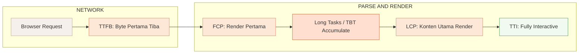
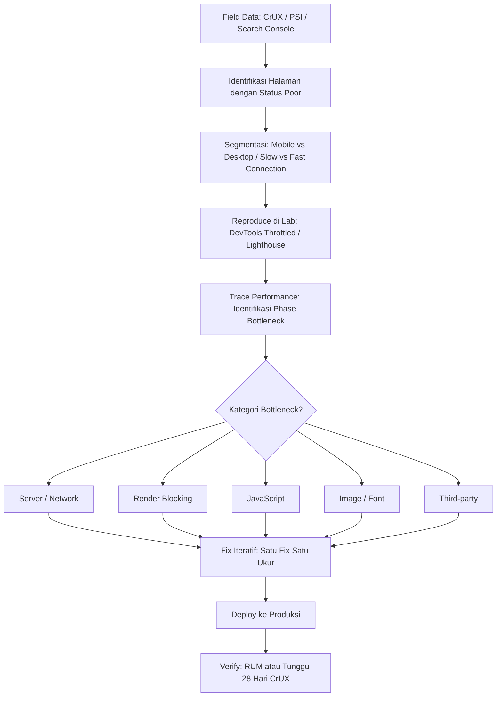
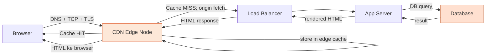

import { Section, Box, Steps, Step, Recap, CardGrid, Card, Chip, Hero, Compare } from "@components";

<Hero eyebrow="Chapter 06 &middot; Web Vitals" title="Debugging &amp; Optimasi<br /><em>Lintas Stack</em>" sub="Metrik pendukung, workflow debug sistematis, dan cara backend memengaruhi pengalaman pengguna">
  <p>Chapter ini menyatukan semua yang telah kamu pelajari tentang LCP, INP, dan CLS ke dalam satu alur kerja yang bisa diikuti dari deteksi masalah di lapangan sampai fix yang terverifikasi di produksi. Bukan hanya tahu apa yang rusak, melainkan tahu bagaimana cara menemukannya secara sistematis dan memperbaikinya di lapisan yang tepat.</p>
  <Fragment slot="meta">
    <Chip icon="activity">Debug &amp; Optimasi</Chip>
    <Chip icon="clock">~38 menit baca</Chip>
  </Fragment>
</Hero>

Tiga chapter sebelumnya membahas LCP, INP, dan CLS secara terpisah. Tapi di dunia nyata, masalah performa jarang datang dalam kotak yang rapi. Sebuah halaman bisa punya LCP lambat sekaligus INP buruk, dengan penyebab yang sebenarnya bermuara ke satu hal yang sama: TTFB tinggi karena query database lambat, atau bundle JavaScript yang terlalu besar karena tidak ada code splitting. Chapter ini mengajarkan cara membaca peta permasalahan secara menyeluruh — mulai dari metrik pendukung yang menjadi sinyal awal, sampai ke pola optimasi konkret yang bisa diterapkan di frontend maupun backend.

Urutan pembahasannya penting: kamu perlu memahami metrik pendukung seperti FCP, TTFB, dan TBT terlebih dahulu, karena metrik inilah yang memberi petunjuk ke lapisan mana harus menggali. Setelah itu, workflow debug sistematis memastikan kamu tidak membuang waktu mengoptimasi hal yang salah. Baru kemudian pola optimasi frontend dan backend bisa diterapkan dengan target yang jelas. Terakhir, kita lihat bagaimana framework modern seperti Next.js, Astro, dan Nuxt membentuk ulang cara kita mendekati setiap metrik.

<Section num="01" id="metrik-pendukung" title="Metrik Pendukung: FCP, TTFB, TBT, Speed Index" sub="Sinyal diagnostik di balik Core Web Vitals">

<p class="lead">Core Web Vitals adalah metrik yang dinilai oleh Google, tetapi FCP, TTFB, dan TBT adalah metrik yang <em>menjelaskan mengapa</em> Core Web Vitals buruk — tanpa ketiganya, debugging terasa seperti menebak dalam gelap.</p>

Ketika LCP sebuah halaman berada di zona merah, jawabannya tidak selalu jelas hanya dari angka LCP itu sendiri. Apakah server lambat mengirim byte pertama? Apakah ada rantai resource yang memblokir render? Apakah JavaScript terlalu banyak sehingga main thread tidak tersedia untuk merender? FCP, TTFB, TBT, dan Speed Index adalah instrumen diagnostik yang membantu menjawab pertanyaan-pertanyaan ini.

**FCP (First Contentful Paint)** mengukur kapan pertama kali browser merender konten apapun yang bisa dilihat — teks, gambar, elemen SVG, atau canvas non-putih. Ini berbeda dari LCP: FCP bisa dipicu oleh spinner loading, placeholder kosong, atau header navigasi, bukan konten utama halaman. FCP berguna sebagai sinyal bahwa "halaman sudah mulai merespons" — jika FCP juga lambat, berarti masalah ada di awal sekali, kemungkinan besar di server response atau resource yang memblokir rendering. Target FCP yang baik adalah **≤ 1.8 detik**. Perlu dicatat bahwa FCP tidak masuk dalam Core Web Vitals yang dinilai Google untuk ranking, tetapi sangat berguna sebagai diagnostic signal di Lighthouse dan PageSpeed Insights.

**TTFB (Time to First Byte)** mengukur waktu dari user mengirim request URL sampai byte pertama dari response HTML tiba di browser. Ini adalah metrik server-side murni — semua yang terjadi antara request dan byte pertama adalah tanggung jawab infrastruktur kamu: pemrosesan di server, query database, cache hit/miss, jarak ke CDN, dan kualitas koneksi jaringan. Target TTFB menurut Lighthouse adalah **≤ 800ms**, tetapi dalam praktik production, origin web yang baik seharusnya merespons dalam **< 200ms** sebelum CDN meneruskan ke user. TTFB yang tinggi hampir selalu merupakan masalah backend — bukan frontend.

**TBT (Total Blocking Time)** mengukur total waktu main thread JavaScript diblokir antara FCP dan TTI (Time to Interactive). Setiap tugas JavaScript yang berjalan lebih dari 50ms dianggap "long task", dan TBT adalah jumlah dari (durasi task - 50ms) untuk semua long task yang terjadi dalam rentang tersebut. TBT adalah **lab proxy untuk INP** — jika TBT tinggi di Lighthouse, sangat besar kemungkinan INP juga tinggi di lapangan, karena long tasks yang sama yang menyumbang TBT juga yang akan menunda respons interaksi pengguna. Target TBT adalah **≤ 200ms** dan bobotnya 30% dari Lighthouse Performance Score — ini bobot terbesar kedua setelah LCP.

**Speed Index** mengukur seberapa cepat konten visual halaman terisi secara progresif, dihitung dari rekaman video halaman loading. Speed Index yang rendah berarti pengguna melihat konten lebih cepat secara keseluruhan, bukan hanya pada satu momen tertentu. Ini berguna untuk membandingkan dua implementasi yang berbeda secara holistik, tetapi kurang berguna untuk debugging spesifik karena tidak menunjuk ke penyebab tunggal.

<div class="tbl-wrap"><table>
  <thead>
    <tr>
      <th>Metrik</th>
      <th>Yang Diukur</th>
      <th>Target "Good"</th>
      <th>Korelasi CWV</th>
      <th>Lab / Field?</th>
    </tr>
  </thead>
  <tbody>
    <tr>
      <td><code>FCP</code></td>
      <td>Render pertama apapun yang terlihat</td>
      <td>≤ 1.8s</td>
      <td>Sinyal awal LCP; FCP lambat → LCP hampir pasti lambat</td>
      <td>Lab &amp; Field</td>
    </tr>
    <tr>
      <td><code>TTFB</code></td>
      <td>Kecepatan server mengirim byte pertama HTML</td>
      <td>≤ 800ms (Lighthouse); &lt; 200ms (origin)</td>
      <td>TTFB tinggi langsung menunda LCP</td>
      <td>Lab &amp; Field</td>
    </tr>
    <tr>
      <td><code>TBT</code></td>
      <td>Total main thread blocking antara FCP &amp; TTI</td>
      <td>≤ 200ms</td>
      <td>Lab proxy untuk INP; TBT tinggi → INP kemungkinan tinggi</td>
      <td>Lab saja</td>
    </tr>
    <tr>
      <td><code>Speed Index</code></td>
      <td>Kecepatan pengisian visual halaman secara progresif</td>
      <td>≤ 3.4s</td>
      <td>Tidak langsung; mencerminkan LCP &amp; rendering keseluruhan</td>
      <td>Lab saja</td>
    </tr>
    <tr>
      <td><code>TTI</code></td>
      <td>Kapan halaman sepenuhnya interaktif</td>
      <td>≤ 3.8s</td>
      <td>Endpoint dari TBT; tinggi = INP berpotensi buruk</td>
      <td>Lab saja</td>
    </tr>
  </tbody>
</table></div>


<p class="fig-cap"><b>Timeline metrik performa.</b> TTFB terjadi paling awal di fase jaringan; FCP adalah render pertama; TBT terakumulasi antara FCP dan TTI; LCP terjadi di tengah; TTI menandai akhir dari fase blocking.</p>

<Box variant="tip" icon="💡" label="Tip: TBT sebagai shortcut INP"><p>TBT tinggi di Lighthouse hampir selalu berkorelasi dengan INP tinggi di field — karena long tasks yang sama yang memblokir main thread juga yang menunda respons interaksi. Fix TBT dulu untuk quick win INP sebelum membuka Performance trace yang lebih detail.</p></Box>

<Box variant="analogy" icon="🩺" label="Analogi: Pemeriksaan Medis"><p>Core Web Vitals seperti hasil diagnosa dokter (LCP buruk, INP buruk), sedangkan TTFB, FCP, dan TBT seperti hasil lab darah — angka-angka spesifik yang menjelaskan <em>mengapa</em> diagnosa tersebut keluar. Dokter tidak langsung mengobati tanpa melihat hasil lab, dan developer tidak seharusnya langsung mengoptimasi tanpa membaca metrik pendukungnya.</p></Box>

<Box variant="note" icon="📝" label="Yang baru kamu pelajari"><p>FCP, TTFB, TBT, dan Speed Index bukan pengganti Core Web Vitals — melainkan alat bantu diagnostik yang menunjuk ke lapisan mana masalah performa berasal: server (TTFB), awal render (FCP), atau JavaScript blocking (TBT).</p></Box>

Dengan memahami apa yang diukur masing-masing metrik pendukung ini, kita siap membangun workflow debug yang tidak sekadar reaktif, melainkan sistematis dan terukur.

</Section>

<Section num="02" id="workflow-debug" title="Workflow Debug Sistematis" sub="Dari data lapangan ke fix produksi yang terverifikasi">

<p class="lead">Kesalahan terbesar dalam debugging performa adalah membuka Lighthouse terlalu awal — sebelum tahu halaman mana yang bermasalah, di segment pengguna mana, dan seberapa buruk kondisi lapangannya.</p>

Lighthouse adalah alat lab yang sangat berguna, tetapi ia mengukur satu halaman, satu kali, dengan koneksi dan perangkat yang disimulasi. Data lapangan (field data) dari pengguna nyata seringkali sangat berbeda — terutama untuk pengguna dengan perangkat low-end atau koneksi lambat di Indonesia. Workflow debug yang baik selalu dimulai dari lapangan, bukan dari lab.

Permasalahan performa juga sering tersembunyi di balik agregasi. Halaman utama (`/`) mungkin terlihat cepat karena didominasi oleh pengguna desktop dengan koneksi cepat, sementara halaman produk (`/product/[id]`) yang justru paling banyak diakses oleh pengguna mobile mengalami LCP buruk secara konsisten. Tanpa segmentasi, masalah yang paling berdampak terhadap bisnis bisa terlewat.


<p class="fig-cap"><b>Workflow debug sistematis.</b> Mulai dari field data, segmentasi, reproduce di lab, trace bottleneck, fix iteratif, lalu verifikasi kembali di lapangan. Jangan loncat dari A langsung ke L.</p>

<Steps>
  <Step num="01" title="Mulai dari Field Data">
    Buka Google Search Console di bagian **Core Web Vitals** untuk melihat halaman mana yang masuk kategori "Poor" atau "Needs Improvement". Gunakan **PageSpeed Insights (PSI)** untuk per-URL dengan data CrUX 28 hari terakhir. Jika proyek sudah pasang RUM (Real User Monitoring), baca distribusi p75 per halaman dan per segment.
  </Step>
  <Step num="02" title="Segmentasi Data">
    Pisahkan data **mobile vs desktop** — sebagian besar situs Indonesia didominasi mobile, dan performa mobile hampir selalu jauh lebih buruk. Pisahkan juga berdasarkan kecepatan koneksi jika RUM kamu mendukungnya. Fokus debug di segment terburuk — itulah yang paling berdampak terhadap pengalaman pengguna nyata.
  </Step>
  <Step num="03" title="Reproduce di Lab">
    Buka Chrome DevTools, aktifkan **CPU throttling 4x** (simulasi perangkat mid-range) dan **network throttling Fast 3G** atau Slow 4G. Jalankan **Lighthouse** untuk mendapatkan gambaran umum, lalu record **Performance trace** untuk detail long tasks dan resource loading order. Reproduksi harus konsisten sebelum mulai menggali lebih dalam.
  </Step>
  <Step num="04" title="Trace dan Identifikasi Bottleneck">
    Di Performance trace, perhatikan urutan resource: kapan HTML pertama di-parse, apakah ada stylesheet atau script yang memblokir, kapan gambar LCP mulai di-fetch, dan berapa lama. Cek TTFB di panel Network. Cari long tasks di main thread yang menyumbang TBT. Klasifikasikan bottleneck ke dalam kategori: **Server/Network**, **Render Blocking**, **JavaScript**, **Image/Font**, atau **Third-party**.
  </Step>
  <Step num="05" title="Fix Iteratif">
    Fix **satu hal** dulu, lalu ukur ulang di lab dengan kondisi yang sama. Jangan fix semua sekaligus — kalau performa membaik, kamu tidak tahu mana yang berkontribusi, dan kalau tidak membaik, kamu tidak tahu mana yang justru memperburuk. Iterasi ini lambat di permukaan, tetapi jauh lebih efisien secara total.
  </Step>
  <Step num="06" title="Deploy dan Verifikasi di Field">
    Setelah fix di lab, deploy ke produksi. Jika kamu punya RUM, validasi perbaikan dalam beberapa jam atau hari. Jika tidak, perlu menunggu CrUX diperbarui setiap 28 hari — data CrUX adalah rolling window 28 hari, jadi perubahan baru terlihat secara penuh setelah 28 hari setelah deploy.
  </Step>
</Steps>

<div class="tbl-wrap"><table>
  <thead>
    <tr>
      <th>Kategori Bottleneck</th>
      <th>Sinyal di Lab</th>
      <th>CWV yang Terdampak</th>
      <th>Arah Fix</th>
    </tr>
  </thead>
  <tbody>
    <tr>
      <td>Server / Network</td>
      <td>TTFB &gt; 800ms di Network panel</td>
      <td>LCP (langsung)</td>
      <td>Caching, CDN, DB query, edge function</td>
    </tr>
    <tr>
      <td>Render Blocking</td>
      <td>CSS/JS di &lt;head&gt; tanpa <code>async</code>/<code>defer</code></td>
      <td>LCP, FCP</td>
      <td>Defer non-critical scripts, inline critical CSS</td>
    </tr>
    <tr>
      <td>JavaScript</td>
      <td>Long tasks di main thread timeline, TBT tinggi</td>
      <td>INP, TBT</td>
      <td>Code splitting, lazy load, break up long tasks</td>
    </tr>
    <tr>
      <td>Image / Font</td>
      <td>LCP image fetched late, font FOIT/FOUT</td>
      <td>LCP, CLS</td>
      <td>Preload LCP image, font-display: swap, dimensi tetap</td>
    </tr>
    <tr>
      <td>Third-party</td>
      <td>Script eksternal di timeline sebelum LCP</td>
      <td>LCP, INP, TBT</td>
      <td>Defer/lazy load, facade pattern, audit kebutuhan</td>
    </tr>
  </tbody>
</table></div>

<Box variant="warn" icon="⚠️" label="Jangan Optimasi Semua Sekaligus"><p>Mengubah banyak hal bersamaan adalah cara paling efisien untuk tidak tahu apa yang berhasil. Fix satu bottleneck, jalankan Lighthouse ulang dengan kondisi identik, catat hasilnya, baru lanjut ke bottleneck berikutnya. Ini berlaku baik di lab maupun di produksi.</p></Box>

<Box variant="bridge" icon="🌉" label="Jembatan: Debugging Backend vs Debugging Performa"><p>Workflow debug performa ini mirip dengan workflow debugging bug di backend: kamu tidak langsung menulis ulang semua kode, melainkan memulai dari log/trace untuk menemukan garis yang salah. Di performa, "log"-nya adalah Performance trace dan metrik, dan "garis yang salah"-nya bisa berupa satu gambar tanpa dimensi atau satu query database yang lambat.</p></Box>

<Box variant="note" icon="📝" label="Yang baru kamu pelajari"><p>Workflow debug yang efektif selalu bergerak dari data lapangan ke lab, bukan sebaliknya — dan fix harus iteratif agar dampak setiap perubahan bisa diukur secara jelas.</p></Box>

Setelah memahami cara menemukan masalah, saatnya melihat toolkit konkret untuk memperbaikinya — dimulai dari lapisan frontend.

</Section>

<Section num="03" id="optimasi-frontend" title="Pola Optimasi Frontend" sub="Teknik-teknik yang bekerja di lapisan browser dan build pipeline">

<p class="lead">Sebagian besar perbaikan performa frontend bermuara ke dua hal: kirim lebih sedikit bytes, dan jalankan lebih sedikit JavaScript sebelum halaman bisa digunakan.</p>

Frontend developer memiliki kendali langsung atas apa yang dikirim ke browser: ukuran bundle JavaScript, format dan dimensi gambar, urutan loading resource, dan font yang digunakan. Teknik-teknik di seksi ini bisa diterapkan secara independen — tidak perlu mengubah backend untuk mendapatkan manfaatnya.

**Code splitting** adalah teknik memecah bundle JavaScript yang besar menjadi potongan-potongan kecil yang hanya dimuat saat dibutuhkan. Tanpa code splitting, sebuah aplikasi single-page yang punya 50 halaman akan mengirim kode semua halaman itu kepada pengguna yang hanya membuka halaman beranda. Di React, ini dilakukan dengan `React.lazy` dan `Suspense`. Di Next.js, `dynamic()` dari `next/dynamic` otomatis melakukan code splitting per komponen. Di Vite, cukup menggunakan `import()` dinamis dan Rollup akan otomatis memisahkan chunk.

```javascript
// React: lazy load komponen yang hanya dipakai di halaman tertentu
const ProductDetail = React.lazy(() => import('./ProductDetail'));

function App() {
  return (
    <Suspense fallback={<div>Loading...</div>}>
      <ProductDetail />
    </Suspense>
  );
}

// Next.js: dynamic import dengan no SSR untuk komponen browser-only
import dynamic from 'next/dynamic';
const HeavyChart = dynamic(() => import('../components/HeavyChart'), {
  ssr: false,
  loading: () => <p>Loading chart...</p>,
});
```

**Lazy loading gambar** berarti gambar yang berada di bawah viewport pertama tidak dimuat sampai pengguna mendekati area tersebut. Ini bisa dilakukan hanya dengan menambahkan atribut `loading="lazy"` pada elemen ``. Penting: **jangan** lazy load gambar LCP, karena itu justru memperlambat metrik yang paling penting. Lazy load hanya untuk gambar yang tidak terlihat saat halaman pertama kali dibuka.

**Preload, preconnect, dan dns-prefetch** adalah hint kepada browser tentang resource yang akan dibutuhkan segera. `<link rel="preload">` digunakan untuk resource yang pasti dipakai di halaman ini — terutama gambar LCP dan font kritikal. `<link rel="preconnect">` digunakan untuk domain eksternal yang pasti dihubungi (CDN gambar, API, analytics) agar handshake TCP dan TLS sudah selesai sebelum request sebenarnya dibuat. `<link rel="dns-prefetch">` adalah versi yang lebih ringan dan menjadi fallback untuk browser yang tidak mendukung `preconnect`.

```html
<!-- Preload gambar LCP - WAJIB untuk hero image -->
<link rel="preload" as="image" href="/hero.webp" fetchpriority="high">

<!-- Preconnect ke CDN gambar -->
<link rel="preconnect" href="https://cdn.skincare-backend.com" crossorigin>

<!-- Preconnect ke font provider -->
<link rel="preconnect" href="https://fonts.gstatic.com" crossorigin>
<link rel="dns-prefetch" href="https://fonts.googleapis.com">
```

**Critical CSS** adalah CSS yang dibutuhkan untuk merender konten above-the-fold. Daripada memuat satu stylesheet besar yang memblokir rendering, inline CSS kritikal di dalam `<style>` di dalam `<head>`, lalu muat sisanya secara non-blocking. Tools seperti Critters (dipakai Next.js dan Angular) mengotomatiskan ekstraksi critical CSS.

**Tree shaking** mengeliminasi kode JavaScript yang tidak pernah dipanggil (dead code). Ini memerlukan modul ES Modules (`import`/`export`) — CommonJS (`require`) tidak bisa di-tree-shake. Pastikan library yang kamu pakai menyediakan ESM build, dan hindari import seperti `import _ from 'lodash'` yang menarik seluruh library; gunakan `import debounce from 'lodash/debounce'` atau lodash-es.

**Image format dan responsivitas** memiliki dampak besar pada LCP. WebP umumnya 25-35% lebih kecil dari JPEG dengan kualitas setara. AVIF lebih kecil lagi, tetapi dukungan browser masih lebih terbatas. Gunakan `srcset` dan `sizes` agar browser memilih resolusi yang tepat untuk layar dan DPR masing-masing perangkat.

```html

```

**Font subsetting dan self-hosting** menghilangkan ketergantungan pada Google Fonts CDN yang membutuhkan tambahan DNS lookup, TCP handshake, dan TLS handshake sebelum font bisa dimuat. Self-hosting font juga memungkinkan penggunaan `font-display: optional` atau `font-display: swap` dengan kontrol penuh, serta subsetting — hanya menyertakan karakter Latin yang benar-benar dipakai daripada seluruh Unicode set.

**Audit third-party scripts** adalah salah satu optimasi dengan ROI tertinggi. Setiap script di `<head>` berpotensi memblokir render, dan setiap script analytics atau marketing menambahkan long task di main thread. Tunda semua script yang tidak kritis dengan `defer` atau `async`, dan pertimbangkan apakah beberapa script betul-betul dibutuhkan atau bisa diganti dengan implementasi native yang lebih ringan.

<div class="tbl-wrap"><table>
  <thead>
    <tr>
      <th>Teknik</th>
      <th>Target CWV</th>
      <th>Effort Implementasi</th>
      <th>Estimasi Impact</th>
    </tr>
  </thead>
  <tbody>
    <tr>
      <td>Preload gambar LCP</td>
      <td>LCP</td>
      <td>Rendah — satu baris HTML</td>
      <td>Tinggi — bisa pangkas 200-800ms LCP</td>
    </tr>
    <tr>
      <td>Lazy load gambar non-LCP</td>
      <td>LCP (indirect)</td>
      <td>Rendah — atribut <code>loading="lazy"</code></td>
      <td>Sedang — kurangi bandwidth awal</td>
    </tr>
    <tr>
      <td>Code splitting per route</td>
      <td>INP, TBT</td>
      <td>Sedang — perlu refactor import</td>
      <td>Tinggi — kurangi JS parse/execute</td>
    </tr>
    <tr>
      <td>Critical CSS inline</td>
      <td>LCP, FCP</td>
      <td>Sedang — perlu tooling/ekstraksi</td>
      <td>Sedang — eliminasi render-blocking CSS</td>
    </tr>
    <tr>
      <td>WebP / AVIF conversion</td>
      <td>LCP</td>
      <td>Rendah — konversi build-time</td>
      <td>Sedang — 25-60% ukuran lebih kecil</td>
    </tr>
    <tr>
      <td>Self-hosting font + subsetting</td>
      <td>LCP, CLS</td>
      <td>Sedang — download &amp; konfigurasi</td>
      <td>Sedang — eliminasi DNS lookup eksternal</td>
    </tr>
    <tr>
      <td>Defer third-party scripts</td>
      <td>LCP, INP, TBT</td>
      <td>Rendah — tambah <code>defer</code>/<code>async</code></td>
      <td>Tinggi — bisa eliminasi multiple long tasks</td>
    </tr>
    <tr>
      <td>Tree shaking</td>
      <td>INP, TBT</td>
      <td>Sedang — audit import</td>
      <td>Sedang — tergantung seberapa banyak dead code</td>
    </tr>
  </tbody>
</table></div>

<Box variant="tip" icon="💡" label="Tip: Prioritaskan Preload LCP Image"><p>Dari semua teknik frontend, preload gambar LCP memiliki rasio effort-to-impact tertinggi. Satu baris <code>&lt;link rel="preload" as="image" fetchpriority="high"&gt;</code> di <code>&lt;head&gt;</code> bisa memangkas ratusan milidetik dari LCP karena browser bisa memulai fetch gambar sebelum HTML selesai di-parse.</p></Box>

<Box variant="analogy" icon="🎒" label="Analogi: Ransel Perjalanan"><p>Code splitting seperti packing ransel perjalanan dengan cerdas: kamu tidak membawa semua baju untuk satu bulan ke kafe hari ini, hanya bawa yang dibutuhkan hari ini. Tanpa code splitting, browser "membawa" kode semua halaman setiap kali user membuka halaman manapun.</p></Box>

<Box variant="note" icon="📝" label="Yang baru kamu pelajari"><p>Optimasi frontend efektif berputar di dua prinsip: kurangi ukuran resource yang dikirim (code splitting, tree shaking, format gambar modern) dan percepat resource yang kritis agar tersedia lebih awal (preload, critical CSS, self-hosting font).</p></Box>

Teknik-teknik frontend di atas efektif untuk bottleneck di sisi browser. Namun, jika TTFB sudah tinggi sejak awal, tidak ada teknik frontend yang bisa mengkompensasinya — itu adalah masalah backend dan infrastruktur.

</Section>

<Section num="04" id="backend-dan-infrastruktur" title="Backend &amp; Infrastruktur yang Memengaruhi LCP" sub="TTFB adalah backend metric — sepenuhnya di kontrol server">

<p class="lead">Jika Lighthouse menampilkan peringatan "Reduce initial server response time", itu bukan masalah CSS atau JavaScript — itu artinya server terlalu lambat mengirim HTML, dan solusinya ada di lapisan backend dan infrastruktur.</p>

TTFB sering diabaikan oleh frontend developer karena terasa seperti "bukan urusan saya". Padahal TTFB adalah komponen pertama dari LCP — setiap milisecond TTFB adalah milisecond yang ditambahkan ke LCP sebelum browser bahkan bisa mulai merender apapun. Jika backend kamu membutuhkan 1.2 detik untuk merespons, LCP tidak mungkin bisa di bawah 1.2 detik, tidak peduli seberapa optimal frontend-nya.

**Database query performance** adalah penyebab paling umum TTFB yang tinggi. Setiap page render di server yang membutuhkan query database — terutama tanpa index yang tepat atau dengan N+1 query problem — akan memperlambat response secara proporsional. Gunakan `EXPLAIN ANALYZE` di PostgreSQL atau `EXPLAIN` di MySQL untuk mengidentifikasi query lambat. Pasang index pada kolom yang digunakan di klausa `WHERE`, `JOIN`, dan `ORDER BY`. Untuk proyek seperti `github.com/kamu/skincare-backend`, query yang mengambil produk beserta variannya harus di-index pada `product_id` dan mungkin perlu di-eager-load untuk menghindari N+1.

```sql
-- Identifikasi query lambat dengan EXPLAIN ANALYZE
EXPLAIN ANALYZE
SELECT p.*, v.*, r.average_rating
FROM products p
JOIN variants v ON v.product_id = p.id
LEFT JOIN product_ratings r ON r.product_id = p.id
WHERE p.category_id = $1
ORDER BY p.created_at DESC
LIMIT 20;

-- Indeks yang kemungkinan dibutuhkan
CREATE INDEX idx_products_category_created ON products(category_id, created_at DESC);
CREATE INDEX idx_variants_product ON variants(product_id);
```

**Server-side caching** adalah cara paling efektif untuk memangkas TTFB. Ada tiga lapisan caching yang bisa diterapkan:
- **Full-page cache**: cache seluruh HTML response untuk halaman yang tidak personalized. Ini bisa dilakukan di level CDN atau di aplikasi dengan Redis. Halaman kategori produk, blog, landing page — semua kandidat utama.
- **Database query cache**: cache hasil query yang sering dieksekusi tetapi datanya tidak berubah setiap detik. Redis sangat cocok untuk ini.
- **API response cache**: jika halaman bergantung pada API upstream untuk merender, cache response API tersebut di sisi server.

**CDN (Content Delivery Network)** tidak hanya untuk static assets. CDN modern seperti Cloudflare, Fastly, dan Akamai bisa meng-cache HTML response di edge node yang dekat dengan user, sehingga request tidak perlu sampai ke origin server. Strategi `stale-while-revalidate` di cache-control header memungkinkan CDN menyajikan cache yang sedikit lama sambil memperbarui di background — keseimbangan antara freshness dan kecepatan.

```
# Header untuk caching HTML di CDN dengan SWR
Cache-Control: public, max-age=60, stale-while-revalidate=600
```

**Static Site Generation (SSG)** membawa TTFB ke level terendah yang bisa dicapai: HTML di-pre-render pada saat build, disimpan sebagai file statis, dan disajikan langsung dari CDN tanpa pemrosesan server apapun. TTFB mendekati nol karena hanya melibatkan transfer file. Ini cocok untuk konten yang tidak berubah terlalu sering, seperti halaman produk, artikel blog, atau landing page.

**Edge Functions dan Edge SSR** adalah pendekatan modern yang menggabungkan keunggulan SSR (konten dinamis dan personalized) dengan keunggulan CDN (eksekusi dekat user). Dengan Cloudflare Workers, Vercel Edge Functions, atau Deno Deploy, kamu bisa menjalankan logika rendering di ratusan edge node di seluruh dunia, sehingga TTFB tetap rendah meski konten dinamis.

**Kompresi Brotli** memberikan rasio kompresi yang lebih baik dibanding Gzip untuk teks (HTML, CSS, JS), terutama untuk file berukuran sedang ke besar. Brotli menghasilkan file 15-25% lebih kecil dari Gzip dengan kecepatan dekompresi yang sebanding. Pastikan server atau CDN kamu mengaktifkan Brotli dan menyajikannya ke browser yang mendukung (semua browser modern mendukung Brotli).

**HTTP/2 multiplexing** memungkinkan browser mengirim banyak request secara paralel melalui satu koneksi TCP, menghilangkan head-of-line blocking yang ada di HTTP/1.1. Ini sangat membantu halaman dengan banyak resource kecil. HTTP/3 (QUIC) membawa ini lebih jauh dengan menghilangkan TCP head-of-line blocking sama sekali.

**Redirect chains** adalah musuh tersembunyi TTFB. Setiap redirect (HTTP 301/302) menambahkan satu round-trip ke waktu loading — termasuk DNS lookup baru, TCP handshake, dan TTFB tambahan. Pola umum yang harus dieliminasi: `http://` → `https://` → `www.` → `non-www.`. Konfigurasi server untuk mengarahkan langsung ke URL final.


<p class="fig-cap"><b>Request chain dari browser ke CDN ke origin.</b> Cache HIT di CDN edge berarti TTFB sangat rendah — hanya latency jaringan. Cache MISS membutuhkan perjalanan penuh ke origin, termasuk query database, yang bisa menambahkan ratusan milidetik TTFB.</p>

<div class="tbl-wrap"><table>
  <thead>
    <tr>
      <th>Teknik Backend</th>
      <th>TTFB Impact</th>
      <th>Kompleksitas</th>
      <th>Cocok Untuk</th>
    </tr>
  </thead>
  <tbody>
    <tr>
      <td>Index database yang tepat</td>
      <td>Tinggi — eliminasi slow queries</td>
      <td>Sedang</td>
      <td>Semua aplikasi berbasis DB</td>
    </tr>
    <tr>
      <td>Full-page HTML cache (Redis)</td>
      <td>Sangat Tinggi — hit dari memory</td>
      <td>Sedang</td>
      <td>Halaman semi-statis atau tidak personalized</td>
    </tr>
    <tr>
      <td>CDN HTML caching</td>
      <td>Sangat Tinggi — hit dari edge</td>
      <td>Rendah — konfigurasi header</td>
      <td>Halaman publik dengan traffic tinggi</td>
    </tr>
    <tr>
      <td>Static Site Generation</td>
      <td>Tertinggi — file statis</td>
      <td>Tinggi — perlu rethink arsitektur</td>
      <td>Konten yang jarang berubah</td>
    </tr>
    <tr>
      <td>Edge SSR</td>
      <td>Tinggi — render dekat user</td>
      <td>Tinggi — platform baru</td>
      <td>Konten dinamis + audience global</td>
    </tr>
    <tr>
      <td>Brotli compression</td>
      <td>Sedang — file lebih kecil</td>
      <td>Rendah — server config</td>
      <td>Semua situs</td>
    </tr>
    <tr>
      <td>Eliminasi redirect chain</td>
      <td>Sedang — kurangi round-trip</td>
      <td>Rendah — config server</td>
      <td>Semua situs, terutama yang masih HTTP</td>
    </tr>
  </tbody>
</table></div>

<Box variant="bridge" icon="🌉" label="Jembatan: TTFB adalah Backend Developer's Problem"><p>Jika Lighthouse menunjuk peringatan "Reduce initial server response time" dan TTFB di atas 800ms, itu bukan masalah yang bisa diselesaikan dengan mengoptimasi CSS atau JavaScript. Backend perlu di-fix: caching lebih agresif, query lebih efisien, atau infrastruktur lebih dekat ke user. Frontend tidak bisa mengkompensasi server yang lambat merespons.</p></Box>

<Box variant="warn" icon="⚠️" label="Jangan Lupakan Redirect"><p>Redirect chain yang panjang sering menjadi "invisible tax" yang diabaikan. Satu redirect HTTP→HTTPS→www→non-www bisa menambahkan 3 round-trip sebelum byte pertama HTML tiba — di mobile dengan latency tinggi, ini bisa berarti 600-900ms terbuang sebelum halaman bahkan mulai dimuat. Audit redirect dengan <code>curl -IL https://namadomain.com</code>.</p></Box>

<Box variant="note" icon="📝" label="Yang baru kamu pelajari"><p>TTFB adalah backend metric yang sepenuhnya dikontrol oleh infrastruktur dan kode server: database performance, caching strategy, CDN configuration, dan jarak fisik ke user. Setiap millisecond TTFB langsung ditambahkan ke LCP sebelum browser bisa melakukan apapun.</p></Box>

Memahami bagaimana backend memengaruhi Web Vitals membuka pertanyaan yang lebih luas: bagaimana framework populer — yang masing-masing punya opini kuat tentang rendering dan data fetching — membentuk karakteristik Web Vitals secara keseluruhan?

</Section>

<Section num="05" id="framework-modern" title="Web Vitals di Framework Modern" sub="Bagaimana pilihan framework membentuk karakteristik LCP, INP, dan CLS">

<p class="lead">Tidak ada framework yang "otomatis cepat" — setiap framework memiliki gotcha Web Vitals tersendiri, dan mengetahui gotcha ini lebih penting daripada memilih framework yang "tercepat" secara teoritis.</p>

Framework modern memang menyediakan banyak abstraksi yang membantu — optimasi gambar otomatis, code splitting per route, server-side rendering — tetapi abstraksi tersebut juga menyembunyikan biaya yang kadang tidak terlihat sampai di produksi dengan traffic nyata. Bagian ini membahas karakteristik Web Vitals yang spesifik untuk React/Next.js, Astro, Vue/Nuxt, dan Laravel Inertia.js.

**React dan Next.js** adalah kombinasi yang paling umum untuk aplikasi web skala besar. React memiliki satu karakteristik yang sangat memengaruhi INP: **hydration cost**. Saat halaman yang di-render server pertama kali dibuka, React harus menjalankan JavaScript untuk "menghidupkan" semua komponen — event listener dipasang, state diinisialisasi, dan React merender ulang seluruh tree untuk memastikan hasilnya konsisten dengan HTML yang dikirim server. Proses ini bisa menjadi long task besar yang menyumbang TBT tinggi dan membuat INP buruk di load awal.

**React Server Components (RSC)** di Next.js App Router adalah respons terhadap masalah ini. Komponen yang tidak membutuhkan interaktivitas dirender di server dan dikirim sebagai HTML — tidak ada JavaScript untuk komponen tersebut yang dikirim ke browser. Hanya Client Components yang membutuhkan hydration. Ini bisa mengurangi ukuran bundle JavaScript secara drastis, yang langsung memperbaiki TBT dan INP.

```jsx
// Server Component — tidak ada JS yang dikirim ke browser
// app/ProductList.tsx
import { db } from '@/lib/db';

export default async function ProductList() {
  const products = await db.query('SELECT * FROM products LIMIT 20');
  return (
    <ul>
      {products.map(p => (
        <li key={p.id}>{p.name} — Rp {p.price.toLocaleString('id-ID')}</li>
      ))}
    </ul>
  );
}

// Client Component — hanya ini yang perlu dihydrate
'use client';
export function AddToCartButton({ productId }: { productId: string }) {
  const [loading, setLoading] = useState(false);
  return (
    <button onClick={() => handleAddToCart(productId, setLoading)}>
      {loading ? 'Menambahkan...' : 'Tambah ke Keranjang'}
    </button>
  );
}
```

Fitur `next/image` mengotomatiskan beberapa optimasi kritis: mengkonversi ke WebP/AVIF, menambahkan dimensi width/height untuk mencegah CLS, menerapkan lazy loading untuk gambar di bawah fold, dan menyajikan ukuran yang sesuai dengan viewport. `next/script` memungkinkan kontrol atas waktu eksekusi script pihak ketiga: `strategy="afterInteractive"` menunda eksekusi sampai halaman interaktif, dan `strategy="lazyOnload"` menunggu sampai semua resource lain selesai dimuat.

**Astro** mengambil pendekatan yang lebih radikal: **zero JavaScript by default**. Semua komponen dirender di server dan dikirim sebagai HTML murni — tidak ada hydration, tidak ada client-side JavaScript, tidak ada bundle. Ini menghasilkan LCP dan INP yang sangat baik secara by default karena tidak ada long tasks dari JavaScript yang perlu dieksekusi.

Untuk komponen yang membutuhkan interaktivitas, Astro menggunakan **Islands Architecture**: hanya komponen tersebut yang dihydrate, dan dengan direktif seperti `client:idle` atau `client:visible`, kamu bisa mengontrol kapan hydration terjadi — saat browser idle atau saat komponen masuk viewport.

```astro
---
// Komponen Astro — dirender di server, tidak ada JS dikirim
import ProductCard from './ProductCard.astro';
const products = await fetch('/api/products').then(r => r.json());
---

<section>
  {products.map(p => <ProductCard product={p} />)}
</section>

<!-- Hanya komponen interaktif yang dihydrate -->
<SearchBar client:idle />
<ShoppingCart client:visible />
```

**Vue dan Nuxt** memiliki karakteristik hidration yang lebih ringan dari React — Vue's hydration algorithm lebih efisien untuk tree yang sama. Nuxt dengan SSR menghasilkan LCP yang baik karena HTML sudah siap dari server. `useLazyFetch` di Nuxt memungkinkan data fetching di-defer agar tidak memblokir initial render: halaman dimuat dengan placeholder, dan data diisi setelah render awal selesai.

```javascript
// Nuxt: defer data fetching agar tidak block render awal
const { data: products, pending } = useLazyFetch('/api/products');

// Template bisa render loading state dulu
// <div v-if="pending">Loading...</div>
// <ProductGrid v-else :products="products" />
```

**Laravel dengan Inertia.js** adalah pola yang populer di komunitas PHP. First load adalah full SSR page — server merender HTML lengkap, yang menghasilkan LCP yang baik. Navigasi berikutnya adalah SPA-style: Inertia mengganti konten halaman tanpa full page reload, yang terasa cepat secara perseptual tetapi bisa memperkenalkan INP issues karena JavaScript harus menjalankan logika navigasi dan render di client.

```php
// Laravel controller: Inertia merender via SSR pada first load
public function index() {
    return Inertia::render('Products/Index', [
        'products' => Product::with('variants')
            ->latest()
            ->paginate(20),
    ]);
}
```

<div class="tbl-wrap"><table>
  <thead>
    <tr>
      <th>Framework</th>
      <th>Kekuatan CWV</th>
      <th>Gotcha CWV</th>
      <th>Rekomendasi</th>
    </tr>
  </thead>
  <tbody>
    <tr>
      <td>Next.js App Router</td>
      <td>RSC kurangi JS, SSR kuatkan LCP</td>
      <td>Hydration cost Client Components, large bundle jika banyak client</td>
      <td>Maksimalkan Server Components, gunakan <code>next/image</code> &amp; <code>next/script</code></td>
    </tr>
    <tr>
      <td>Astro</td>
      <td>Zero JS default, LCP &amp; INP by default sangat baik</td>
      <td>Islands yang agresif bisa rebuild besar; <code>client:load</code> pada banyak komponen = React biasa</td>
      <td>Gunakan <code>client:idle</code> atau <code>client:visible</code> bukan <code>client:load</code></td>
    </tr>
    <tr>
      <td>Nuxt SSR</td>
      <td>Hydration lebih ringan dari React, SSR baik untuk LCP</td>
      <td>useFetch blocking bisa tunda render; Nuxt DevTools membantu audit</td>
      <td>Gunakan <code>useLazyFetch</code> untuk data non-kritikal</td>
    </tr>
    <tr>
      <td>Laravel + Inertia</td>
      <td>First load SSR baik untuk LCP; navigasi SPA terasa cepat</td>
      <td>SPA navigation bisa punya INP issues; bundle JS total bisa besar</td>
      <td>Code split per page component; audit JS yang dieksekusi saat navigasi</td>
    </tr>
    <tr>
      <td>SPA Murni (Vite + Vue/React)</td>
      <td>Navigasi antar halaman sangat cepat setelah load</td>
      <td>LCP buruk di first load (HTML kosong, harus tunggu JS); TBT tinggi</td>
      <td>Tambah SSR atau prerendering untuk halaman penting</td>
    </tr>
  </tbody>
</table></div>

<Box variant="warn" icon="⚠️" label="SPA Murni dan LCP"><p>Single Page Application murni (HTML kosong + bundle besar) adalah resep untuk LCP yang buruk: browser menerima HTML hampir kosong, harus mengunduh dan mengeksekusi JavaScript, baru kemudian merender konten. LCP di kondisi ini bisa 3-5 detik bahkan di koneksi yang cukup baik. Jika pakai SPA, selalu tambahkan SSR atau minimal prerendering untuk halaman kritis.</p></Box>

<Box variant="tip" icon="💡" label="Tip: Astro untuk Situs Konten-Berat"><p>Jika situs kamu didominasi konten yang tidak membutuhkan banyak interaktivitas — dokumentasi, blog, landing page, halaman kursus — Astro adalah pilihan yang memberikan Web Vitals yang sangat baik secara default tanpa kerja ekstra. Zero JS default berarti tidak ada TBT, tidak ada hydration cost, dan LCP hanya bergantung pada TTFB dan ukuran resource.</p></Box>

<Box variant="note" icon="📝" label="Yang baru kamu pelajari"><p>Setiap framework punya trade-off CWV yang berbeda: React/Next.js menghadapi hydration cost yang perlu dikelola aktif; Astro menghilangkan masalah ini secara default tapi butuh disiplin dalam penggunaan client directives; Laravel Inertia memberikan LCP baik di first load tapi perlu perhatian di navigasi SPA. Pilih berdasarkan karakteristik konten dan kemampuan tim untuk mengelola gotcha yang ada.</p></Box>

</Section>

<Section num="06" id="ringkasan" title="Ringkasan" sub="Yang wajib menempel dari chapter ini">

<p class="lead">Debugging Web Vitals yang efektif membutuhkan pemahaman metrik pendukung sebagai kompas diagnostik, workflow yang bergerak dari data lapangan ke lab ke fix, dan pengetahuan bahwa bottleneck bisa berada di semua lapisan stack — browser, JavaScript, gambar, font, server, database, hingga CDN.</p>

Chapter ini memulai dengan meletakkan FCP, TTFB, TBT, dan Speed Index sebagai instrumen diagnostik yang membantu mengidentifikasi lapisan mana yang menjadi sumber masalah sebelum melihat angka Core Web Vitals secara mentah. Workflow debug sistematis kemudian memastikan kamu tidak membuang waktu mengoptimasi hal yang salah: mulai dari data lapangan, segmentasi, reproduce di lab dengan kondisi realistis, trace bottleneck secara kategoris, fix iteratif, dan verifikasi kembali di field. Pola optimasi frontend memberikan toolkit konkret dari preload LCP image sampai code splitting, sementara seksi backend memperjelas bahwa TTFB adalah masalah server — bukan sesuatu yang bisa di-workaround dari sisi CSS atau JavaScript. Terakhir, setiap framework populer dilihat dari perspektif CWV: apa yang mereka permudah, dan apa gotcha yang perlu dikelola secara eksplisit.

<Recap title="Yang Wajib Menempel">
<ul>
<li><b>FCP</b> mengukur render pertama apapun (termasuk spinner), TTFB mengukur kecepatan server merespons — keduanya sinyal diagnostik, bukan Core Web Vitals yang dinilai Google.</li>
<li><b>TBT</b> adalah lab proxy terbaik untuk INP: TBT tinggi di Lighthouse hampir selalu berarti INP tinggi di lapangan, karena long tasks yang sama yang memblokir main thread juga yang menunda respons interaksi.</li>
<li>Workflow debug yang benar dimulai dari <b>field data</b> (CrUX, Search Console, PSI), bukan dari Lighthouse — identifikasi halaman bermasalah dan segment terburuk sebelum membuka DevTools.</li>
<li><b>Fix iteratif</b> adalah kunci: ubah satu hal, ukur, lanjut. Mengoptimasi semua sekaligus membuat dampak individual tidak bisa diukur, dan perubahan yang memperburuk tidak bisa diidentifikasi.</li>
<li>TTFB adalah <b>backend metric</b> sepenuhnya: database query performance, server-side caching, CDN, kompresi, dan eliminasi redirect chain — tidak ada teknik frontend yang bisa mengkompensasi server yang lambat merespons.</li>
<li>Setiap framework punya gotcha CWV: React/Next.js perlu manajemen hydration dengan Server Components; Astro memberikan zero-JS default tapi butuh disiplin client directives; SPA murni membutuhkan SSR atau prerendering untuk LCP yang baik.</li>
<li><b>Preload gambar LCP</b> dan <b>defer third-party scripts</b> adalah dua teknik frontend dengan rasio effort-to-impact tertinggi untuk LCP dan INP masing-masing.</li>
</ul>
</Recap>

Di **Chapter 7** kita membahas babak terakhir: bagaimana membangun sistem monitoring produksi berkelanjutan — Real User Monitoring, performance budget, alerting otomatis, dan cara memastikan regresi performa tertangkap sebelum memengaruhi pengguna nyata dalam skala besar.

</Section>
