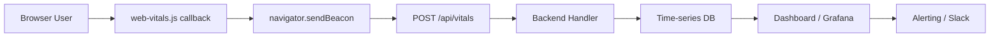
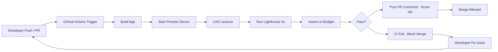

import { Section, Box, Steps, Step, Recap, CardGrid, Card, Chip, Hero, Compare } from "@components";

<Hero eyebrow="Chapter 07 &middot; Web Vitals" title="Monitoring Produksi &amp; <em>Performance Budget</em>" sub="RUM di production, alerting, performance budget di CI, dan studi kasus end-to-end">
  <p>Audit Lighthouse satu kali seperti mengambil satu foto — berguna, tapi tidak cukup untuk memahami bagaimana performa berubah dari waktu ke waktu di tangan pengguna nyata. Chapter penutup ini membekali kamu dengan sistem monitoring yang berkelanjutan dan mekanisme anggaran performa yang menjaga regresi tidak lolos ke production.</p>
  <Fragment slot="meta">
    <Chip icon="activity">Real User Monitoring</Chip>
    <Chip icon="clock">~36 menit baca</Chip>
  </Fragment>
</Hero>

Kita sudah melewati perjalanan panjang — dari memahami apa itu LCP, INP, dan CLS; cara mengukurnya; teknik optimasi spesifik per metrik; hingga strategi rendering. Kini saatnya menutup lingkaran: bagaimana kamu tahu bahwa performa tetap baik setelah deploy? Bagaimana regresi tertangkap sebelum pengguna mengeluh? Bagaimana seluruh tim berkomitmen pada standar yang sama? Chapter 7 menjawab ketiga pertanyaan itu.

Alurnya adalah: setup RUM untuk mengumpulkan data lapangan → kirim metrik ke backend atau analytics → tetapkan performance budget sebagai "garis batas" eksplisit → enforce budget di CI melalui Lighthouse CI → lalu rangkum semuanya dalam studi kasus end-to-end yang bisa langsung kamu terapkan. Setelah chapter ini selesai, kamu memiliki toolkit lengkap dari audit pertama hingga production monitoring yang berkelanjutan.

<Section num="01" id="rum-di-production" title="Real User Monitoring di Production" sub="Mengapa satu audit tidak cukup, dan bagaimana RUM mengisi celah itu">

<p class="lead">Lighthouse adalah alat lab — satu sesi, satu perangkat, satu kondisi jaringan. Real User Monitoring (RUM) mengumpulkan ribuan sesi nyata dari berbagai perangkat, jaringan, dan geografi secara berkelanjutan.</p>

Bayangkan kamu baru saja menjalankan Lighthouse dan mendapat skor LCP 2.1 detik — angka yang bagus. Namun pengguna dari Sulawesi yang menggunakan smartphone kelas menengah dengan koneksi 3G mungkin mengalami LCP 6 detik. Lighthouse tidak pernah memberi tahu kamu soal itu karena Lighthouse dijalankan dari mesin kamu dengan koneksi kantor yang cepat. Inilah celah mendasar audit lab: ia merepresentasikan kondisi ideal, bukan kondisi nyata pengguna.

RUM hadir untuk menutup celah tersebut. Library <code>web-vitals.js</code> dari Google — bobot hanya sekitar 2KB gzipped — mengukur CWV langsung di browser pengguna menggunakan API bawaan seperti <code>PerformanceObserver</code> dan <code>LayoutShift</code>. Setiap kali pengguna mengunjungi halaman, metrik dikumpulkan dan dikirim ke endpoint analytics. Seiring waktu, kamu memiliki distribusi data lapangan yang representatif untuk berbagai segmen.

Segmentasi adalah kunci dari RUM yang actionable. Data agregat tanpa segmentasi sering menyesatkan — rata-rata P75 yang "Needs Improvement" bisa menyembunyikan fakta bahwa pengguna mobile mengalami "Poor" sementara pengguna desktop sudah "Good". Segmentasi minimal yang wajib diimplementasikan:

- **Device type**: mobile vs desktop — biasanya perbedaan paling signifikan
- **Network type**: <code>4G</code>, <code>WiFi</code>, <code>3G</code>, <code>slow-2G</code> — ambil dari <code>navigator.connection.effectiveType</code>
- **Browser**: Chrome, Safari, Firefox — terutama penting untuk INP yang belum tersedia di semua browser
- **Geography**: negara atau kota — untuk memahami masalah CDN atau server location
- **Route / page template**: halaman produk vs halaman checkout vs beranda — metrik per template jauh lebih berguna daripada metrik global
- **App version**: untuk korelasi regresi dengan deploy tertentu

<div class="tbl-wrap"><table><thead><tr><th>Dimensi Dashboard</th><th>Pertanyaan yang Dijawab</th><th>Cara Segmentasi</th></tr></thead><tbody><tr><td>Device type</td><td>Apakah pengguna mobile jauh lebih lambat?</td><td><code>navigator.userAgent</code> atau header <code>Sec-CH-UA-Mobile</code></td></tr><tr><td>Network type</td><td>Apakah pengguna 3G penyumbab utama "Poor"?</td><td><code>navigator.connection.effectiveType</code></td></tr><tr><td>Geography</td><td>Apakah ada region yang lambat akibat CDN miss?</td><td>IP geolocation di backend</td></tr><tr><td>Page route</td><td>Halaman mana yang paling banyak "Poor"?</td><td><code>window.location.pathname</code></td></tr><tr><td>App version</td><td>Deploy mana yang menyebabkan regresi?</td><td>Meta tag atau env variable</td></tr><tr><td>Browser</td><td>Apakah Safari punya masalah INP berbeda?</td><td><code>navigator.userAgent</code></td></tr></tbody></table></div>

Untuk situs dengan traffic tinggi, kamu tidak perlu mengirim 100% data. Sampling 1–10% sudah cukup untuk statistical significance dalam kebanyakan kasus — bahkan sampling 0.1% untuk situs dengan jutaan pengguna per hari tetap memberi ribuan data point per jam. Implementasikan sampling di sisi client:

```js
// Kirim hanya 10% sesi untuk site besar
if (Math.random() < 0.1) {
  initVitalsTracking();
}
```

Selain mengumpulkan data, kamu perlu alerting yang proaktif. Setup threshold alert berbasis waktu — misalnya: "jika LCP P75 mobile lebih dari 3 detik selama 1 jam berturut-turut, kirim notifikasi ke channel Slack #web-perf." Alerting berbasis P75 lebih robust daripada berbasis rata-rata karena tahan terhadap outlier ekstrem. Gunakan juga alerting berbasis persentase distribusi — "jika persentase sesi dengan rating Poor melampaui 15%, alert segera."

Dashboard yang baik bukan hanya menampilkan P75, tapi seluruh distribusi. Tampilkan berapa persen sesi masuk ke kategori Good (hijau), Needs Improvement (kuning), dan Poor (merah) per segment dan per halaman. Angka ini jauh lebih mudah dikomunikasikan ke product manager daripada angka milidetik.

<Box variant="analogy" icon="🧩" label="Analogi: RUM seperti Grafana untuk backend"><p>Kamu tidak akan menjalankan satu benchmark saja untuk mengukur performa API backend — kamu pasang Grafana, Prometheus, atau Datadog untuk memantau latency, error rate, dan throughput secara berkelanjutan. RUM untuk Web Vitals adalah hal yang sama: observability berkelanjutan, bukan audit satu kali. Satu Lighthouse run seperti satu load test manual — berguna, tapi bukan pengganti production monitoring.</p></Box>

Data RUM juga menjadi sumber kebenaran saat ada perdebatan di tim. Daripada berdebat "apakah halaman ini lambat?", kamu tinggal buka dashboard dan tunjukkan: "LCP P75 mobile kita 4.2 detik, dan 43% sesi mobile rating Poor." Angka lapangan tidak bisa dibantah.

<Box variant="note" icon="📝" label="Yang baru kamu pelajari"><p>RUM mengisi celah data lapangan yang tidak bisa diisi Lighthouse. Segmentasi per device, network, dan route adalah kunci untuk menemukan masalah nyata, bukan masalah rata-rata. Sampling memungkinkan efisiensi di situs besar. Alerting berbasis P75 dan distribusi membuat tim proaktif, bukan reaktif.</p></Box>

Sekarang kita tahu apa yang perlu dikumpulkan — bagaimana cara mengirim data tersebut ke sistem analytics?

</Section>

<Section num="02" id="mengirim-ke-analytics" title="Mengirim Metrik ke Analytics &amp; Backend" sub="Implementasi web-vitals.js, sendBeacon, dan integrasi berbagai platform">

<p class="lead">Library <code>web-vitals.js</code> menyediakan callback yang dipanggil tepat sekali ketika nilai final setiap metrik tersedia — tugasmu hanya memutuskan kemana data itu dikirim.</p>

Setiap callback <code>web-vitals.js</code> menerima objek dengan properti: <code>name</code> (nama metrik, mis. "LCP"), <code>value</code> (nilai dalam milidetik atau unit tanpa dimensi untuk CLS), <code>rating</code> ("good", "needs-improvement", "poor"), <code>id</code> (ID unik per sesi untuk deduplication), dan <code>attribution</code> (data debug tentang elemen atau interaksi penyebab). Callback ini dipanggil satu kali per metrik per page load — tidak ada update berkala yang perlu kamu filter.

Cara mengirim data yang direkomendasikan adalah <code>navigator.sendBeacon</code>. API ini bersifat non-blocking: browser mengirim request di latar belakang tanpa mengganggu rendering, dan yang paling penting, ia bekerja bahkan saat halaman sedang di-unload — misalnya saat pengguna menutup tab atau mengklik link ke halaman lain. Ini sangat kritis untuk INP dan CLS yang nilainya sering baru final menjelang akhir sesi.

```js
import { onLCP, onINP, onCLS, onFCP, onTTFB } from 'web-vitals';

function sendToAnalytics({ name, value, rating, id, attribution }) {
  const payload = JSON.stringify({
    name,
    value,
    rating,
    id,
    attribution,
    url: location.href,
    timestamp: Date.now(),
    deviceType: /Mobi|Android/i.test(navigator.userAgent) ? 'mobile' : 'desktop',
    networkType: navigator.connection?.effectiveType ?? 'unknown',
    appVersion: document.querySelector('meta[name="app-version"]')?.content ?? 'unknown',
  });

  // sendBeacon untuk keandalan saat page unload
  if (navigator.sendBeacon) {
    navigator.sendBeacon('/api/vitals', payload);
  } else {
    // Fallback untuk browser lama
    fetch('/api/vitals', { method: 'POST', body: payload, keepalive: true });
  }
}

onLCP(sendToAnalytics);
onINP(sendToAnalytics);
onCLS(sendToAnalytics);
onFCP(sendToAnalytics);
onTTFB(sendToAnalytics);
```

Di sisi backend — misalnya di project <code>github.com/kamu/skincare-backend</code> yang ditulis di Go — endpoint <code>/api/vitals</code> cukup sederhana: terima POST body JSON, validasi, lalu simpan ke time-series database. Time-series DB yang umum dipakai untuk ini antara lain InfluxDB, TimescaleDB (PostgreSQL extension), atau BigQuery untuk skala besar.

```go
// skincare-backend: internal/handler/vitals.go
func (h *VitalsHandler) CollectVitals(w http.ResponseWriter, r *http.Request) {
    var payload VitalsPayload
    if err := json.NewDecoder(r.Body).Decode(&payload); err != nil {
        http.Error(w, "bad request", http.StatusBadRequest)
        return
    }
    // Simpan ke time-series DB secara async
    go h.store.InsertVitals(r.Context(), payload)
    w.WriteHeader(http.StatusNoContent)
}
```

Jika kamu tidak ingin membangun backend sendiri, ada beberapa opsi yang lebih cepat:

**Google Analytics 4** menerima custom events. Gunakan <code>{"gtag('event', 'web_vitals', {...})"}</code> dan metrik akan langsung muncul di GA4 Reports. Kelemahannya: data sampling GA4 bisa tidak akurat untuk site kecil, dan querying distribusi P75 butuh BigQuery export.

**Vercel Analytics** menyediakan Web Vitals tracking built-in untuk project yang di-deploy di Vercel — zero configuration, tampil langsung di dashboard Vercel. Cocok untuk site yang sudah di Vercel.

**Cloudflare Web Analytics** juga mengumpulkan Core Web Vitals secara otomatis dari Cloudflare's network — tersedia bahkan di free tier.

Data <code>attribution</code> adalah fitur yang sering diabaikan tapi sangat berharga untuk debugging. Misalnya, <code>lcp.attribution.element</code> memberi tahu elemen DOM yang menjadi kandidat LCP — jika nilainya <code>"img#hero-banner"</code>, kamu tahu persis gambar mana yang perlu dioptimasi. Demikian pula <code>inp.attribution.eventTarget</code> memberi tahu elemen yang berinteraksi saat INP buruk, dan <code>cls.attribution.largestShiftSource.node</code> menunjuk elemen yang paling banyak bergeser.


<p class="fig-cap"><b>Alur RUM end-to-end.</b> Data bergerak dari browser melalui sendBeacon ke backend, disimpan di time-series DB, divisualisasikan di dashboard, dan memicu alert bila threshold terlampaui.</p>

<Box variant="tip" icon="💡" label="Pro tip: batching untuk efisiensi"><p>Untuk mengurangi jumlah request ke backend, kumpulkan semua metrik dalam satu objek dan kirim sekaligus di akhir sesi menggunakan <code>visibilitychange</code> event. Ini memotong jumlah request per sesi dari 5 menjadi 1, menghemat bandwidth dan mengurangi overhead backend secara signifikan.</p></Box>

<Box variant="note" icon="📝" label="Yang baru kamu pelajari"><p>Implementasi RUM dengan <code>web-vitals.js</code> hanya butuh beberapa baris — kuncinya adalah menggunakan <code>navigator.sendBeacon</code> untuk keandalan saat unload, menyertakan konteks (device, network, route, version) bersama nilai metrik, dan memanfaatkan data attribution untuk debugging spesifik.</p></Box>

Kini data mengalir. Langkah berikutnya: bagaimana kita membuat komitmen eksplisit bahwa data itu tidak boleh melampaui batas tertentu?

</Section>

<Section num="03" id="performance-budget" title="Performance Budget: Definisi dan Kategori" sub="Menetapkan garis batas eksplisit agar performa tidak turun perlahan tanpa disadari">

<p class="lead">Performance budget adalah komitmen eksplisit tim bahwa metrik tertentu — ukuran bundle, skor Lighthouse, atau nilai CWV — tidak boleh melebihi threshold yang disepakati bersama.</p>

Tanpa performance budget, performa web turun perlahan dalam "death by a thousand cuts." Setiap fitur baru menambah sedikit JavaScript. Setiap integrasi marketing menambah satu script tracking. Setiap gambar baru diunggah tanpa kompresi. Tidak ada satu keputusan yang terasa dramatis, tapi enam bulan kemudian LCP yang tadinya 2.0 detik menjadi 3.8 detik dan tidak ada yang bisa menunjuk siapa yang bertanggung jawab. Performance budget memutus pola ini dengan membuat standar performa setara dengan standar kualitas lainnya — sesuatu yang diuji dan di-enforce secara otomatis.

Ada tiga kategori performance budget yang saling melengkapi:

**1. Quantity Budget** — batasan pada aset mentah. Ini paling mudah diukur dan di-enforce karena tidak memerlukan browser. Contoh:
- Main JS bundle gzipped: maks 200KB
- Total image weight per halaman: maks 1MB
- Jumlah HTTP requests: maks 50
- Third-party scripts: maks 3

**2. Timing Budget** — batasan pada metrik waktu, baik lab maupun field. Contoh:
- LCP di Lighthouse (mobile throttled): < 2.5 detik
- Total Blocking Time (TBT): < 300ms
- INP field data P75: < 200ms
- TTFB dari origin: < 600ms

**3. Rule-based Budget** — batasan pada score komposit atau aturan audit. Contoh:
- Lighthouse Performance score: ≥ 90
- Tidak ada gambar yang di-serve tanpa format modern (WebP/AVIF)
- Tidak ada render-blocking resource di above-the-fold

<div class="tbl-wrap"><table><thead><tr><th>Budget Type</th><th>Cara Set</th><th>Tools</th><th>Contoh Nilai</th></tr></thead><tbody><tr><td>Quantity budget</td><td>Audit bundle output setelah build</td><td><code>size-limit</code>, <code>bundlesize</code></td><td>JS main bundle &lt; 200KB gzip</td></tr><tr><td>Timing budget</td><td>Lighthouse lab measurement</td><td>Lighthouse CI, WebPageTest</td><td>LCP &lt; 2.5s, TBT &lt; 300ms</td></tr><tr><td>Rule-based budget</td><td>Lighthouse audit rules</td><td>Lighthouse CI assert</td><td>Score &ge; 90, tidak ada render-blocking</td></tr><tr><td>Field budget</td><td>RUM data P75 threshold</td><td>CrUX, GA4, custom dashboard</td><td>LCP P75 &lt; 2.5s, INP P75 &lt; 200ms</td></tr></tbody></table></div>

Cara menetapkan budget yang realistis: mulai dari baseline saat ini, lalu set target 10–20% lebih baik. Jangan langsung menargetkan angka ideal jika kondisi saat ini jauh dari ideal — budget yang terlalu jauh dari realita akan diabaikan karena terasa tidak mungkin. Tingkatkan budget secara bertahap setiap sprint atau kuartal, sambil tim melakukan perbaikan yang diperlukan.

Pertimbangkan juga granularitas budget per route. Halaman beranda mungkin bisa sangat ringan dan mencapai budget JS 80KB, tapi halaman checkout dengan payment widget, address form, dan promo code validator mungkin secara realistis butuh 300KB. Budget per-page-template lebih berguna daripada budget global tunggal.

```json
// .performance-budget.json — contoh konfigurasi
{
  "pages": [
    {
      "path": "/",
      "timingBudget": {
        "lcp": 2000,
        "tbt": 200,
        "cls": 0.05
      },
      "resourceBudget": {
        "script": 80000,
        "total": 500000
      }
    },
    {
      "path": "/products",
      "timingBudget": {
        "lcp": 2500,
        "tbt": 300,
        "cls": 0.1
      },
      "resourceBudget": {
        "script": 200000,
        "total": 1000000
      }
    }
  ]
}
```

Aspek yang sering diabaikan adalah **shared ownership**. Performance budget hanya efektif jika seluruh tim — product manager, designer, backend developer, frontend developer — mengetahui dan menyetujui budget tersebut. Jika backend developer menambahkan endpoint yang mengembalikan 2MB JSON tanpa kompresi, atau designer meminta animasi berat yang memblokir thread utama, atau product manager meminta 5 analytics tag baru, semua itu bisa menabrak budget. Buat budget terlihat: tampilkan di README, di PR template, di channel Slack tim, dan tentunya di CI pipeline.

<Box variant="warn" icon="⚠️" label="Gotcha: budget yang tidak realistis"><p>Performance budget yang terlalu ketat membuat tim frustrasi dan akhirnya diabaikan atau di-bypass. Budget yang terlalu longgar tidak memberikan nilai apapun. Mulai dari prinsip "tidak boleh lebih buruk dari sekarang" — jadikan baseline saat ini sebagai budget awal, lalu tingkatkan secara bertahap. Ratchet ke atas, jangan langsung melompat ke target ideal.</p></Box>

<Box variant="bridge" icon="🌉" label="Jembatan: dari API rate limit ke performance budget"><p>Di backend, kamu biasanya menetapkan rate limit — misalnya "endpoint ini maks 1000 request per menit" — untuk menjaga sistem tidak overload. Performance budget bekerja dengan logika yang sama untuk frontend: "halaman ini maks 200KB JavaScript" adalah rate limit untuk ukuran bundle. Keduanya adalah komitmen eksplisit yang di-enforce secara otomatis, bukan hanya panduan yang mudah dilupakan.</p></Box>

<Box variant="note" icon="📝" label="Yang baru kamu pelajari"><p>Performance budget adalah komitmen eksplisit yang mencegah "death by a thousand cuts." Ada tiga kategori: quantity budget untuk aset mentah, timing budget untuk metrik waktu, dan rule-based budget untuk skor komposit. Budget yang realistis dimulai dari baseline, bukan dari target ideal.</p></Box>

Budget yang sudah ditetapkan hanya berguna jika ada yang memeriksa di setiap perubahan kode — itulah peran Lighthouse CI.

</Section>

<Section num="04" id="lighthouse-ci" title="Lighthouse CI dan Integrasi Pipeline" sub="Menjalankan Lighthouse secara otomatis di setiap PR dan membuat regresi memblokir merge">

<p class="lead">Lighthouse CI (LHCI) adalah alat resmi Google untuk menjalankan Lighthouse secara otomatis di setiap commit atau pull request, membandingkan hasilnya dengan budget, dan memblokir merge jika ada regresi.</p>

Tanpa LHCI, performance budget hanya ada di dokumen — tidak ada yang memeriksa secara otomatis apakah PR yang masuk melanggar budget tersebut. Dengan LHCI, setiap PR mendapat "laporan Lighthouse" otomatis, score dibandingkan dengan baseline sebelumnya, dan CI bisa dikonfigurasi untuk fail jika metric tertentu menurun melampaui ambang batas yang ditentukan.

Instalasi LHCI sebagai development dependency:

```bash
npm install --save-dev @lhci/cli
```

Atau sebagai global binary untuk penggunaan langsung di pipeline:

```bash
npm install -g @lhci/cli
```

Konfigurasi LHCI disimpan di file <code>.lighthouserc.json</code> atau <code>lighthouserc.js</code> di root project:

```json
{
  "ci": {
    "collect": {
      "url": [
        "http://localhost:3000/",
        "http://localhost:3000/products",
        "http://localhost:3000/products/1"
      ],
      "numberOfRuns": 3,
      "settings": {
        "preset": "desktop"
      }
    },
    "assert": {
      "preset": "lighthouse:no-pwa",
      "assertions": {
        "categories:performance": ["warn", { "minScore": 0.9 }],
        "largest-contentful-paint": ["error", { "maxNumericValue": 2500 }],
        "total-blocking-time": ["error", { "maxNumericValue": 300 }],
        "cumulative-layout-shift": ["error", { "maxNumericValue": 0.1 }],
        "uses-optimized-images": ["warn", {}],
        "render-blocking-resources": ["warn", {}]
      }
    },
    "upload": {
      "target": "temporary-public-storage"
    }
  }
}
```

Perhatikan perbedaan antara <code>"error"</code> dan <code>"warn"</code> di assertions. Error menyebabkan LHCI exit dengan code non-zero sehingga CI pipeline fail — gunakan untuk metrik yang benar-benar tidak boleh regresi. Warn hanya menampilkan peringatan tanpa memblokir — gunakan untuk metrik yang ingin dipantau tapi belum wajib pass.

Integrasi dengan GitHub Actions adalah yang paling umum. Berikut contoh workflow lengkap:

```yaml
# .github/workflows/lighthouse-ci.yml
name: Lighthouse CI

on:
  pull_request:
    branches: [main]
  push:
    branches: [main]

jobs:
  lhci:
    name: Lighthouse CI
    runs-on: ubuntu-latest
    steps:
      - name: Checkout
        uses: actions/checkout@v4

      - name: Setup Node.js
        uses: actions/setup-node@v4
        with:
          node-version: '20'
          cache: 'npm'

      - name: Install dependencies
        run: npm ci

      - name: Build
        run: npm run build

      - name: Start preview server
        run: npm run preview &
        env:
          PORT: 3000

      - name: Wait for server
        run: npx wait-on http://localhost:3000 --timeout 30000

      - name: Run Lighthouse CI
        run: npx lhci autorun
        env:
          LHCI_GITHUB_APP_TOKEN: ${{ secrets.LHCI_GITHUB_APP_TOKEN }}
```

Dengan <code>LHCI_GITHUB_APP_TOKEN</code>, LHCI akan otomatis mempost komentar di PR yang menampilkan perbandingan score sebelum dan sesudah perubahan — sangat membantu reviewer untuk langsung melihat dampak performa dari setiap PR.

Untuk bundle size, gunakan <code>size-limit</code> secara terpisah atau bersamaan:

```json
// package.json
{
  "size-limit": [
    {
      "path": "./dist/assets/*.js",
      "limit": "200 KB"
    },
    {
      "path": "./dist/assets/*.css",
      "limit": "50 KB"
    }
  ],
  "scripts": {
    "size": "size-limit"
  }
}
```


<p class="fig-cap"><b>Pipeline LHCI di GitHub Actions.</b> Setiap push atau PR memicu Lighthouse CI yang menjalankan audit, membandingkan dengan budget, mempost hasil ke PR comment, dan memblokir merge jika ada regresi kritis.</p>

<Box variant="tip" icon="💡" label="Pro tip: uji halaman yang representatif"><p>Jangan hanya menjalankan LHCI terhadap halaman beranda. Sertakan halaman product listing, halaman detail produk, dan halaman checkout — halaman-halaman ini biasanya jauh lebih berat karena mengandung lebih banyak JavaScript, gambar, dan third-party widget. Regresi performa biasanya pertama kali muncul di halaman dalam, bukan beranda.</p></Box>

Untuk project yang sudah memiliki LHCI server sendiri (self-hosted), upload ke server pribadi memberi keuntungan tambahan: riwayat score bisa dikomparasi dari waktu ke waktu melalui dashboard LHCI, sehingga kamu bisa melihat tren performa selama berbulan-bulan, bukan hanya perbandingan per PR.

<Box variant="note" icon="📝" label="Yang baru kamu pelajari"><p>LHCI mengotomasi pemeriksaan performance budget di setiap PR. Konfigurasi <code>.lighthouserc.json</code> menentukan URL yang diaudit, metrik yang di-assert, dan threshold error vs warn. Integrasi GitHub Actions memungkinkan PR comment otomatis dan blocking merge saat regresi terdeteksi.</p></Box>

Sekarang mari kita rangkum semua yang sudah dipelajari dalam sebuah studi kasus nyata — dari kondisi buruk hingga performa optimal dan monitoring berkelanjutan.

</Section>

<Section num="05" id="studi-kasus" title="Studi Kasus: Optimasi Halaman Nyata" sub="End-to-end workflow: audit, diagnosa, perbaikan, deploy, dan monitoring berkelanjutan">

<p class="lead">Skenario nyata: halaman product listing di aplikasi skincare-backend yang mengalami LCP 4.2 detik, INP 380ms, dan CLS 0.18 — semuanya masuk kategori "Poor". Berikut perjalanan penuh dari audit pertama hingga monitoring berkelanjutan.</p>

Halaman ini adalah daftar produk skincare dengan hero banner, filter kategori, grid produk 24 item, dan widget review dari third-party. Ini bukan halaman kecil — tipikal halaman e-commerce yang kompleks, dan masalah performa di sini adalah representasi masalah yang ditemui di kebanyakan situs commerce.

<Steps>
<Step title="Initial Audit — Ukur, Jangan Asumsikan">

Mulai dari PageSpeed Insights untuk mendapat data lapangan nyata dari CrUX. Hasilnya mengejutkan: PSI menampilkan "Poor" untuk ketiga Core Web Vitals. Lebih jauh, Google Search Console menunjukkan 67% URL di domain ini masuk kategori "Poor" untuk CWV — artinya dampaknya sudah terasa di ranking search.

Data lapangan dari Search Console:
- LCP P75: 4.2 detik (Poor — threshold Good adalah &lt; 2.5s)
- INP P75: 380ms (Poor — threshold Good adalah &lt; 200ms)  
- CLS P75: 0.18 (Poor — threshold Good adalah &lt; 0.1)

Ini bukan masalah edge case — mayoritas pengguna mengalami performa buruk.

</Step>

<Step title="Segmentasi — Temukan Di Mana Masalah Paling Parah">

Data agregat menunjukkan masalah, tapi segmentasi menunjukkan prioritas. Dari data RUM yang sudah terpasang:

- Mobile: LCP 5.8 detik (sangat Poor), INP 520ms (Poor)
- Desktop: LCP 2.9 detik (Needs Improvement), INP 180ms (Good)

Kesimpulan: masalah jauh lebih parah di mobile. Ini menggeser prioritas — perbaikan yang memberikan dampak terbesar di mobile harus didahulukan.

Segmentasi network juga mengungkap: pengguna 3G mengalami LCP rata-rata 8.2 detik. Mereka mewakili 23% traffic tapi 61% sesi "Poor". Optimasi image dan resource hint akan memberikan dampak terbesar untuk segmen ini.

</Step>

<Step title="Reproduce dan Diagnosa — DevTools dan Lighthouse">

Di Chrome DevTools, aktifkan CPU throttling 4x dan network throttling "Fast 3G" untuk mensimulasikan kondisi mobile. Jalankan Lighthouse dalam kondisi ini.

Temuan diagnosa:

1. **Hero image**: file PNG 1.2MB, tidak ada format WebP, tidak ada atribut `width`/`height`, tidak ada `fetchpriority="high"`. Ini penyumbab LCP utama — browser tidak tahu gambar ini penting dan tidak me-preload-nya.

2. **Google Fonts**: dimuat via `<link rel="stylesheet">` yang blocking — browser tidak bisa render apapun sampai CSS Fonts selesai diunduh. Ini menambah ~450ms ke First Contentful Paint.

3. **Ad widget tanpa reserved space**: widget iklan banner di antara produk dimuat secara async tanpa `width`/`height` yang dideklarasikan. Saat iklan muncul, seluruh grid produk di bawahnya bergeser turun — inilah penyebab CLS 0.18.

4. **React hydration besar**: seluruh halaman di-hydrate sekaligus termasuk komponen di bawah fold yang tidak terlihat. TBT 580ms sebagian besar berasal dari ini — yang juga berkontribusi ke INP tinggi karena main thread sibuk.

5. **Third-party review widget**: skrip dari domain eksternal dimuat secara synchronous di `<head>`, menambah ~320ms blokir render.

</Step>

<Step title="Prioritas Fix Berdasarkan Dampak">

Bukan semua fix perlu dilakukan sekaligus. Urutkan berdasarkan estimasi dampak vs usaha:

<div class="tbl-wrap"><table><thead><tr><th>Masalah</th><th>Fix</th><th>Impact CWV</th><th>Estimasi Waktu</th></tr></thead><tbody><tr><td>Hero image 1.2MB PNG</td><td>Konversi ke WebP, tambah <code>srcset</code>, <code>fetchpriority="high"</code>, deklarasikan <code>width</code>/<code>height</code></td><td>LCP -1.5s</td><td>2 jam</td></tr><tr><td>Ad widget tanpa dimensi</td><td>Reserved space dengan CSS <code>aspect-ratio</code> atau fixed height, fallback placeholder</td><td>CLS 0.18 → 0.02</td><td>3 jam</td></tr><tr><td>Google Fonts blocking</td><td><code>preconnect</code> + <code>font-display: swap</code> + preload font file utama</td><td>FCP -400ms, LCP -200ms</td><td>1 jam</td></tr><tr><td>React hydration masif</td><td><code>React.lazy</code> + <code>Suspense</code> untuk komponen below-fold, defer filter sidebar</td><td>TBT -280ms, INP -120ms</td><td>1 hari</td></tr><tr><td>Third-party review widget</td><td>Load dengan <code>defer</code>, pindah ke bawah <code>body</code></td><td>FCP -300ms</td><td>30 menit</td></tr></tbody></table></div>

Urutan implementasi: mulai dari yang ROI-nya tertinggi — hero image fix dan ad reserved space bisa dilakukan dalam setengah hari dan memberikan perbaikan signifikan di LCP dan CLS.

</Step>

<Step title="Implementasi Iteratif — Ukur Setelah Setiap Fix">

Jangan implementasikan semua fix sekaligus lalu ukur di akhir. Implementasikan satu per satu, deploy ke staging, ukur dengan Lighthouse dan WebPageTest, lalu deploy ke production. Pola ini memungkinkan kamu memverifikasi setiap fix memberikan dampak yang diharapkan — dan menangkap jika ada fix yang tidak berdampak atau bahkan memperburuk kondisi.

Fix hero image:

```html
<!-- Sebelum -->


<!-- Sesudah -->
<picture>
  <source
    srcset="/images/hero-skincare-800.webp 800w,
            /images/hero-skincare-1200.webp 1200w,
            /images/hero-skincare-1600.webp 1600w"
    type="image/webp"
  />
  
</picture>
```

Fix reserved space untuk ad widget:

```css
/* Ad container dengan reserved space agar tidak CLS */
.ad-banner-container {
  width: 100%;
  aspect-ratio: 728 / 90; /* dimensi standar leaderboard */
  background-color: var(--color-surface-subtle);
  contain: layout;
}

@media (max-width: 768px) {
  .ad-banner-container {
    aspect-ratio: 320 / 50; /* mobile banner */
  }
}
```

Fix Google Fonts:

```html
<!-- Sebelum: blocking -->
<link rel="stylesheet" href="https://fonts.googleapis.com/css2?family=Inter:wght@400;600;700&display=swap" />

<!-- Sesudah: non-blocking dengan preconnect dan preload -->
<link rel="preconnect" href="https://fonts.googleapis.com" />
<link rel="preconnect" href="https://fonts.gstatic.com" crossorigin />
<link rel="preload" as="style" href="https://fonts.googleapis.com/css2?family=Inter:wght@400;600;700&display=swap" />
<link rel="stylesheet" href="https://fonts.googleapis.com/css2?family=Inter:wght@400;600;700&display=swap" media="print" onload="this.media='all'" />
```

</Step>

<Step title="Hasil Field Data Setelah 4 Minggu">

Data lapangan CrUX diperbarui setiap bulan dengan data rolling 28 hari, jadi hasil penuh baru terlihat setelah 4 minggu setelah deploy terakhir:

- **LCP P75**: 4.2s → **2.1 detik** (Poor → Good ✓)
- **INP P75**: 380ms → **145ms** (Poor → Good ✓)
- **CLS P75**: 0.18 → **0.05** (Poor → Good ✓)

Search Console: URL dengan status "Good" naik dari 33% menjadi **89%**. Dampak bisnis yang terukur: bounce rate turun 18%, session duration naik 12%, dan conversion rate halaman produk naik 7%.

</Step>

<Step title="Setup Monitoring Berkelanjutan untuk Mencegah Regresi">

Setelah performa baik, pasang sistem pencegahan regresi:

1. **LHCI di CI**: file <code>.lighthouserc.json</code> dikonfigurasi dengan threshold LCP &lt; 2.5s, TBT &lt; 300ms, CLS &lt; 0.1. Setiap PR yang menurunkan metric di bawah threshold akan diblokir.

2. **RUM monitoring**: dashboard RUM menampilkan LCP, INP, CLS per device dan per route. Alert Slack terpasang: jika LCP P75 mobile melampaui 3s selama 30 menit, notifikasi otomatis dikirim.

3. **Weekly review**: setiap Senin, tim melihat tren metrik seminggu terakhir di dashboard. Penurunan yang belum memicu alert tapi menunjukkan tren turun ditangkap di sini.

4. **Monthly CrUX check**: data lapangan resmi di PageSpeed Insights dicek setiap bulan untuk memverifikasi bahwa improvement bertahan.

</Step>
</Steps>

<Box variant="note" icon="📝" label="Template workflow yang bisa diulang"><p>Studi kasus ini adalah template yang bisa diterapkan untuk halaman apapun: audit → segmentasi → diagnosa → prioritas → implementasi iteratif → verifikasi → monitoring berkelanjutan. Web Vitals adalah disiplin berkelanjutan, bukan proyek sekali jalan. Setiap fitur baru, setiap library baru, setiap A/B test berpotensi mengubah metrik — sistem monitoring dan budget yang baik memastikan kamu mengetahuinya sebelum pengguna mengeluh.</p></Box>

Dengan menyelesaikan studi kasus ini, kamu sekarang memiliki pemahaman end-to-end yang lengkap — dari mengukur, mendiagnosa, memperbaiki, hingga memantau Web Vitals secara berkelanjutan di production.

</Section>

<Section num="06" id="ringkasan" title="Ringkasan" sub="Yang wajib menempel dari chapter ini">

<p class="lead">Chapter terakhir ini menutup siklus lengkap Web Vitals: dari data satu audit menjadi sistem observability yang berkelanjutan, dari intuisi menjadi komitmen eksplisit melalui performance budget, dan dari perbaikan satu kali menjadi proses yang menjaga performa tetap baik selamanya.</p>

Kamu telah belajar bahwa Lighthouse adalah titik awal yang bagus tapi tidak cukup — RUM memberikan kebenaran lapangan yang tidak bisa didapat dari audit lab. Dengan <code>web-vitals.js</code> dan <code>navigator.sendBeacon</code>, kamu bisa mengumpulkan data dari ribuan pengguna nyata, mensegmentasikannya berdasarkan device, network, dan route, lalu membangun dashboard dan alerting yang membuat tim proaktif. Performance budget mengubah standar performa dari sesuatu yang "diingat" menjadi sesuatu yang "diukur dan di-enforce" di setiap PR melalui Lighthouse CI. Dan studi kasus end-to-end membuktikan bahwa workflow ini benar-benar bekerja: dari LCP 4.2s, INP 380ms, CLS 0.18 — semua Poor — menjadi semua Good dalam beberapa sprint.

<Recap title="Yang Wajib Menempel">
<ul>
<li>RUM adalah keharusan di production — Lighthouse hanya satu sesi ideal; RUM mengumpulkan data nyata dari ribuan pengguna dengan berbagai perangkat, jaringan, dan geografi.</li>
<li>Segmentasi RUM wajib mencakup setidaknya device type, network type, dan page route — tanpa segmentasi, data agregat menyembunyikan masalah nyata.</li>
<li><code>navigator.sendBeacon</code> adalah cara yang tepat untuk mengirim metrik — non-blocking dan bekerja bahkan saat halaman di-unload, sehingga tidak ada data yang hilang di akhir sesi.</li>
<li>Data <code>attribution</code> dari <code>web-vitals.js</code> menunjuk elemen spesifik penyebab masalah — <code>lcp.attribution.element</code>, <code>inp.attribution.eventTarget</code>, dan <code>cls.attribution.largestShiftSource.node</code> mempersingkat waktu debugging secara dramatis.</li>
<li>Performance budget adalah komitmen eksplisit tim dalam tiga kategori: quantity budget untuk ukuran aset, timing budget untuk metrik waktu, dan rule-based budget untuk skor komposit — mulai dari baseline saat ini, bukan dari target ideal.</li>
<li>Lighthouse CI mengotomasi pemeriksaan budget di setiap PR melalui <code>.lighthouserc.json</code> — konfigurasi assertion error memblokir merge, warn hanya memberi peringatan; jalankan LHCI di halaman yang representatif, bukan hanya beranda.</li>
<li>Workflow optimasi yang bisa diulang: audit → segmentasi → diagnosa → prioritas berdasarkan dampak → implementasi iteratif → verifikasi lapangan → monitoring berkelanjutan. Ini adalah disiplin, bukan proyek sekali jalan.</li>
</ul>
</Recap>

Selamat — kamu telah menyelesaikan keseluruhan course Belajar Web Vitals. Kamu sekarang memiliki fondasi yang solid untuk mengukur LCP, INP, dan CLS; mendiagnosis root cause spesifik di DevTools dan Lighthouse; mengimplementasikan perbaikan yang tepat sasaran untuk setiap metrik; memilih strategi rendering yang sesuai; dan yang paling penting, menjaga performa itu tetap baik melalui sistem monitoring dan budget yang berkelanjutan. Kualitas pengalaman pengguna adalah tanggung jawab yang tidak selesai di satu sprint — dan sekarang kamu punya semua alat untuk mempertahankannya.

</Section>
